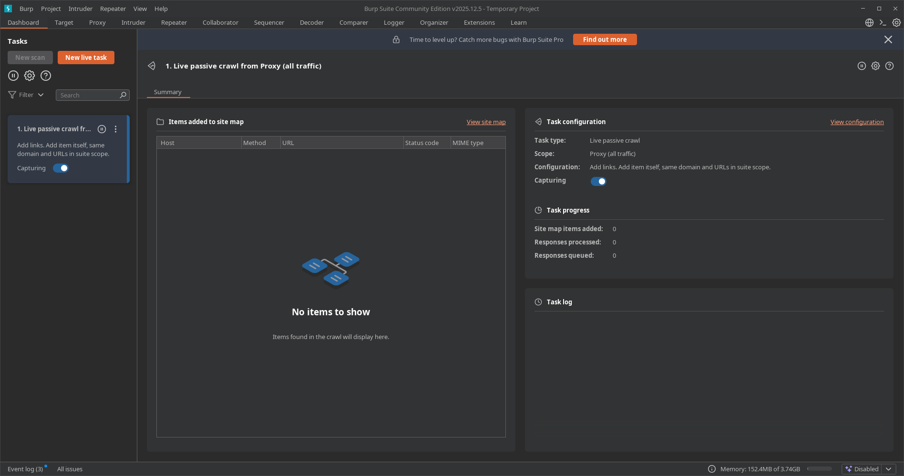
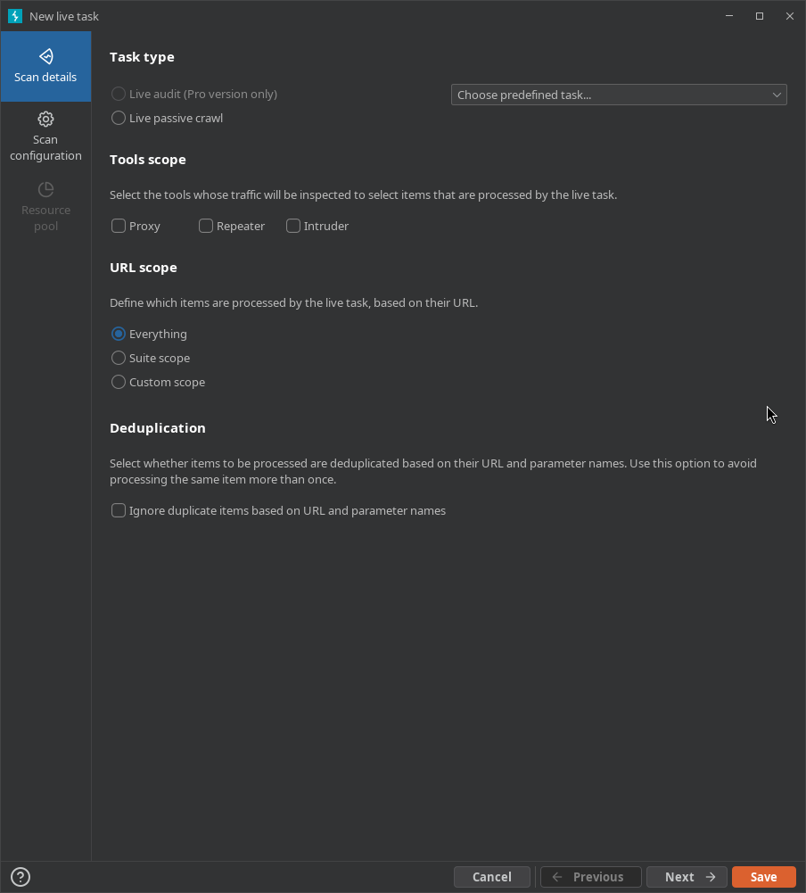
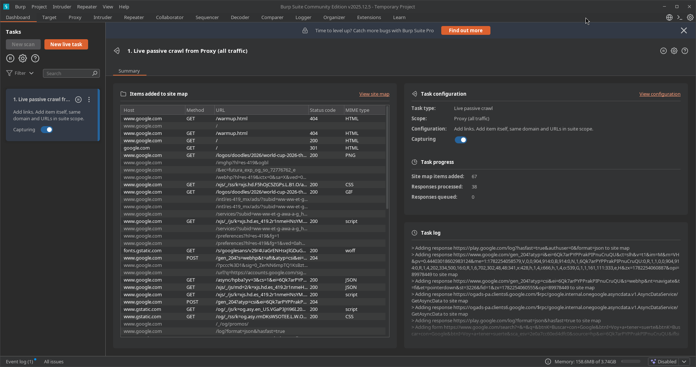
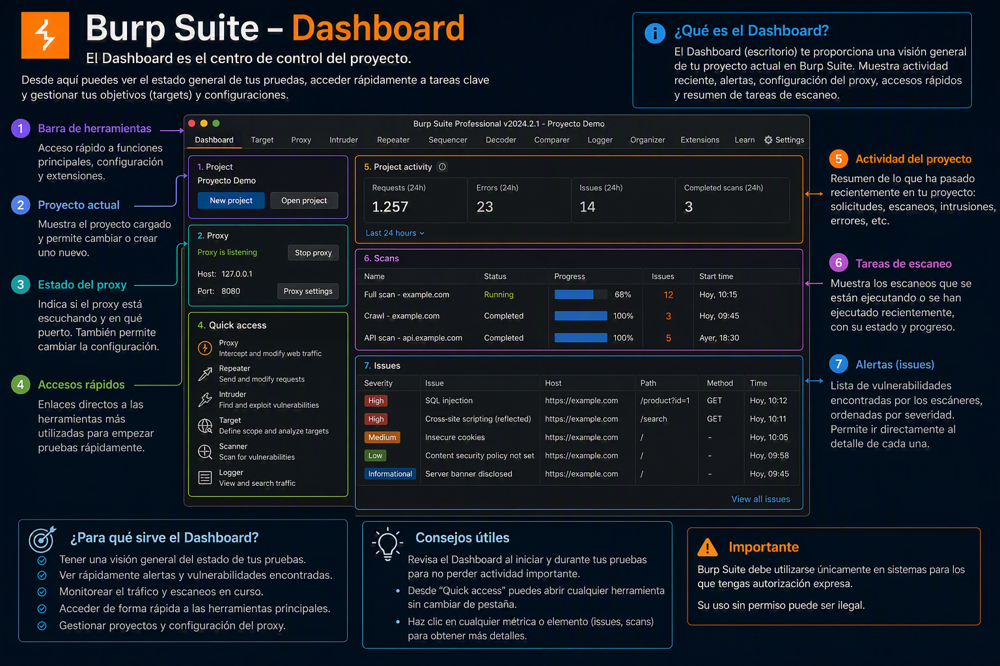

---
tags:
  - "#estructura/subseccion"
  - "#gestion/duracion/muy-corto"
  - "#gestion/relevancia/media"
  - "#gestion/dificultad/muy-facil"
  - "#hacking/red-team"
  - "#herramientas/burp-suite"
  - "#formato/apunte"
  - gestion/estado/terminado
---
### 📌 Propósito Operativo
El Dashboard es la pantalla principal y el centro de monitoreo de Burp Suite. Su función en una auditoría es ofrecerle al auditor una **vista panorámica en tiempo real** sobre el rendimiento de la suite, el estado de los componentes activos, las tareas automatizadas que se ejecutan en segundo plano y el registro global de eventos del sistema.

---

## 🧩 Anatomía del Dashboard: Secciones Clave

La interfaz del Dashboard se divide estructuralmente en **tres bloques principales**:

### 1. ⚙️ Tasks (Tareas)
Es el motor de ejecución de la herramienta. Aquí se gestionan y supervisan todas las acciones automatizadas que Burp Suite realiza en segundo plano:

* **Live Passive Crawl:** *(Activo por defecto)* Examina de forma silenciosa todo el tráfico HTTP/S que pasa a través del Proxy. Mapea la estructura web y detecta anomalías sin lanzar una sola petición propia.
* **Audits (Versión Pro):** Muestra el progreso de los escaneos automatizados de vulnerabilidades, indicando el porcentaje de avance, la velocidad de peticiones por segundo y el contador de fallos.

#### 🚀 Creación de una Nueva Tarea en Vivo (New Live Task)
Las tareas en vivo permiten automatizar acciones a medida que navegas o interactúas con los diferentes módulos. Se configuran a través de dos menús principales:

##### 📋 A. Scan Details (Detalles de la Tarea)
Define el comportamiento básico y el alcance de la interceptación:

* **Task Type (Tipo de Tarea):**
    * `Live passive crawl`: Analiza de forma pasiva el tráfico para construir el mapa del sitio sin enviar nuevas peticiones.
    * `Live audit`: Escaneo activo de vulnerabilidades *(opción exclusiva de la versión Pro)*.
* **Tools Scope (Alcance de Herramientas):** Determina qué módulos alimentarán esta tarea con su tráfico. Se puede seleccionar el flujo proveniente del **Proxy**, **Repeater** o **Intruder**.
* **URL Scope (Alcance de URL):** Define qué objetivos o direcciones web serán procesados:
    * `Everything`: Procesa absolutamente todo el tráfico recibido por las herramientas seleccionadas.
    * `Suite scope`: Se limita estrictamente a los objetivos definidos globalmente en la pestaña *Target > Scope*.
    * `Custom scope`: Permite configurar un filtrado personalizado con reglas específicas para esta tarea.
* **Deduplication (Deduplicación):** Al activar `Ignore duplicate items based on URL and parameter names`, Burp Suite evita procesar peticiones idénticas repetidas veces, optimizando el rendimiento de la máquina y manteniendo limpio el *Site Map*.

##### ⚙️ B. Scan Configuration (Configuración del Escaneo)
Parametriza la lógica interna que utilizará el motor de rastreo pasivo:

* **Types of item to add (Elementos a agregar):** Especifica qué tipo de interacciones guardará automáticamente en el mapa del sitio:
    * `Links`: Extrae y mapea todos los hipervínculos encontrados dentro de las respuestas HTTP.
    * `Form submissions`: Mapea y registra los formularios de envío de datos detectados.
* **URLs to add (URLs a incluir):** Filtros avanzados de almacenamiento. Permite elegir si se añade el elemento consultado (`The item itself`), contenido que pertenezca al mismo dominio (`Items on the same domain`) o únicamente si la dirección coincide con el Scope establecido (`URLs in scope`).

---

### 2. 🚨 Issue Activity (Actividad de Problemas / Vulnerabilidades)

> 💡 **Nota de entorno:** Esta sección es el centro de control de hallazgos. Aunque muestra todo su potencial en la versión *Professional* mediante el escáner activo (Audits), la versión *Community* también registra alertas automáticas basadas en el análisis pasivo del tráfico que cruza el Proxy.

Muestra un feed cronológico y en tiempo real de las vulnerabilidades, fallas de configuración e inconsistencias detectadas en el objetivo. Al seleccionar cualquier elemento, la interfaz despliega una descripción detallada, la ruta del impacto, la reproducción de la petición/respuesta HTTP y recomendaciones de remediación.

Los hallazgos se clasifican mediante un código de colores estándar basado en su severidad e impacto potencial:

* **🔴 High (Alta):** Vulnerabilidades críticas que permiten comprometer el servidor o los datos de forma directa.
    * *Ejemplos comunes:* SQL Injection (SQLi), Cross-Site Scripting (XSS) Almacenado/Reflejado, Remote Code Execution (RCE), Local/Remote File Inclusion (LFI/RFI) e Inyecciones de Comandos.
* **🟠 Medium (Media):** Fallos que exponen la lógica de la aplicación o permiten vectores de ataque indirectos.
    * *Ejemplos comunes:* CSRF (Cross-Site Request Forgery), vulnerabilidades de control de acceso (IDORs), almacenamiento inseguro de cookies (sin flags `HttpOnly` o `Secure`), o configuraciones CORS permisivas (`Access-Control-Allow-Origin: *`).
* **🟡 Low (Baja):** Brechas menores o configuraciones débiles que facilitan la fase de reconocimiento a un atacante.
    * *Ejemplos comunes:* Divulgación de versiones de software específicas en cabeceras, listado de directorios habilitado, o uso de algoritmos de cifrado SSL/TLS obsoletos en el servidor.
* **🔵 Information (Informativa):** Datos puramente descriptivos sobre la infraestructura detectada que no representan un riesgo directo, pero mapean la superficie de ataque.
    * *Ejemplos comunes:* Detección de subida de archivos permitida, descubrimiento de paneles de administración de tecnologías conocidas (como `/wp-admin`), o métodos HTTP inusuales permitidos (OPTIONS, PUT, DELETE).

---

### 3. 🪵 Event Log (Registro de Eventos)

Es el historial clínico y operativo de la herramienta. No registra vulnerabilidades del objetivo, sino el comportamiento, estado y salud interna del propio Burp Suite durante la sesión de auditoría. Es la primera sección a revisar cuando una herramienta o conexión no responde como debería.

Registra de forma detallada los siguientes eventos críticos:

* **⚙️ Estado de los Servicios Core:** Mensajes sobre el ciclo de vida de los oyentes (*listeners*) del Proxy (Ej: `"Proxy service started on 127.0.0.1:8080"` o `"Failed to bind to port 8080"` si el puerto ya está en uso por otro proceso del sistema).
* **🌐 Errores de Red y Handshakes:** Alertas detalladas cuando Burp Suite no logra comunicarse con el servidor web. Registra fallas de negociación TLS/SSL, certificados digitales del objetivo que no son de confianza, caídas de conexión por timeout, o bloqueos por parte de firewalls/WAFs intermedios.
* **🔌 Gestión de Extensiones (Burp Extensions / BApp Store):** Logs de carga, ejecución y errores de scripts desarrollados en Java, Python o Ruby. Si una extensión de la BApp Store crashea o genera una excepción de memoria, el fallo se reflejará aquí.
* **⚠️ Rendimiento del Sistema (System Health):** Alertas críticas del entorno de ejecución de Java (JVM), tales como advertencias de agotamiento de memoria RAM asignada (*Out of Memory*) o caídas en la velocidad de procesamiento de hilos al procesar payloads pesados en el Intruder.

---

## 🛠️ Buenas Prácticas del Auditor en el Dashboard

* **Monitorear el Event Log ante Errores 404/500:** Si al interceptar tráfico notas que las páginas no cargan o el navegador se queda en blanco, revisa el *Event Log*. Suele avisar de inmediato si el navegador no confía en el certificado CA de Burp Suite o si hay un fallo en el apretón de manos SSL.
* **Pausar Tareas Innecesarias:** Si estás auditando desde una máquina con recursos limitados (poca memoria RAM), puedes pausar las tareas de rastreo (*Crawl*) desde el panel de *Tasks* para liberar hilos de procesamiento y priorizar el uso del *Intruder* o *Repeater*.

---

[[Herramientas - Auditoría y Análisis Web con Burp Suite|⬅️ Volver a Burp Suite]]