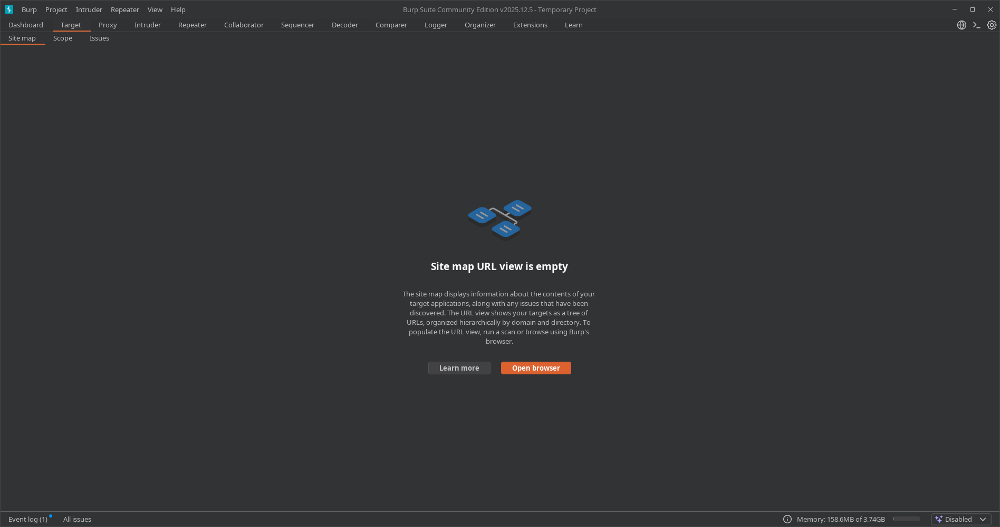
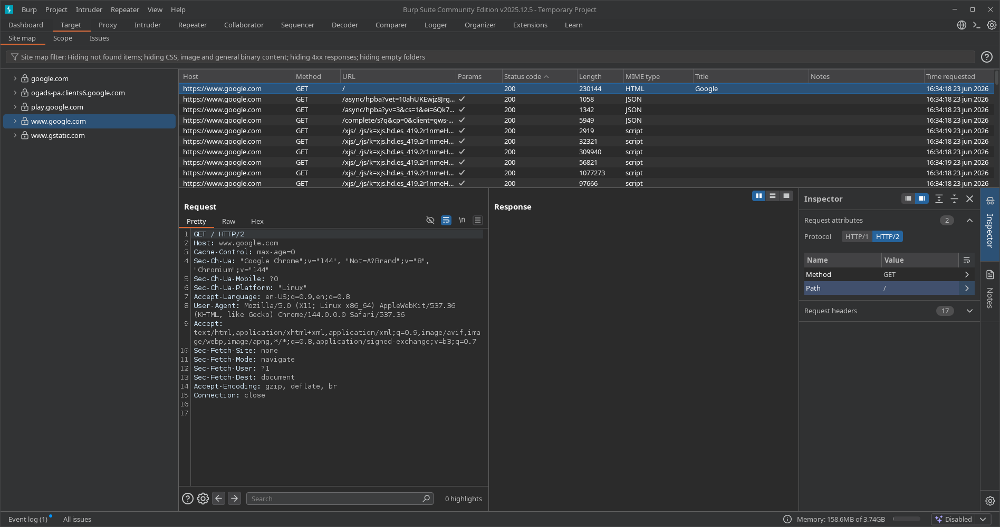
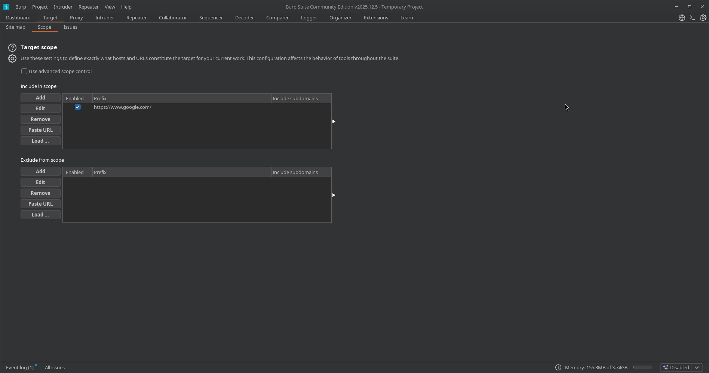
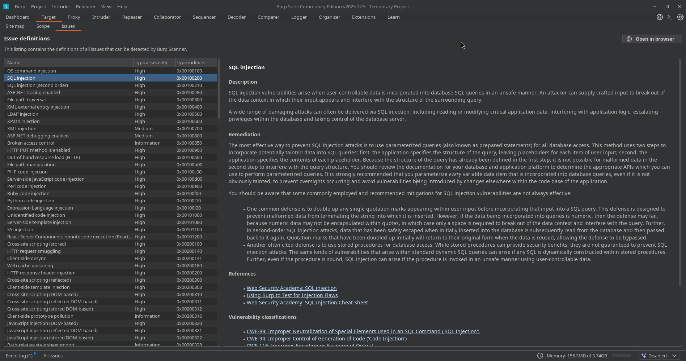

---
tags:
  - "#estructura/subseccion"
  - "#gestion/duracion/corto"
  - "#gestion/relevancia/muy-alta"
  - "#gestion/dificultad/facil"
  - "#hacking/red-team"
  - "#auditoria/reconocimiento"
  - "#herramientas/burp-suite"
  - "#formato/apunte"
  - gestion/estado/terminado
---
## 📌 Propósito Operativo
La pestaña **Target** es el punto de partida crítico de cualquier auditoría web. Su función es centralizar el reconocimiento pasivo y activo, permitiendo al auditor estructurar la superficie de ataque del objetivo. 

Operativamente nos sirve para tres cosas fundamentales:
1. **Delimitar el Scope (Alcance):** Restringir las acciones de Burp Suite para que interactúe únicamente con los dominios o IPs autorizados en el contrato de auditoría.
2. **Analizar el Site Map (Mapa del Sitio):** Visualizar de forma jerárquica la estructura de carpetas, archivos, scripts y endpoints de la aplicación web objetivo.
3. **Gestionar y Estudiar Vulnerabilidades (Issues):** Consolidar los hallazgos y acceder a la enciclopedia interna de fallos de seguridad para documentar los reportes técnicos.

---

## 🗺️ 1. Site Map (Mapa del Sitio)
A medida que el tráfico pasa por el Proxy o se ejecuta una tarea de *Crawl*, Burp Suite va construyendo un árbol con la estructura de la aplicación.

* **Panel Izquierdo (Árbol jerárquico):** Muestra los hosts, carpetas y archivos descubiertos. Los elementos en **blanco brillante** representan recursos que ya han sido visitados/solicitados; los elementos en **gris/difuminado** son recursos que Burp infiere que existen (enlaces encontrados en el código HTML) pero que aún no han sido cargados.
* **Panel Superior Derecho (Lista de Contenido):** Desglosa detalladamente cada petición individual realizada al recurso seleccionado (Método GET/POST, URL, Código de Estado HTTP, Extensión, Longitud, etc.).
* **Panel Inferior Derecho (Request / Response):** Permite inspeccionar a fondo la anatomía de la petición enviada y la respuesta exacta devuelta por el servidor.

### 🔍 Análisis de Datos en Tiempo Real (Basado en Captura Operativa)
Cuando observamos el flujo de un rastreo dinámico (como el *Live passive crawl*), la tabla de contenidos recopila metadatos críticos de cada petición. Analizando la estructura de las columnas visibles, podemos extraer la siguiente telemetría clave para auditoría:

#### A. Identificación de Hosts (`Host`)
* **Propósito:** Muestra el dominio o subdominio exacto que procesa la petición.
* **Uso en Auditoría:** Permite detectar rápidamente conexiones de terceros o fugas de datos hacia dominios externos (como `fonts.gstatic.com` o `play.google.com`). Esto ayuda al auditor a mapear dependencias de la aplicación que podrían ser vulnerables a ataques de scripts de terceros (*Supply Chain Attacks*).

#### B. Métodos HTTP (`Method`)
* **GET:** Peticiones de solicitud de recursos. La gran mayoría de consultas iniciales (scripts, imágenes, HTML base como `/warmup.html`) utilizan este método.
* **POST:** Envío de datos hacia el servidor. Es crucial monitorear estos métodos durante el reconocimiento, ya que suelen representar formularios de inicio de sesión, endpoints de APIs (`/rpc/...`) o envío de telemetría, mapeando los puntos exactos donde buscaremos inyecciones o fallos lógicos más adelante.

#### C. Códigos de Estado (`Status code`)
El servidor responde con códigos numéricos que nos indican el éxito o fracaso de la interacción:
* 🟢 **200 OK:** El recurso existe y se cargó correctamente (archivos JSON, scripts, imágenes).
* 🟡 **301 Moved Permanently:** Redirección. El servidor fuerza un salto hacia otra ubicación (visto en `google.com` hacia su subdominio `www`).
* 🔴 **404 Not Found:** El recurso no existe en el servidor. Detectar un 404 en elementos indexados (como en `/warmup.html`) nos da indicios de configuraciones antiguas del servidor o rutas mal mapeadas por la aplicación.

#### D. Tipos de Contenido (`MIME type`)
Clasifica la naturaleza del archivo devuelto por el backend:
* **HTML:** Estructura web base.
* **script / JSON:** Lógica del lado del cliente y endpoints de intercambio de datos. Identificar archivos JSON expuestos es prioritario, ya que suelen contener estructuras de APIs explotables.
* **CSS / woff / PNG / GIF:** Recursos estáticos de diseño e imágenes. Generalmente se filtran o ignoran en fases avanzadas de ataque para limpiar el ruido visual en el proxy.

### 🪵 Telemetría del Task Log & Task Progress (Panel Derecho)
* **Site map items added:** Indica el número total de nodos indexados que poblarán directamente tu pestaña Target.
* **Task log (Feed analítico):** Muestra el flujo crudo del motor de Burp. En el log se observa el análisis sintáctico automatizado: *"Adding response..."*, *"Adding form..."*. Burp Suite analiza el código de las respuestas y, si encuentra un formulario HTML (`<form>`), lo registra de inmediato para que el auditor sepa qué endpoints aceptan parámetros de entrada.

---

## 🛡️ 2. Scope (Alcance del Target) - Control Avanzado
El Scope es el escudo legal y operativo del auditor. Permite definir qué URLs entran en las pruebas y cuáles deben ser ignoradas por las herramientas de automatización de Burp.

* **Include in scope (Incluir):** Lista de expresiones regulares, IPs o dominios sobre los cuales tenemos permiso de auditoría (ej: `https://www.google.com/`).
* **Exclude from scope (Excluir):** Lista de recursos que, aun perteneciendo al cliente, no deben ser tocados (Ej: Pasarelas de pago de producción, servicios de terceros o endpoints destructivos).

### 🎛️ Opciones y Herramientas del Panel de Control (Análisis de Botones)
Al costado izquierdo de las tablas *Include* y *Exclude*, contamos con un menú de interacción crítico para gestionar el alcance de forma masiva:
* **Add / Edit / Remove:** Gestión básica e individual de filas para añadir nuevas URLs base, modificar expresiones existentes o eliminar objetivos antiguos del alcance del proyecto.
* **Paste URL (Pegar URL):** Una de las funciones más eficientes en el día a día. Permite copiar una lista de subdominios o endpoints directamente desde la terminal de Kali Linux (obtenidos de herramientas de reconocimiento pasivo o fuzzing) y pegarlos en el Scope de forma masiva con un solo clic.
* **Load ... (Cargar Archivo):** Permite importar un archivo de texto plano (`.txt`) externo con cientos o miles de URLs o rutas objetivo. Es crucial en auditorías de gran envergadura (Scope amplio) para automatizar la configuración del entorno de pruebas sin tener que ingresar datos manualmente.

### ⚙️ Advanced Scope Control (Control de Alcance Avanzado)
Justo arriba de la tabla se localiza la casilla de verificación **Use advanced scope control**. Al activarla, Burp Suite cambia su interfaz simple por una división técnica estructurada en 4 variables por cada fila:
1.  **Protocol (Protocolo):** Permite especificar si el ataque se limita a `http`, `https` o si debe aceptar ambos.
2.  **Host or IP range (Host o Rango de IPs):** Admite expresiones regulares de Regex avanzadas (Ej: `.*\.target\.com` para incluir de golpe todos los subdominios de una organización) o rangos enteros de red CIDR (Ej: `192.168.1.0/24`).
3.  **Port (Puerto):** Permite segmentar si la auditoría web se realiza en puertos no estándar (Ej: `8080`, `8443`), aislando el tráfico web del resto de puertos abiertos en el servidor.
4.  **File (Archivo / Ruta):** Restringe el alcance a un directorio o script específico dentro del servidor web (Ej: `/api/v1/`), ignorando el resto de la navegación del sitio.

---

## 🛠️ Guía Práctica: Cómo Configurar el Scope de Forma Correcta
Para evitar saturar el *Site Map* con tráfico basura (peticiones de fondo de Google, extensiones de tu navegador, telemetría, etc.), sigue esta metodología:

1. Navega hacia el sitio objetivo a través del Proxy para que aparezca en el **Site Map**.
2. Haz clic derecho sobre el dominio principal del objetivo (Ej: `http://10.10.10.X` o `https://ejemplo.com`).
3. Selecciona la opción **`Add to scope`** (Añadir al alcance).
4. Burp Suite te mostrará una ventana emergente preguntando si deseas detener la interceptación de tráfico fuera del Scope (*"Do you want Burp Proxy to stop sending out-of-scope items to the History?"*). Haz clic en **Yes**.
5. **Aplicar Filtro Visual:** Dirígete a la barra de filtro que se encuentra justo arriba del árbol del Site Map (suele decir *Filter: Showing all items*), haz clic en ella y activa la casilla **`Show only in-scope items`**.

> 💡 **Resultado:** Tu árbol se limpiará de inmediato y solo verás la información de la web que estás auditando.

🛑 **Alerta de Seguridad para el Auditor**
> ⚠️ **Regla de Oro:** Nunca lances un ataque automatizado (Intruder) ni un escaneo activo sin haber configurado y verificado previamente el Scope. Atacar un dominio o IP que no esté explícitamente listado en tu alcance puede considerarse un delito informático o generar denegación de servicio (DoS) en infraestructura no autorizada.

---

## 🚨 3. Issues (Registro y Definiciones de Vulnerabilidades)
Ubicado dentro del ecosistema del Target, el módulo de **Issues** opera de dos maneras en Burp Suite: como consola de hallazgos en tiempo real y como un diccionario estandarizado de vulnerabilidades (**Issue definitions**).

* **Lista de Issues Activos:** Agrupa los fallos de seguridad explotados o inferidos en el objetivo actual, clasificándolos por severidad mediante un código visual de colores (rojo para severidad alta, naranja para media, etc.).
* **Advisory (Asesoría Técnica Avanzada):** Al seleccionar cualquier vulnerabilidad, Burp Suite despliega un panel de inteligencia técnica que sirve como plantilla directa para reportes de auditoría.

### 🧠 Desglose de la Base de Conocimientos (Análisis de Panel de Definiciones)
El panel derecho de **Issue definitions** desglosa la información técnica bajo una estructura formal de reporte:

* **Description (Descripción de la Vulnerabilidad):**
    * *Contenido:* Explica la anatomía del fallo a nivel de código y lógica (ej: cómo la entrada del usuario se concatena directamente en una consulta SQL sin sanitizar, rompiendo el contexto de la base de datos).
    * *Uso en el Vault:* Te da el fundamento teórico preciso sobre el impacto del vector de ataque (extracción de datos, control del servidor backend, etc.).
* **Remediation (Remediación y Mitigación):**
    * *Contenido:* Establece las contramedidas de defensa en profundidad obligatorias para los desarrolladores.
    * *Detalle Técnico:* Recomienda de forma prioritaria el uso de consultas parametrizadas (*Prepared Statements*), la duplicación de comillas simples como defensa secundaria o el uso seguro de procedimientos almacenados.
* **References & Vulnerability Classifications (Referencias Cruzadas):**
    * *Contenido:* Enlaces directos a laboratorios prácticos de *Web Security Academy* y hojas de trucos (*Cheat Sheets*) para testear el fallo de forma manual.
    * *Mapeo de Estándares:* Asocia el fallo directamente con los identificadores globales de la industria MITRE:
        * `CWE-89`: Neutralización incorrecta de elementos especiales en comandos SQL (*SQL Injection*).
        * `CWE-94`: Control incorrecto de generación de código (*Code Injection*).

### 🛠️ Utilidad Práctica para tus Primeras Auditorías
Aunque tu pestaña de hallazgos esté vacía al iniciar un proyecto, la subpestaña **Issue definitions** te permite:
* **Estudiar vectores antes de atacar:** Si sabes que un servidor usa cierta tecnología, puedes buscarla en la lista por su *Type index* hexadecimal para comprender qué buscar en el Proxy.
* **Copiar y Pegar Reportes Profesionales:** Las secciones de *Description* y *Remediation* están redactadas bajo estándares internacionales de la industria. Puedes utilizarlas como base formal para rellenar los reportes técnicos que entregues a tus clientes.

---

[[Herramientas - Auditoría y Análisis Web con Burp Suite|⬅️ Volver a Burp Suite]]