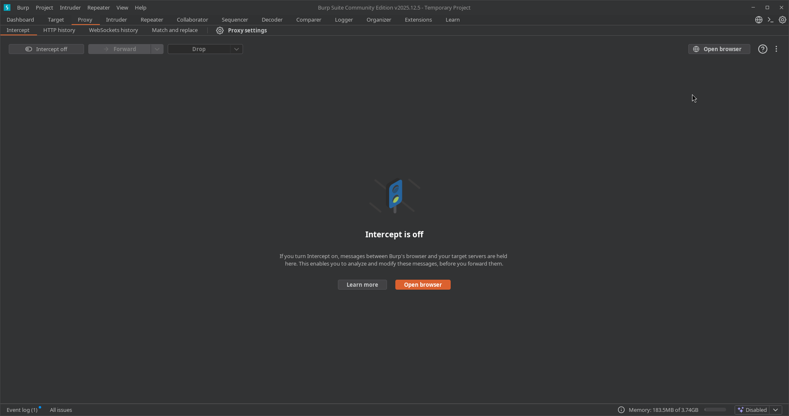
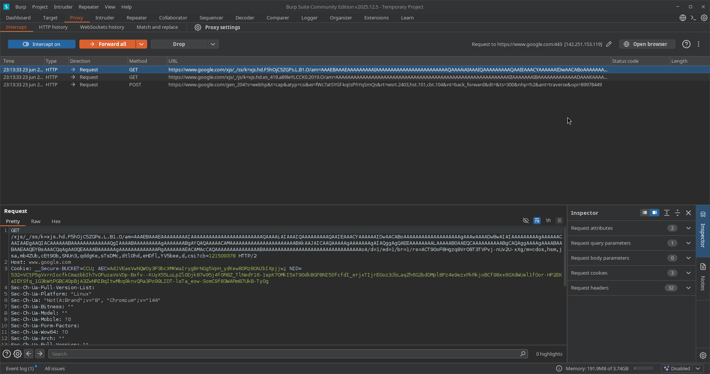
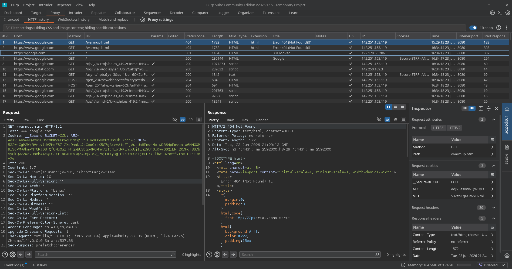
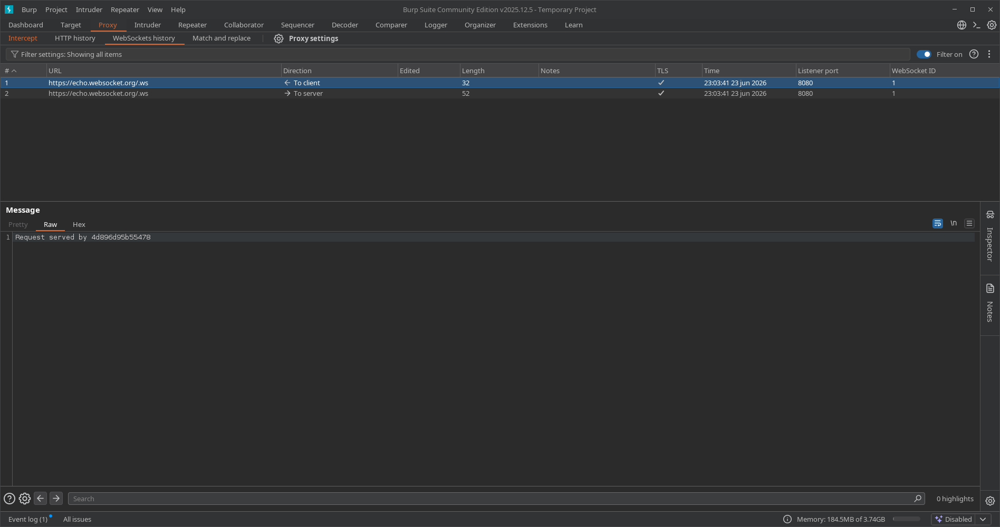
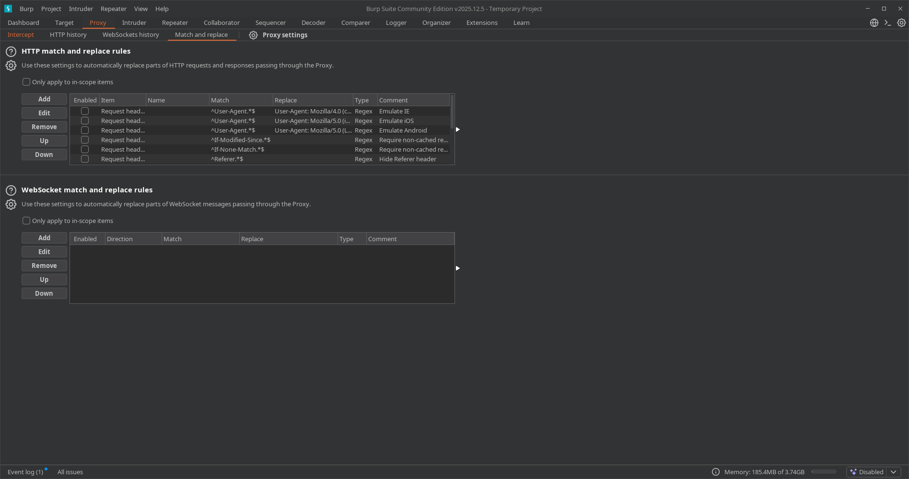
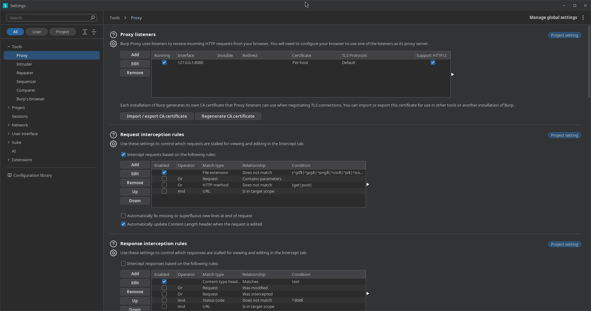
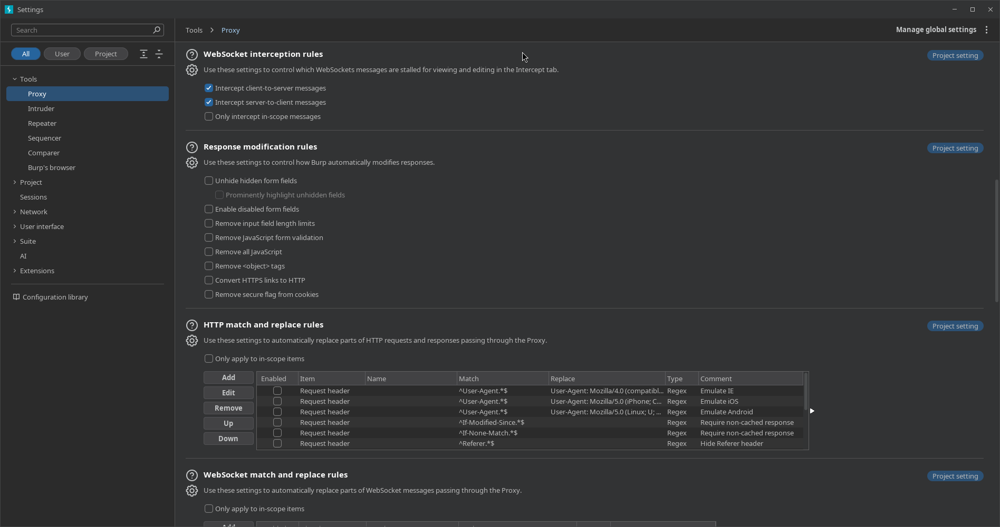
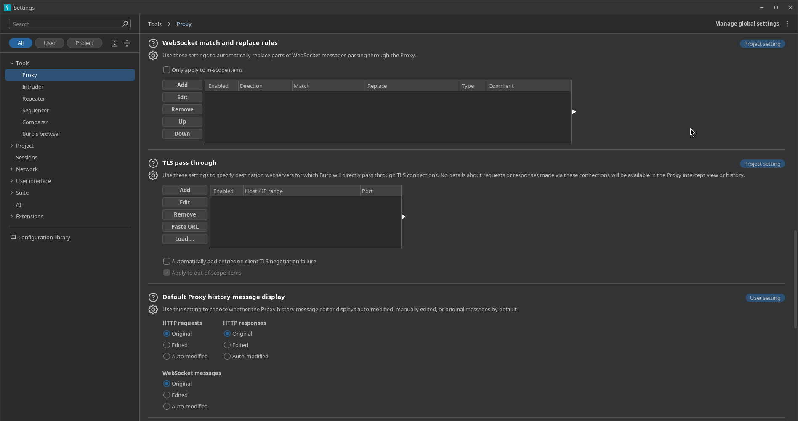
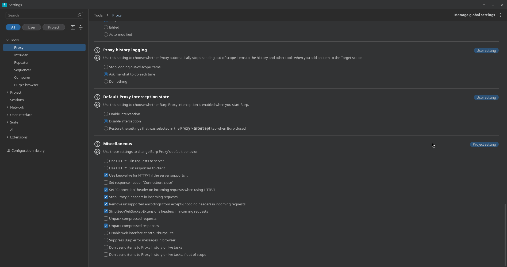
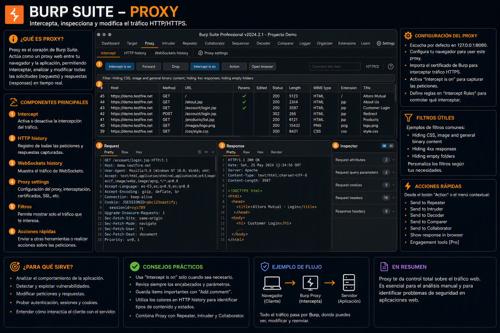

---
tags:
  - "#estructura/subseccion"
  - "#gestion/duracion/corto"
  - "#gestion/relevancia/muy-alta"
  - "#gestion/dificultad/muy-facil"
  - "#hacking/red-team"
  - "#herramientas/burp-suite"
  - "#tecnologia/servicio/http-s"
  - "#formato/apunte"
  - gestion/estado/terminado
---
### 📌 Propósito Operativo
El **Proxy** es la herramienta central e icónica de Burp Suite. Actúa como un intermediario (*Man-in-the-Middle*) situado estratégicamente entre nuestro navegador web (o cliente) y el servidor objetivo. Su función crítica en una auditoría es capturar, inspeccionar y permitir la modificación en tiempo real de todo el tráfico de la capa de aplicación, tanto las peticiones salientes (Requests) como las respuestas entrantes (Responses).

---

## 🧩 Análisis Exhaustivo de las Pestañas Principales

La sección de Proxy se segmenta operativamente en cinco sub-pestañas indispensables:

### 1. 🛑 Intercept (Interceptación en Tiempo Real)

#### 🕹️ Panel de Control Superior (Control de Flujo)
* **Botón Intercept (On / Off):** Alterna el estado del proxy. Cuando se encuentra en `Intercept on`, Burp captura las peticiones y las retiene indefinidamente. Si se desactiva (`Intercept off`), el tráfico fluye libremente pero se sigue indexando pasivamente en el *HTTP History*.
* **Forward:** Libera la petición que se muestra actualmente en pantalla (incluyendo cualquier modificación manual realizada en sus cabeceras o cuerpo) permitiéndole continuar su camino hacia el backend del servidor.
* **Drop:** Destruye el paquete de forma fulminante. El servidor nunca se entera de la existencia de esa petición y el navegador cliente rompe la carga mostrando un error de conexión vacía o cancelada.
* **Menú Desplegable Action:** Proporciona un menú contextual de escalado operativo rápido. Permite enviar el flujo de datos exacto a otros módulos (`Send to Repeater` con `Ctrl+R`, `Send to Intruder` con `Ctrl+I`), cambiar el método HTTP (convertir un `GET` a `POST` automáticamente) o forzar la interceptación de la respuesta HTTP asociada a esta petición específica mediante `Intercept response to this request`.
* **Open Browser:** Lanza una instancia integrada de Chromium preconfigurada de forma nativa para enrutar todo su tráfico a través de la interfaz del proxy de Burp, eliminando la necesidad de instalar extensiones de terceros (como FoxyProxy) o alterar los almacenes de certificados del sistema operativo anfitrión.

#### 📊 Fila de Metadatos de la Petición
Situada justo encima del visualizador, muestra la URL base completa del objetivo junto con su dirección IP de resolución y el puerto destino (Ej: `Request to https://www.google.com:443 [142.251.155.119]`). A su derecha, el icono del lápiz (`✏️`) permite reescribir manualmente el host de destino sobre la marcha.

#### 📝 Visualizador del Cuerpo del Mensaje (Panel Inferior Izquierdo)
Este subpanel presenta de manera estructurada el contenido en crudo de la petición HTTP interceptada:
* **Pestaña Pretty:** Aplica un formateo estético automático al código estructurado (JSON, XML, HTML) o payloads kilométricos de parámetros para que la lectura del auditor sea cómoda y rápida.
* **Pestaña Raw:** Muestra la petición HTTP en su estado más puro y nativo, exponiendo saltos de línea (`\r\n`), la estructura exacta de la cabecera `Host`, las directivas de seguridad como `Sec-Ch-Ua`, los valores de las `Cookies` de sesión y los tokens de autenticación en texto plano.
* **Pestaña Hex:** Expone los datos en formato hexadecimal. Es indispensable cuando se auditan subidas de archivos binarios, manipulación de caracteres nulos (`%00`) o payloads de evasión que requieren la inyección de bytes específicos no imprimibles.

#### 🔍 Panel Lateral Izquierdo: Inspector (Análisis Estructurado)
El **Inspector** segmenta matemáticamente los componentes de la petición para realizar análisis analíticos rápidos sin necesidad de buscar entre las líneas del código en crudo:
* **Request attributes:** Muestra información general del protocolo, como el método empleado (`GET`), la ruta HTTP solicitada (`/async/hpba...`) y la versión de HTTP (`HTTP/1.1`).
* **Request query parameters:** Desglosa de forma automática todos los parámetros adjuntos en la URL (los valores que siguen al símbolo `?` separados por `&`). Permite editar, añadir o borrar variables de forma aislada para buscar inyecciones como SQLi o fallos lógicos.
* **Request body parameters:** Extrae y lista los parámetros enviados dentro del cuerpo de la petición (típicos en métodos `POST` con formatos `application/x-www-form-urlencoded`).
* **Request cookies:** Mapea de forma individualizada cada una de las cookies enviadas por el navegador (como tokens `JWT`, variables `PHPSESSID` o identificadores analíticos), permitiendo alterar valores clave (como cambiar un parámetro de rol de `user` a `admin`) sin romper la estructura de la cabecera original.
* **Request headers:** Almacena de forma ordenada la totalidad de las cabeceras HTTP de la petición (`User-Agent`, `Accept-Language`, `Authorization`, etc.), facilitando la inyección automatizada de cabeceras de suplantación de IP (como `X-Forwarded-For`).

---

### 2. 🪵 HTTP History (Historial de Navegación HTTP/S)
Representa la base de datos cronológica de todo el tráfico que ha cruzado el proxy desde el inicio de la sesión.

#### 🔍 Barra de Filtros Superior
* **Filter settings:** Situada en la parte alta de la tabla, actúa como el primer escudo contra el ruido visual (Ej: `Filter settings: Hiding CSS and image content; hiding specific extensions`). Al hacer clic sobre ella, se despliega el menú de configuración que permite aislar objetivos del *Scope*, ocultar archivos estáticos redundantes o filtrar por códigos de estado específicos.
* **Filter on:** Un interruptor rápido deslizable (`on/off`) situado a la derecha que permite activar o desactivar instantáneamente las reglas de filtrado guardadas sin perder su configuración interna.

#### 📊 Columnas Analíticas de la Tabla de Historial
Cada fila representa una interacción de red indexada de forma consecutiva con las siguientes columnas de metadatos:
* **`#` (ID):** El número de índice secuencial e incremental que Burp asigna a cada petición capturada.
* **Host:** El dominio o dirección IP del servidor destino (Ej: `https://www.google.com`).
* **Method:** El verbo o método HTTP empleado en la acción (`GET`, `POST`, etc.).
* **URL:** La ruta o endpoint específico consultado dentro del servidor (Ej: `/warmup.html`).
* **Params:** Indica con una marca de verificación (`✓`) si la petición transporta parámetros en la URL (Query), en el cuerpo (Body) o en formularios multipartes, facilitando la detección rápida de puntos de inyección potenciales.
* **Edited:** Muestra si el paquete fue alterado manualmente en la pestaña *Intercept* antes de ser enviado al servidor.
* **Status code:** El código de respuesta HTTP devuelto por el backend. Es crucial para el mapeo rápido (Ej: `200 OK` para éxito, `301/302` para redirecciones, `404 Not Found` para recursos inexistentes).
* **Length:** El tamaño en bytes del cuerpo del mensaje de respuesta.
* **MIME type / Extension:** Identifica el tipo de contenido del recurso (`HTML`, `script`, `text`) junto con su extensión (`html`, `js`), ayudando a filtrar rápidamente scripts vulnerables o subidas de archivos.
* **Title:** Extrae automáticamente la etiqueta HTML `<title>` de la respuesta, permitiendo al auditor deducir el propósito de la página sin abrirla (Ej: `Error 404 (Not Found)!!!`).
* **TLS:** Una marca de verificación (`✓`) que certifica si la sesión de red viaja cifrada mediante TLS/SSL.
* **IP:** La dirección IP pública o interna del servidor remoto con el que se estableció la comunicación.
* **Cookies:** Muestra fragmentos de las cookies enviadas (Ej: `__Secure-STRIP=...`), útiles para identificar la persistencia de sesiones de usuario.
* **Time:** La marca de tiempo exacta de la ejecución de la petición.
* **Listener port:** El puerto local de Burp Suite por donde entró el tráfico (habitualmente `8080`).

---

#### 📐 Interfaz Tripartita de Inspección (Panel Inferior)
Al seleccionar cualquier petición del historial, la interfaz de Burp se divide en tres potentes paneles paralelos para una auditoría exhaustiva en pantalla dividida:

##### 📥 A. Panel de Petición (Request)
Situado abajo a la izquierda, despliega lo que el cliente envió al servidor. 
* Cuenta con las sub-pestañas **Pretty**, **Raw** y **Hex** para desglosar de forma integral el método, el host, las cookies de sesión (como `__Secure-BUCKET`, `AEC`, `NID`) y la cadena del `User-Agent` empleada por el navegador web.

##### 📤 B. Panel de Respuesta (Response)
Situado en el centro inferior, muestra de manera sincronizada la contestación exacta entregada por el servidor.
* Incluye una sub-pestaña adicional llamada **Render**, que emula de forma estática la visualización visual que vería el usuario final en su navegador (muy útil para confirmar de un vistazo páginas de error 404 o paneles administrativos bloqueados). 
* Permite auditar en crudo las cabeceras de seguridad que envía el backend (`Content-Type`, `Referrer-Policy`, `Content-Length`) y el código fuente estructurado que retorna.

##### 🔍 C. Panel Lateral Derecho: Inspector Sincronizado
El **Inspector** actúa aquí como un desglosador analítico automatizado que extrae los datos de la fila seleccionada y los organiza en menús desplegables inteligentes:
* **Request attributes:** Muestra de forma aislada el protocolo utilizado (`HTTP/1` o `HTTP/2`), el método (`GET`) y la ruta limpia analizada (`/warmup.html`).
* **Request cookies:** Extrae de manera individualizada el nombre y valor de cada cookie presente en la petición (`__Secure-BUCKET`, `AEC`, `NID`) para su estudio criptográfico o de sesión.
* **Request headers:** Agrupa numéricamente el total de cabeceras de la petición cliente (Ej: 30 cabeceras detectadas).
* **Response headers:** Desglosa de forma quirúrgica las cabeceras emitidas por el servidor web, facilitando la revisión rápida del tamaño exacto del cuerpo (`Content-Length: 1572`) y la fecha/hora exacta del backend.

---

### 3. 🔌 WebSocket History (Tráfico Bidireccional Asíncrono)
Sección especializada para el análisis de comunicaciones basadas en el protocolo WebSocket (`ws://` o `wss://`).

#### 🔍 Barra de Filtros e Historial Superior
* **Filter settings (Barra superior):** Permite aislar los canales de sockets por palabras clave o limitar la vista exclusivamente a hosts dentro del *Scope* global (Ej: `Filter settings: Showing all items`).
* **Filter on:** Interruptor deslizable para activar o mitigar los filtros de visualización sin alterar los parámetros de búsqueda interna de la sesión.

#### 📊 Columnas Técnicas del Historial de Sockets
A diferencia de la tabla HTTP convencional, las interacciones asíncronas se indexan mediante metadatos específicos del flujo continuo:
* **`#` (ID secuencial):** Identificador numérico e incremental de cada mensaje individual transmitido por el túnel.
* **URL:** La dirección del endpoint o pasarela de sockets encargada de la persistencia de datos (Ej: `https://echo.websocket.org/.ws`).
* **Direction (Dirección del Tráfico):** Campo crítico que clasifica el origen y destino del paquete:
    * `⬅️ To client`: Mensaje asíncrono empujado por el backend del servidor hacia el frontend del navegador.
    * `➡️ To server`: Payload o parámetro inyectado desde el cliente web hacia los procesos internos del servidor.
* **Edited:** Muestra si el mensaje sufrió alguna modificación manual previa.
* **Length:** El tamaño en bytes del payload o mensaje transmitido (Ej: mensajes de 32 y 52 bytes respectivamente en la captura).
* **Notes:** Comentarios u observaciones automáticas del sistema o de extensiones.
* **TLS:** Una marca de verificación (`✓`) que valida si el túnel del socket está operando bajo cifrado TLS de capa de transporte seguro (`wss`).
* **Time:** Registro cronológico de milisegundos indicando el instante preciso del envío o la recepción.
* **Listener port:** El puerto local por el que Burp intercepta y canaliza la sesión de red (comúnmente `8080`).
* **WebSocket ID:** El identificador único asignado al canal o túnel persistente. Si abres varias pestañas de chat o conexiones independientes, esta columna te ayuda a distinguir qué mensaje pertenece a qué sesión activa (Ej: ambos pertenecen a la sesión `1`).

---

#### 📐 Visualizador de Cargas Útiles (Panel de Mensaje Inferior)
Al seleccionar cualquiera de los ítems de la tabla superior, se expone el cuerpo neto del mensaje en el bloque inferior:
* **Pestaña Message:** Muestra de manera aislada el contenido limpio del paquete. Cuenta con sub-vistas tradicionales (**Pretty**, **Raw**, **Hex**) para analizar cadenas de caracteres inyectadas (como el texto plano en crudo retornando un identificador de servidor: `Request served by 4d896d95b55478`).
* **Inspector Lateral Derecho:** Al igual que en el tráfico tradicional, desglosa propiedades atómicas de la comunicación para optimizar los procesos de recolección de información.

---

### 4. 🔀 Match and Replace (Reglas de Reemplazo Automático)
Herramienta de automatización y manipulación de cadenas de texto basada en expresiones regulares (`Regex`).

#### ⚙️ Controles de Gestión de Reglas (Panel Izquierdo)
A la izquierda de cada bloque de reglas se sitúa una botonera vertical que gobierna el comportamiento de la base de datos de modificaciones:
* **Add:** Despliega una ventana emergente para parametrizar una nueva regla personalizada (tipo de datos, string de coincidencia, reemplazo y comentarios).
* **Edit:** Abre el constructor de la regla seleccionada para alterar sus expresiones regulares o cadenas de texto.
* **Remove:** Elimina de forma permanente la regla del listado.
* **Up / Down:** Modifica la jerarquía y el orden de ejecución de las reglas. Burp procesa la lista de arriba hacia abajo; la prioridad es vital cuando una regla depende de la modificación previa de otra cabecera.

---

#### 🌐 HTTP Match and Replace Rules (Bloque Superior)
Aplica modificaciones automatizadas sobre paquetes que transitan mediante HTTP o HTTPS tradicionales.
* **Casilla `Only apply to in-scope items`:** Filtro crítico. Al marcarse, restringe las sustituciones automáticas únicamente a los dominios declarados en el *Scope* global, evitando modificar accidentalmente peticiones de fondo del sistema operativo o de webs ajenas al objetivo.
* **Estructura de la Tabla de Reglas:**
    * **Enabled:** Casilla de verificación rápida para activar o pausar la regla individual sin necesidad de borrarla.
    * **Item:** Define la sección exacta del paquete donde buscar (Ej: `Request header` para cabeceras de petición, `Response body` para el cuerpo que viene del servidor, etc.).
    * **Match:** La expresión regular o literal buscada (Ej: `^User-Agent.*$` o `^Referer.*$`).
    * **Replace:** El valor arbitrario o modificado que suplantará a la cadena original (Ej: payloads para emular navegadores móviles o IE).
    * **Type:** El motor de procesamiento usado (típicamente `Regex`).
    * **Comment:** Nota descriptiva de su propósito operativo.

##### 📋 Reglas por Defecto Incluidas (Casos de Uso del Sistema):
* **Emulación de Dispositivos / User-Agent Bypass:** Incluye reglas (desactivadas por defecto) para suplantar la identidad del navegador simulando entornos como *Internet Explorer (IE)*, *iOS (iPhone)* o *Android*. Útil para forzar al servidor a entregar layouts móviles o lógicas simplificadas propensas a fallos.
* **Forzar Carga Limpia (`Require non-cached response`):** Reglas dirigidas a buscar las cabeceras `If-Modified-Since` e `If-None-Match` para eliminarlas de la petición saliente (`Replace` en blanco). Esto obliga al servidor web a responder siempre con el recurso completo actualizado (`200 OK`) en lugar de una respuesta de caché (`304 Not Modified`), garantizando que Burp analice código fresco.
* **Privacidad y Evasión (`Hide Referer header`):** Busca la cabecera `^Referer.*$` y la remueve para evitar que el servidor destino rastree el origen de la navegación del auditor.

---

#### 🔌 WebSocket Match and Replace Rules (Bloque Inferior)
Sección homóloga diseñada específicamente para interceptar y alterar los mensajes que viajan a través de canales de comunicación persistentes y bidireccionales (`ws://` y `wss://`).
* Cuenta con su propio control de exclusión para aplicar sustituciones únicamente a elementos en *Scope* (`Only apply to in-scope items`).
* **Columna `Direction`:** Campo exclusivo en esta tabla que condiciona la regla según la dirección del flujo del socket, permitiendo aplicar el reemplazo automatizado únicamente cuando el mensaje va hacia el servidor (`To server`) o cuando viaja hacia el navegador del cliente (`To client`).

---

#### 🚀 Vectores Tácticos y Casos de Uso Comunes en Red Team:
* **Suplantación de Roles / Escalada de Privilegios:** Crear una regla que busque de forma masiva en las cabeceras de petición (`Request header`) la cadena `Cookie: role=user` y la sustituya automáticamente por `Cookie: role=admin`, forzando accesos sin necesidad de modificar cada paquete en el *Intercept*.
* **Bypass de Validaciones en el Cliente (Client-Side Validation Bypass):** Configurar una regla orientada al cuerpo de la respuesta (`Response body`) que lofalice funciones restrictivas de JavaScript (Ej: cambiar `validateInput(){return true}` en lugar de la lógica compleja) eliminando trabas de formularios antes de que impacten en el navegador.
* **Inyección de Cabeceras de Suplantación de IP (WAF / Network Bypass):** Añadir una regla que inyecte de manera sistemática en cada petición saliente cabeceras críticas como `X-Forwarded-For: 127.0.0.1` o `X-Client-IP: 127.0.0.1` para confundir proxies inversos, evadir geobloqueos o simular que las peticiones se originan desde la red interna del propio servidor.

---

### 5. ⚙️ Proxy Settings (Configuración del Entorno de Red)
Permite definir la escucha de interfaces, automatizar la alteración de flujos criptográficos TLS y parametrizar las reglas lógicas que deciden qué paquetes congelar.

#### 🌐 1. Gestión de Interfaces y Tráfico Inicial

##### A. Proxy listeners (Oyentes del Proxy)
* **Tabla de Interfaces:** Muestra los sockets activos donde Burp Suite escucha el tráfico. Por defecto se establece en `127.0.0.1:8080` (bucle de retorno local).
    * `Running`: Casilla de verificación que indica si el puerto está abierto con éxito. Si otra aplicación del sistema ya usa el puerto 8080, se desmarcará automáticamente.
    * `Invisible`: Modo especial para interceptar aplicaciones cliente que no admiten proxies de manera nativa (fuerza la redirección a nivel de red).
    * `Certificate`: Define la política de generación de certificados TLS (por defecto `Per-host`).
    * `Support HTTP/2`: Habilita la negociación y soporte para peticiones bajo la infraestructura del protocolo HTTP/2.
* **Import / export CA certificate:** Botón crucial para extraer la llave pública del certificado raíz `PortSwigger CA`. Al instalarlo en el almacén del sistema o del navegador, se rompe el cifrado HTTPS de forma controlada sin alertas de seguridad.
* **Regenerate CA certificate:** Genera un certificado raíz completamente nuevo. Es la solución recomendada cuando el certificado previo expira o genera conflictos de confianza.

##### B. Request interception rules (Reglas de Interceptación de Peticiones)
Gobierna qué peticiones se detendrán en la pestaña *Intercept*.
* **Regla por defecto (File extension):** Viene activa una regla tipo *Regex* que descarta (`Does not match`) extensiones comunes de archivos estáticos: `(^gif$|^jpg$|^png$|^css$|^js$|...)`. Esto evita que la interfaz se congele de forma molesta con imágenes u hojas de estilo.
* **Casillas de control inferiores:**
    * `Automatically fix missing or superfluous new lines at end of request`: Corrige automáticamente la sintaxis HTTP al final de los paquetes agregando los saltos de línea reglamentarios (`\r\n`).
    * `Automatically update Content-Length header when the request is edited`: *(Activa por defecto)* Si modificas manualmente el tamaño de un payload dentro de *Intercept*, Burp recalcula y actualiza la cabecera `Content-Length` para que el servidor no descarte la petición por corrupción de tamaño.

##### C. Response interception rules (Reglas de Interceptación de Respuestas)
* Condiciona la detención de paquetes que viajan de regreso desde el servidor hacia el cliente. Por defecto, incluye reglas lógicas para interceptar únicamente respuestas cuyo tipo de contenido (`Content type header`) coincida con el formato `text` (HTML, scripts, etc.), ignorando binarios o descargas pesadas.

---

#### 🎛️ 2. Automatización del Cliente y Reglas de Coincidencia

##### A. WebSocket interception rules
* Controla el comportamiento de congelación en canales de comunicación persistentes. Cuenta con dos casillas independientes para interceptar de forma aislada los mensajes del cliente al servidor (`Intercept client-to-server messages`) o del servidor al cliente (`Intercept server-to-client messages`).

##### B. Response modification rules (Reglas de Modificación de Respuestas)
Automatizaciones brutas de seguridad defensiva aplicadas sobre las respuestas del servidor antes de que impacten al navegador:
* `Unhide hidden form fields`: Fuerza a que todos los campos ocultos de los formularios (`type="hidden"`) se rendericen visibles. Excelente vector para identificar parámetros de control de precios o roles que los desarrolladores ocultan al usuario común.
* `Enable disabled form fields`: Elimina el atributo `disabled` de los elementos de formularios, permitiendo interactuar con botones o campos restringidos desde la interfaz visual.
* `Remove input field length limits`: Borra las restricciones de longitud máxima (`maxlength`) en los campos de entrada de texto, facilitando la inserción de payloads kilométricos de *XSS* o *SQLi* directamente desde la web.
* `Remove JavaScript form validation`: Deshabilita los scripts de validación del lado del cliente.
* `Remove all JavaScript`: Remueve por completo las etiquetas `<script>` de los sitios web consultados.
* `Remove <object> tags` / `Convert HTTPS links to HTTP`: Opciones heredadas para auditorías de compatibilidad y rebaja de cifrado (SSL Striping).
* `Remove secure flag from cookies`: Remueve la bandera `Secure` de las cookies transmitidas, lo que permite su viaje a través de canales HTTP no cifrados para vectorizar secuestros de sesión.

##### C. HTTP / WebSocket match and replace rules
* Espejo de configuración global para añadir o editar las reglas de expresiones regulares (`Regex`) automatizadas descritas en el bloque principal del módulo.

---

#### 🔒 3. Túneles y Modos de Visualización

##### A. TLS pass through (Pasar a través de TLS)
* Permite definir una lista de dominios o rangos IP específicos hacia los cuales Burp Suite transmitirá las conexiones TLS/SSL de forma directa, **sin descifrar el tráfico**.
* **Propósito táctico:** Si una aplicación implementa esquemas estrictos de *SSL Pinning* que bloquean el funcionamiento del proxy, o si deseas omitir el tráfico masivo hacia plataformas de actualización del sistema operativo (como servidores de Windows Update), añades el host a esta tabla para aliviar el procesamiento de la CPU.

##### B. Default Proxy history message display
Establece qué versión del paquete se renderizará de forma predeterminada al consultar el *HTTP History* o el *WebSocket History*:
* `Original`: Muestra el paquete tal y como fue concebido en primera instancia.
* `Edited`: Muestra las modificaciones manuales inyectadas durante la interceptación.
* `Auto-modified`: Muestra el estado final del paquete tras haber sido procesado por las reglas automáticas de *Match and Replace*.

---

#### 🪵 4. Comportamiento del Sistema y Miscelánea

##### A. Proxy history logging
* Define las directivas de almacenamiento cuando se trabaja con el Scope del proyecto. Cuenta con la opción interactiva `Ask me what to do each time` (*Preguntarme qué hacer cada vez*), la cual despliega una alerta al auditor si detecta que se están indexando URLs que quedan fuera de los límites autorizados de la auditoría.

##### B. Default Proxy interception state
* Dictamina si Burp Suite debe iniciar con la pestaña *Intercept* encendida o apagada cada vez que abras el software. La buena práctica dicta dejarlo configurado en `Disable interception` para evitar bloqueos indeseados de red en el arranque.

##### C. Miscellaneous (Miscelánea y Ajustes del Protocolo)
Colección de selectores avanzados de ingeniería de bajo nivel sobre las conexiones HTTP/1:
* `Use HTTP/1.0 in requests to server` / `responses to client`: Degradan la versión del protocolo a HTTP/1.0 para entornos antiguos.
* `Use keep-alive for HTTP/1 if the server supports it`: *(Activa por defecto)* Mantiene abiertos los canales de red TCP para agilizar la transmisión y ahorrar recursos del sistema operativo.
* `Strip Proxy-* headers in incoming requests`: *(Activa por defecto)* Remueve cabeceras de proxy intermedias para limpiar las peticiones salientes hacia el objetivo.
* `Remove unsupported encodings from Accept-Encoding headers`: Modifica la cabecera cliente para indicarle al servidor que no envíe formatos de compresión extraños que Burp no pueda decompressar en las pestañas *Pretty* o *Raw*.
* `Unpack compressed responses`: *(Activa por defecto)* Descomprime automáticamente payloads en formatos GZIP/Deflate para que el código fuente de las respuestas siempre aparezca visible en texto claro.
* `Don't send items to Proxy history or live tasks, if out of scope`: Restringe de forma drástica el uso de memoria RAM evitando procesar o guardar datos de cualquier host que no esté explícitamente añadido al Scope operativo.

---

## 🛠️ Buenas Prácticas del Auditor en el módulo Proxy

* **Mantener Apagado el Intercept por Defecto:** Para evitar cuellos de botella e interrupciones molestas durante la exploración inicial, navega con la pestaña *Intercept en OFF*. Deja que todo se registre fluidamente en el *HTTP History* y, posteriormente, envía las peticiones específicas de tu interés hacia el *Repeater* para su explotación controlada.
* **Uso Riguroso del Scope:** El *HTTP History* puede llenarse rápidamente con cientos de peticiones a servicios en segundo plano de tu sistema operativo (telemetría de navegadores, actualizaciones de sistema). Aplica el filtro `Show only in-scope items` de inmediato para centrar tu atención exclusivamente en los activos autorizados de la auditoría.

---

[[Herramientas - Auditoría y Análisis Web con Burp Suite|⬅️ Volver a Burp Suite]]