---
tags:
  - "#estructura/subseccion"
  - "#gestion/duracion/corto"
  - "#gestion/relevancia/muy-alta"
  - "#gestion/dificultad/normal"
  - "#hacking/red-team"
  - "#herramientas/burp-suite"
  - "#tecnologia/servicio/http-s"
  - "#formato/apunte"
  - gestion/estado/terminado
---
## 📌 Propósito Operativo del Módulo
El **Intruder** es el motor de automatización y fuzzing integrado en Burp Suite. Su función principal en auditorías de seguridad y ejercicios de Red Team es la parametrización de peticiones HTTP/S. Permite tomar una solicitud base aislada por el Proxy y lanzar ráfagas masivas de paquetes modificados de forma controlada. Es la alternativa gráfica a herramientas de terminal como `wfuzz` o `ffuf`, optimizada para la identificación de inyecciones de código (SQLi, XSS), descubrimiento de rutas ocultas, enumeración de usuarios y ataques de fuerza bruta.

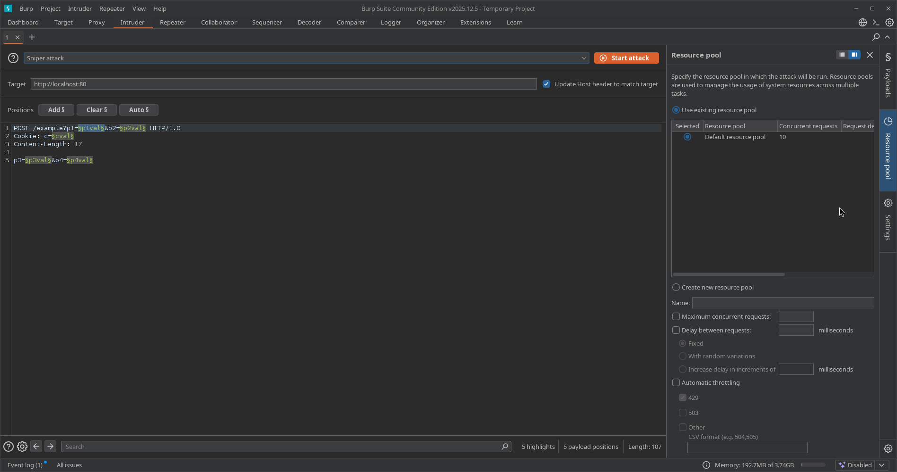

---

## 🎛️ 1. Panel Principal: Target y Positions

Este panel gobierna las coordenadas del objetivo web y la estructura del paquete HTTP donde se inyectarán las cargas útiles (*payloads*).

### A. Sección Target (Configuración del Destino)
Ubicada en la parte superior del panel. Define explícitamente hacia dónde se enrutará el tráfico generado:
* **Host / Port / Use HTTPS:** Determina la dirección IP o dominio de la víctima, el puerto de escucha y si la comunicación viaja cifrada mediante TLS.
* **Update Host header to match target:** Casilla de verificación crítica. Al activarse, Burp reescribe automáticamente la cabecera `Host:` dentro de la petición HTTP para que coincida con el destino configurado. Esto evita que los firewalls de aplicación o proxies inversos (como Cloudflare o Nginx) descarten los paquetes por inconsistencia en el enrutamiento.

### B. Sección Positions (Marcadores de Posición)
Muestra el cuerpo completo de la petición HTTP en texto plano. El objetivo es delimitar mediante los símbolos de sección (`§...§`) cuáles serán las variables dinámicas que se sustituirán por el diccionario durante el ataque.

* **Botonera de Control Lateral:**
    * **Add §:** Envuelve la cadena de texto seleccionada manualmente entre marcadores de posición.
    * **Clear §:** Remueve todos los marcadores presentes en el paquete, dejando el texto limpio para una asignación manual precisa.
    * **Auto §:** Aplica un análisis heurístico para identificar parámetros comunes (valores de formularios POST, cadenas de consulta en GET, cookies o atributos JSON) y colocar marcadores automáticamente.
    * **Refresh:** Actualiza el renderizado visual de la petición en la interfaz.

### C. Attack Type (Tipos de Ataque)
Menú desplegable que define la estrategia matemática y la distribución de los diccionarios sobre las posiciones marcadas:

* **Sniper (Francotirador):** Utiliza un **único diccionario**. Coloca el primer payload en la primera posición, limpia el marcador, pasa a la segunda posición y repite el proceso. Es el modo más común para buscar vulnerabilidades individuales como *SQL Injection* o *XSS* en múltiples parámetros a la vez.
* **Battering Ram (Ariete):** Utiliza un **único diccionario**. Clona e inyecta exactamente la **misma palabra en todas las posiciones marcadas de forma simultánea**. Utilizado en escenarios específicos donde se requiere repetir un token idéntico en dos cabeceras o parámetros distintos a la vez.
* **Pitchfork (Horca):** Requiere **múltiples diccionarios en paralelo** (uno por cada marcador configurado). Avanza de forma estrictamente lineal: toma la línea 1 del diccionario A para el marcador 1, y la línea 1 del diccionario B para el marcador 2. Es ideal para probar pares de credenciales (usuario/clave) extraídos previamente donde ya se conoce la relación exacta entre ellos.
* **Cluster Bomb (Bomba de Racimo):** Requiere **múltiples diccionarios** y opera de forma combinatoria cruzada. Prueba **todas las permutaciones posibles** (combina la línea 1 del diccionario A con la totalidad de líneas del diccionario B). Es el tipo de ataque de mayor consumo de procesamiento y red, indispensable para realizar ataques de fuerza bruta pura contra paneles de autenticación sin datos previos.

---

## 💣 2. Panel Lateral: Payloads (Gestión de Cargas Útiles)

Este panel controla el "arsenal" o los datos crudos que rellenarán los marcadores definidos en la sección anterior.

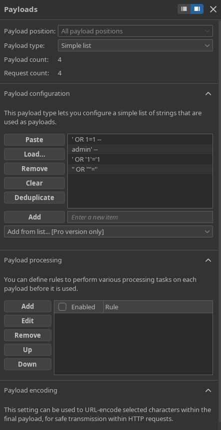

### A. Payload Sets (Asignación de Listas)
* **Payload position:** Permite alternar la configuración entre los distintos marcadores disponibles (habilitado cuando se usan ataques tipo *Pitchfork* o *Cluster Bomb*).
* **Payload type:** Define la lógica de generación del diccionario. Las opciones principales incluyen:
    * **Simple list:** Carga manual de palabras o importación de archivos de texto estándar (`.txt`).
    * **Runtime file:** Lee un archivo externo directamente desde el disco en tiempo de ejecución. Evita que Burp Suite cargue diccionarios masivos (de gigabytes) en la memoria RAM, previniendo cuelgues de la herramienta.
    * **Numbers / Dates:** Generadores automáticos basados en secuencias numéricas (rangos con pasos específicos) o cronológicas, ideales para auditorías de IDOR o enumeración de identificadores secuenciales.
    * **Brute forcer:** Generador matemático que calcula combinaciones de caracteres basadas en un set de entrada (ej: `abcdef123`) y longitudes mínimas/máximas.

### B. Payload Configuration
Espacio dedicado para previsualizar, pegar (`Paste`), cargar (`Load`), remover (`Remove`) o limpiar (`Clear`) las cadenas de texto del diccionario activo. El botón `Deduplicate` permite limpiar payloads repetidos al instante para optimizar el tiempo de ataque.

### C. Payload Processing (Reglas de Modificación en Tiempo Real)
Permite alterar o transformar las cadenas del diccionario justo una fracción de segundo antes de que sean inyectadas en la petición web:
* **Match and replace:** Reemplaza expresiones regulares o caracteres específicos dentro de cada palabra del diccionario.
* **Prefix / Suffix:** Añade texto estático al inicio o al final de cada payload (ej: añadir un token de comentario `--` al final de cada payload de inyección).
* **Encoder / Hash:** Transforma el payload aplicando codificaciones criptográficas o de formato al vuelo (ej: calcular el hash *MD5*, *SHA-256* o codificar en *Base64* antes del envío).

### D. Payload Encoding (Codificación de Red)
* **Casilla "Url-encode these characters":** Configura a Burp para sustituir automáticamente caracteres especiales que puedan corromper la estructura del protocolo HTTP (como espacios, comillas o símbolos `=`, `&`) por su equivalente seguro en formato URL percent-encoding (ej: convirtiendo un espacio en `+` o `%20`).

---

## 🏎️ 3. Panel Lateral: Resource Pool (Optimización de Rendimiento)

Este panel regula la velocidad de transmisión, la concurrencia de la red y el comportamiento del tráfico para balancear la eficiencia del ataque y la estabilidad del servidor objetivo.

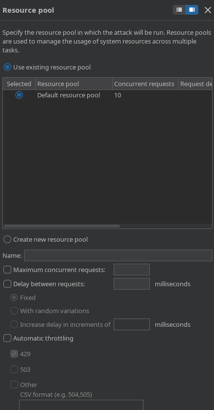

* **Maximum concurrent requests (Hilos de ejecución):** Define el límite máximo de peticiones HTTP simultáneas que se enviarán en paralelo. *Nota técnica:* La versión *Burp Suite Community* introduce una limitación/ralentización por software en este apartado; la versión *Professional* permite desatar ráfagas ilimitadas según la capacidad del hardware del auditor.
* **Delay between requests (Retraso de Red):** Establece una pausa obligatoria (medida en milisegundos) entre cada petición. Es una técnica de evasión fundamental para:
    1. No tumbar servicios web inestables por Denegación de Servicio (DoS).
    2. Evadir sistemas de protección perimetral basados en control de tasa de transferencia (*Rate Limiting*).
* **Automatic throttling (Retraso Aleatorio):** Permite introducir una variación porcentual aleatoria sobre el tiempo de retraso para emular patrones de navegación humana y dificultar la detección por firmas de automatización en los SIEM de los equipos de defensa (Blue Team).

---

## ⚙️ 4. Panel Lateral: Settings (Políticas de Éxito y Extracción)

Modula las directrices operacionales de red, la resiliencia de la comunicación y las metodologías analíticas aplicadas sobre las respuestas HTTP devueltas por la aplicación web atacada.

---

### A. Control de Información y Red (Request Headers, Error Handling & Attack Results)

Esta sección define el comportamiento de bajo nivel del protocolo HTTP, la tolerancia a fallas en canales inestables y las políticas de almacenamiento en disco del tráfico generado.

* **Save attack to project file [Pro version only]:** Permite guardar de manera permanente el progreso, la configuración estructural y los resultados analíticos del ataque directamente dentro del archivo de proyecto de Burp Suite. Si se desactiva, los datos de la ráfaga se perderán al cerrar la ventana.
* **Request headers (Modificación de Encabezados):**
    * `Update Content-Length header`: Directiva técnica obligatoria cuando se inyectan payloads de longitudes variables. Al estar activo, Burp recalcula y sobrescribe automáticamente la cabecera `Content-Length:` de cada petición saliente. Si se desactiva, el servidor web descartará el paquete por corrupción de sintaxis o truncará la carga útil.
    * `Set Connection: close`: Inserta o fuerza la directiva `Connection: close` en las solicitudes entrantes. Esto le indica al servidor web que debe cerrar el socket TCP inmediatamente después de responder a la solicitud, previniendo el agotamiento y retención de conexiones abiertas en el backend del objetivo.
* **Error handling (Tolerancia a Fallos):**
    * `Number of retries on network failure`: Especifica la cantidad de veces correlativas (por ejemplo, `3`) que el motor intentará reenviar una misma petición si ocurre un error de red o un descarte de socket inesperado antes de marcar la solicitud como fallida.
    * `Pause before retry (milliseconds)`: Tiempo de mitigación estático (por ejemplo, `2000` ms) que Burp dejará pasar antes de lanzar el reintento configurado, permitiendo la estabilización temporal de la conexión de red.
* **Attack results (Políticas de Almacenamiento):**
    * `Store requests` / `Store responses`: Almacena una copia idéntica en tiempo real de cada paquete enviado y cada respuesta recibida en la memoria del proyecto. Desmarcarlo optimiza drásticamente el uso de memoria RAM y espacio en disco durante ataques masivos de millones de peticiones.
    * `Make unmodified baseline request`: Envía una petición inicial limpia (sin alterar los marcadores), identificada como la solicitud `0` en la tabla de resultados, sirviendo como punto de comparación analítico de longitud y tiempo de respuesta.
    * `Use denial-of-service mode (no results)`: Ejecuta la ráfaga de peticiones pero descarta inmediatamente las respuestas sin procesar la tabla de resultados. Diseñado exclusivamente para pruebas de estrés de infraestructura o denegación de servicio controladas.
    * `Store full payloads`: Almacena la cadena completa generada en memoria, requisito necesario si se aplican reglas de procesamiento complejas sobre los diccionarios.

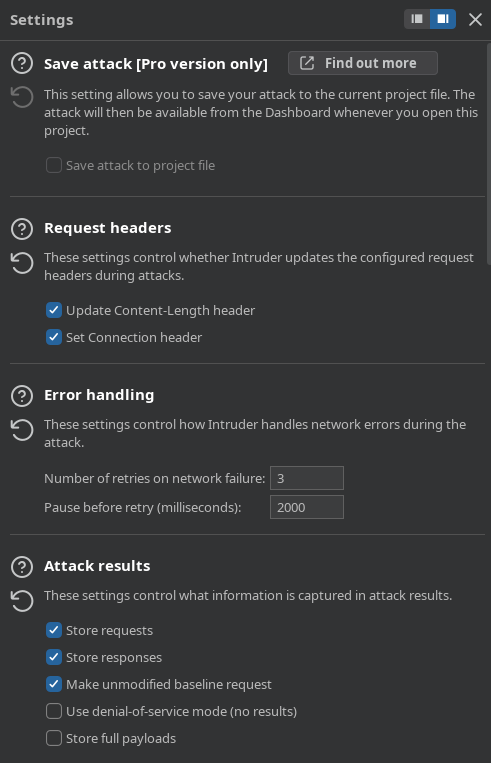

---

### B. Identificación Automática y Firmas (Auto-pause & Grep - Match)

Esta sección delega en el software la capacidad de pausar el ataque reactivamente ante eventos imprevistos y permite mapear el comportamiento del servidor mediante firmas.

* **Auto-pause attack (Pausa Automatizada):**
    * `Enable auto-pause`: Detiene temporalmente la ráfaga de peticiones de manera automatizada bajo dos lógicas operacionales excluyentes:
        * *Pause if an expression in the list appears in a response*: Pausa el ataque si se detecta un término clave (ej: un bloqueo explícito por WAF, páginas de captcha o un código de error *Rate Limit* activo).
        * *Pause if an expression in the list is missing from a response*: Pausa el ataque si deja de reflejarse una firma o patrón que validaba la continuidad del servicio web.
    * *Botonera de Control (Add, Paste, Remove, Clear)*: Permite poblar el listado de expresiones, permitiendo evaluar la coincidencia como texto plano (`Simple string`) o como expresión regular avanzada (`Regex`), discriminando o no el uso de mayúsculas (`Case-sensitive match`).
* **Grep - Match (Filtrado por Firmas Estáticas):**
    * `Flag responses matching these expressions`: Escanea el cuerpo y las cabeceras de las respuestas HTTP en busca de expresiones regulares o cadenas estáticas de texto plano (ej: `"access"`, `"not found"`, `"SQL Syntax Error"`, `"Invalid password"`).
    * *Mecanismo Operativo*: Por cada término declarado en la lista, Burp Intruder añade una columna dedicada en la tabla de resultados en ejecución. Si la firma se encuentra en la respuesta HTTP, marcará la celda con un `✓`, aislando visualmente anomalías o payloads exitosos sin necesidad de inspeccionar el código fuente de forma manual.

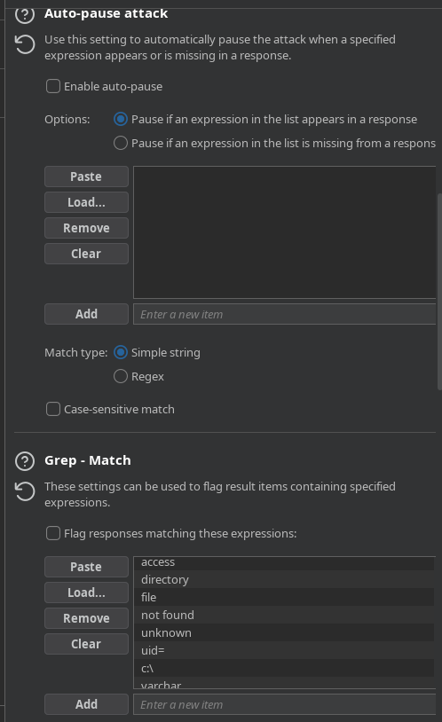

---

### C. Extracción, Enrutamiento y Reflexión (Grep - Extract, Grep - Payloads & Redirections)

Gobierna la recolección quirúrgica de información dentro de las respuestas devueltas y define las políticas de navegación ante códigos de redireccionamiento.

* **Grep - Extract (Minería de Datos Estructurados):**
    * `Extract the following items from responses`: Habilita al auditor para definir expresiones o delimitadores de inicio y fin dentro del código fuente de la respuesta (HTML, JSON, XML). Cada dato atrapado entre dichos límites se extraerá y se ordenará en una columna propia en la tabla de resultados. Es la función estándar para automatizar tareas de exfiltración de bases de datos o recolección masiva de nombres/correos en ataques IDOR.
    * `Maximum capture length`: Limita el tamaño máximo en caracteres (por ejemplo, `100`) del fragmento extraído para evitar desbordamientos de texto en la interfaz gráfica del analista.
* **Grep - Payloads (Análisis de Reflexión):**
    * `Search responses for payload strings`: Fuerza al motor a escanear la respuesta del servidor en busca de la misma cadena exacta enviada en la petición.
    * *Opciones Avanzadas*:
        * *Case sensitive match*: Distingue rigurosamente entre mayúsculas y minúsculas.
        * *Exclude HTTP headers*: Ignora los encabezados de red y busca la reflexión únicamente dentro del cuerpo (*body*) HTML/JSON de la respuesta, minimizando falsos positivos.
        * *Match against pre-URL-encoded payloads*: Compara la respuesta contra el payload original antes de haber sufrido la codificación URL de red. Esta sección es el estándar de la industria para detectar vulnerabilidades de Cross-Site Scripting Reflejado (*Reflected XSS*).
* **Redirections (Control de Redireccionamiento):**
    Determina las acciones del motor cuando el servidor web responde con códigos de estado de la familia `3xx`:
    * `Never`: Ignora la redirección y procesa directamente el paquete `3xx` recibido. Es la configuración estándar para auditorías de *Login Bypass* mediante inyecciones SQL, donde el éxito se manifiesta con un código `302 Found`.
    * `On-site only`: Sigue de manera secuencial la redirección solo si el destino pertenece al mismo host y dominio configurado originalmente en el ataque.
    * `In-scope only`: Sigue el redireccionamiento únicamente si la URL destino está declarada explícitamente dentro del alcance global del proyecto (*Target Scope*).
    * `Always`: Sigue cualquier redirección de forma ciega, sin importar si apunta a hosts externos fuera de control.
    * `Process cookies in redirections`: Al activarse, Burp interceptará y mantendrá en memoria las cookies que el servidor intermedio establezca a través de la cabecera `Set-Cookie` durante el salto de redirección, reutilizándolas en la petición del destino final.

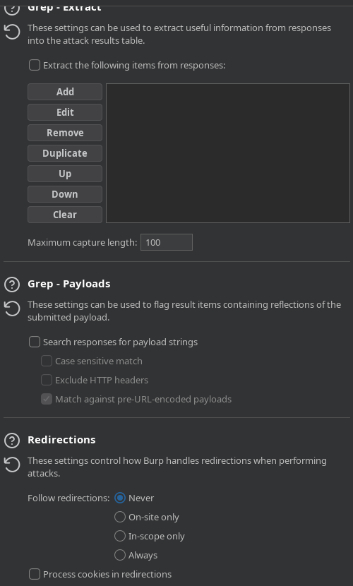

---

### D. Rendimiento del Protocolo (HTTP/1 Connection Reuse & HTTP Version)

Controla la reutilización de canales de comunicación físicos y la compatibilidad de versiones de red en el ataque para maximizar el rendimiento.

* **HTTP/1 connection reuse (Reutilización de Sockets):**
    * `Override the project-level HTTP/1 setting`: Sobrescribe la directiva de conexión global de Burp Suite exclusivamente para este ataque automatizado.
    * `Reuse HTTP/1 connections if the server supports it`: Activa la persistencia de canal. Burp Suite intentará enviar múltiples payloads de manera secuencial a través de un único socket TCP abierto. Esto acelera drásticamente la tasa de peticiones por segundo al remover la latencia que genera abrir y cerrar la conexión (fases de *TCP Handshake* y *TLS Negotiation*) en cada intento.
* **HTTP version (Degradación y Compatibilidad):**
    * `Override the project-level HTTP/2 setting`: Permite forzar el comportamiento de la versión del protocolo ignorando las directivas por defecto del proyecto.
    * `Default to HTTP/2 if the server supports it`: Si se desmarca, fuerza al Intruder a degradar todas las peticiones salientes estrictamente al formato clásico `HTTP/1.1` u `HTTP/1.0`. Es una función clave cuando se auditan servidores antiguos o sistemas donde el soporte de HTTP/2 en herramientas automatizadas genera errores de sincronización o falsos negativos.

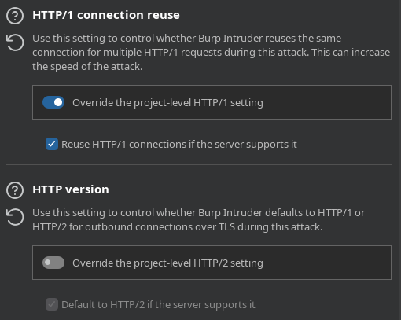

---

### E. Settings Generales (Configuración de la Interfaz y Task Engine)

Esta sección engloba las directrices de control operacional globales para la tarea activa del Intruder. A diferencia de las secciones anteriores, este panel no altera el contenido de los paquetes HTTP, sino que define cómo se comporta la interfaz gráfica de Burp Suite frente al usuario y cómo el motor interno gestiona los recursos del sistema durante la ejecución del ataque.

* **Formulario de Visualización y Consumo (View Settings):**
    * `In-task view only`: Almacena y renderiza los resultados exclusivamente dentro del árbol jerárquico interno de la tarea actual. Desmarcarlo permite enviar los datos hacia otros módulos analíticos globales del proyecto de forma simultánea.
    * `Save table layout`: Guarda de forma fija el ancho de las columnas, el ordenamiento personalizado y los filtros de la tabla que el auditor haya modificado manualmente en la interfaz. Evita tener que reconfigurar la visualización cada vez que se abre la ventana de resultados.
* **Depuración e Inspección (Console UI):**
    * `Show panel for JavaScript console logs`: Habilita una pestaña complementaria en la parte inferior de la ventana del ataque diseñada para registrar errores o mensajes provenientes del motor de ejecución de JavaScript de Burp Suite. Es una función esencial para diagnosticar fallas cuando se integran extensiones complejas (`BApp Store`) que interactúan directamente con el ciclo de vida del Intruder.

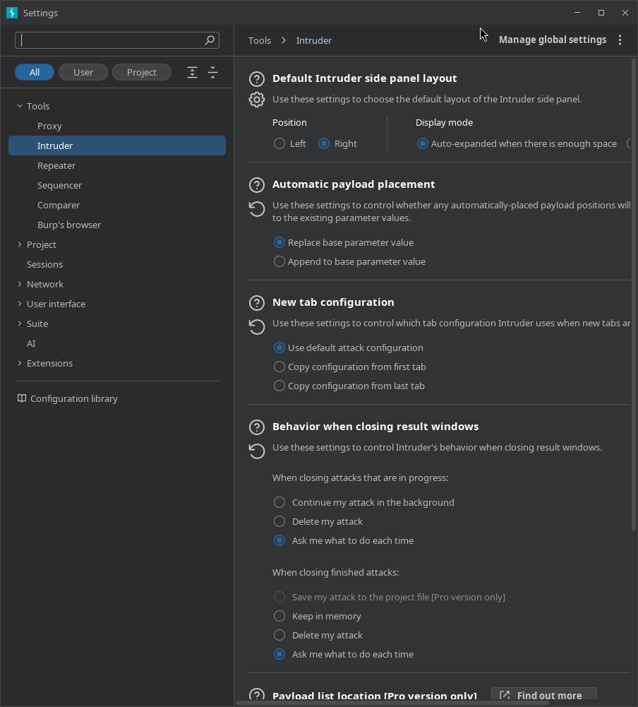

---

## 📊 5. Ventana de Ataque: Monitorización y Análisis en Tiempo Real

Al hacer clic en el botón naranja **Start attack**, Burp Suite despliega una interfaz flotante e independiente diseñada específicamente para la monitorización, orquestación y análisis analítico de la ráfaga de peticiones en curso. Esta ventana es el centro operativo donde el auditor evalúa el impacto de los payloads sobre la lógica de la aplicación web.

---

### A. Anatomía Estructural de la Tabla de Resultados

El panel central organiza cada interacción HTTP a través de un sistema de columnas que permite identificar anomalías visuales e informáticas de forma inmediata.

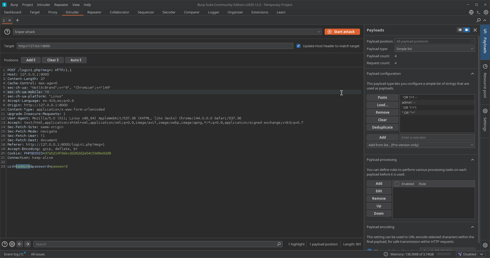

* **Request (Índice de Solicitud):** Identificador numérico, secuencial y correlativo asignado a cada paquete enviado. 
    * *La petición `0` (Baseline):* Representa la solicitud original idéntica a la capturada por el proxy, enviada sin ninguna modificación en sus marcadores. Sirve como el punto de control científico y línea base para contrastar los cambios de tamaño y tiempo del resto del ataque.
* **Payload (Carga Útil):** Muestra de forma transparente la cadena exacta de caracteres, caracteres especiales o sentencias lógicas que el motor inyectó activamente dentro de los marcadores (`§...§`) asignados para esa transacción específica.
* **Status (Código de Estado HTTP):** El código de respuesta devuelto por el servidor web backend.
    * *Códigos `200 OK`:* Generalmente indican que la aplicación procesó la solicitud y renderizó la interfaz común (por ejemplo, devolviendo el mensaje clásico de "Credenciales Incorrectas").
    * *Códigos `302 Found` o `301 Moved Permanently` (Redirecciones):* Son indicadores críticos de éxito en ataques de bypass de autenticación (SQL Injection de Login Bypass). Representan que la consulta maliciosa alteró la lógica de la base de datos, forzó una validación exitosa y el servidor intentó redirigir de inmediato el flujo de la navegación hacia el panel interno o de administración.
* **Length (Longitud de la Respuesta):** El tamaño exacto del cuerpo y las cabeceras de la respuesta HTTP, medido estrictamente en bytes. En auditorías de seguridad web, **un cambio en la longitud equivale casi siempre a una respuesta con contenido o estructura diferente**.
    * *Análisis de Anomalías:* Si de 100 peticiones de prueba, 99 de ellas devuelven una longitud uniforme (ej: `1698` bytes), significa que todas provocaron la misma respuesta de error. Si una única petición (como el payload exitoso) arroja una longitud diferente (ej: `1654` o `1818` bytes), esa discrepancia matemática es el indicador prioritario de que dicho payload modificó la estructura interna de la página web reflejada.
* **Columnas de Extracción y Emparejamiento (Grep Columns):** Columnas dinámicas generadas automáticamente si se configuraron previamente las opciones de *Grep - Match* o *Grep - Extract*. Muestran un check (`✓`) o fragmentos de texto específicos encontrados dentro de la respuesta HTTP para filtrar los resultados de forma automatizada.

---

### B. Análisis Operativo del Flujo de Ataque (Casos Prácticos)

A través de la ventana de resultados, el auditor puede discernir con precisión milimétrica el comportamiento de la aplicación web según las variaciones del backend.

#### Caso 1: Escenario de Inyección Fallida (Respuesta Estándar)
Cuando se inyectan cargas que la base de datos procesa como falsas o que la aplicación maneja como un error de autenticación controlado, el servidor responde de manera uniforme con un código de estado `200 OK` y un tamaño de bytes predecible. 

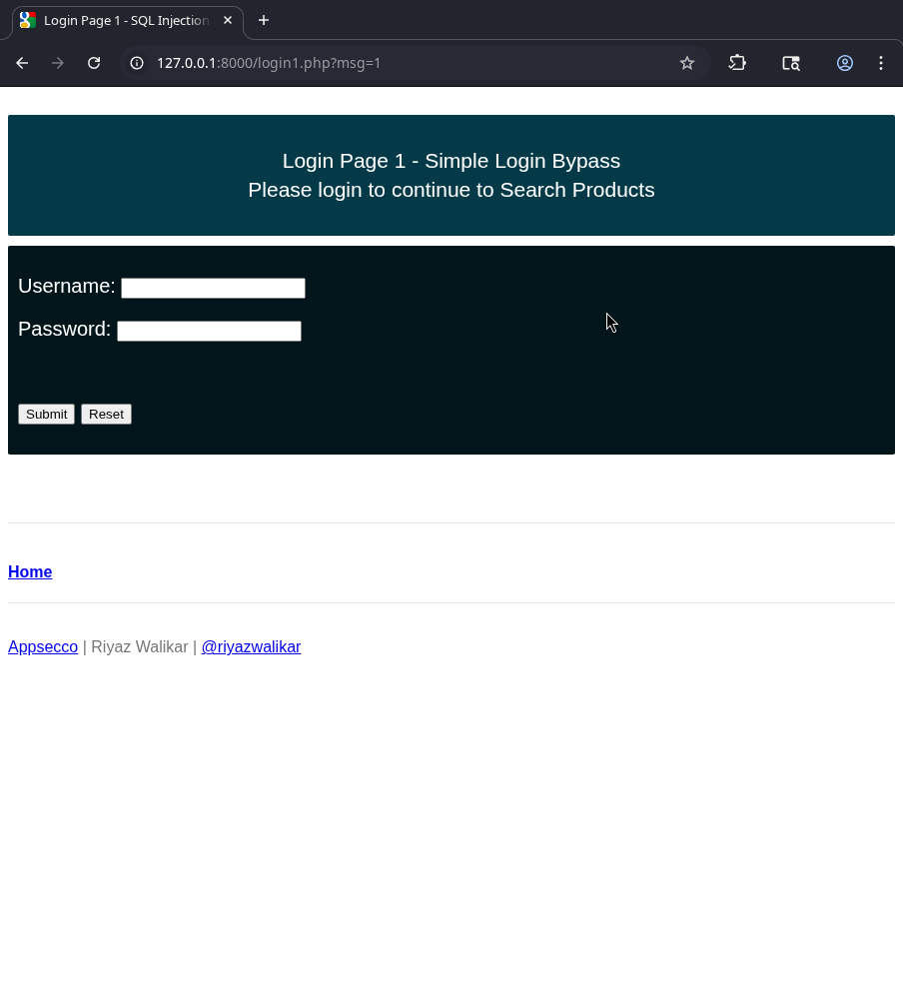

Visualmente en la aplicación web, esto se traduce en el mensaje de error de acceso denegado, reflejando que la estructura del sitio web no ha cambiado y que el payload fue neutralizado por la lógica del código.

#### Caso 2: Escenario de Inyección Exitosa (Bypass de Autenticación)
Al procesar un payload que altera correctamente la consulta SQL de validación (por ejemplo, forzando un cortocircuito lógico mediante un `' OR '1'='1`), el backend rompe su flujo ordinario.

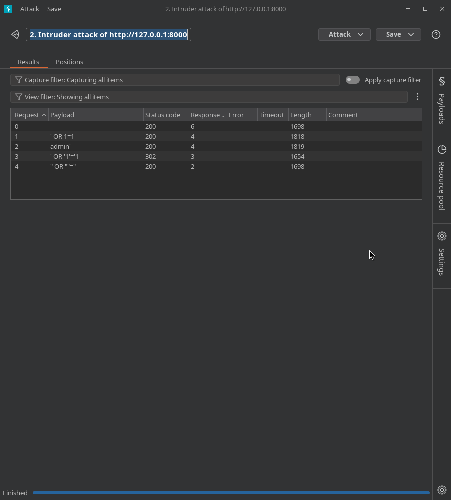

Como se aprecia en la telemetría del ataque, la petición que logra el desvío altera drásticamente los parámetros de la tabla de control: el código de estado puede mutar a una redirección (`302 Found`) y la longitud en bytes se altera notablemente en comparación con la línea base, confirmando la vulnerabilidad.

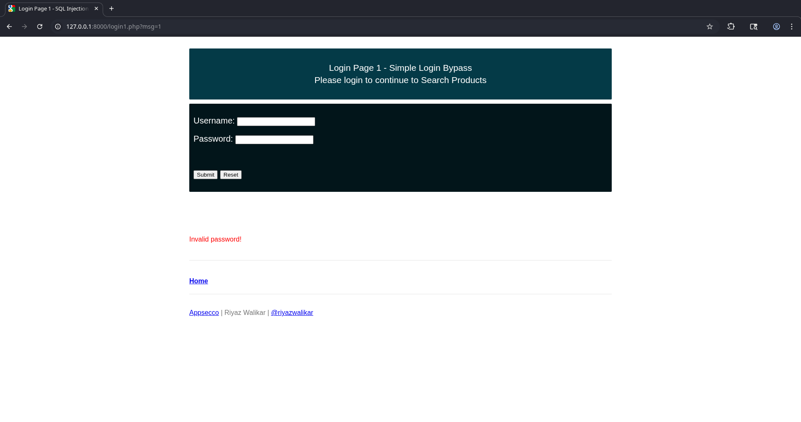

Al inspeccionar el impacto real, el servidor web procesa la sesión como válida y concede el acceso al índice o panel interno del sistema comprometido, demostrando la explotación efectiva del fallo.

---

[[Herramientas - Auditoría y Análisis Web con Burp Suite|⬅️ Volver a Burp Suite]]