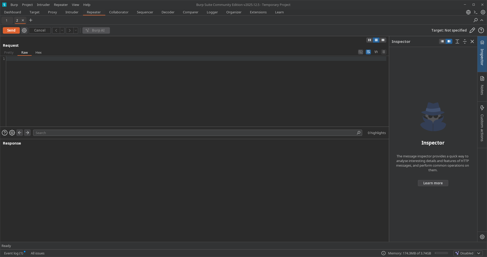
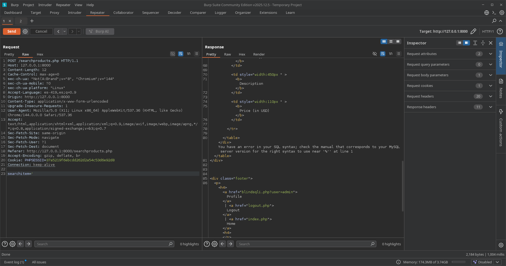
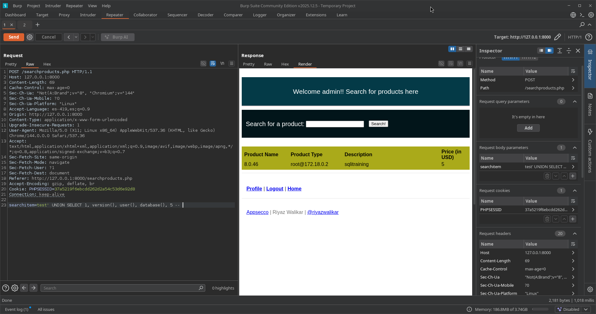
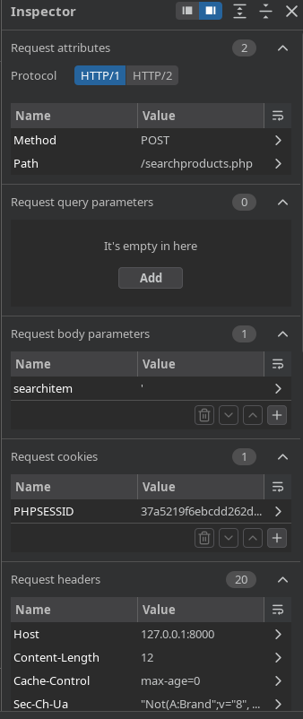
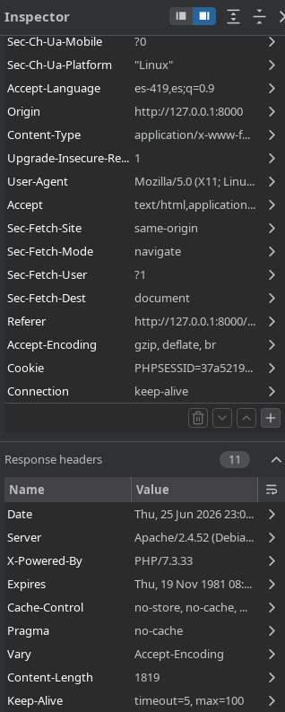
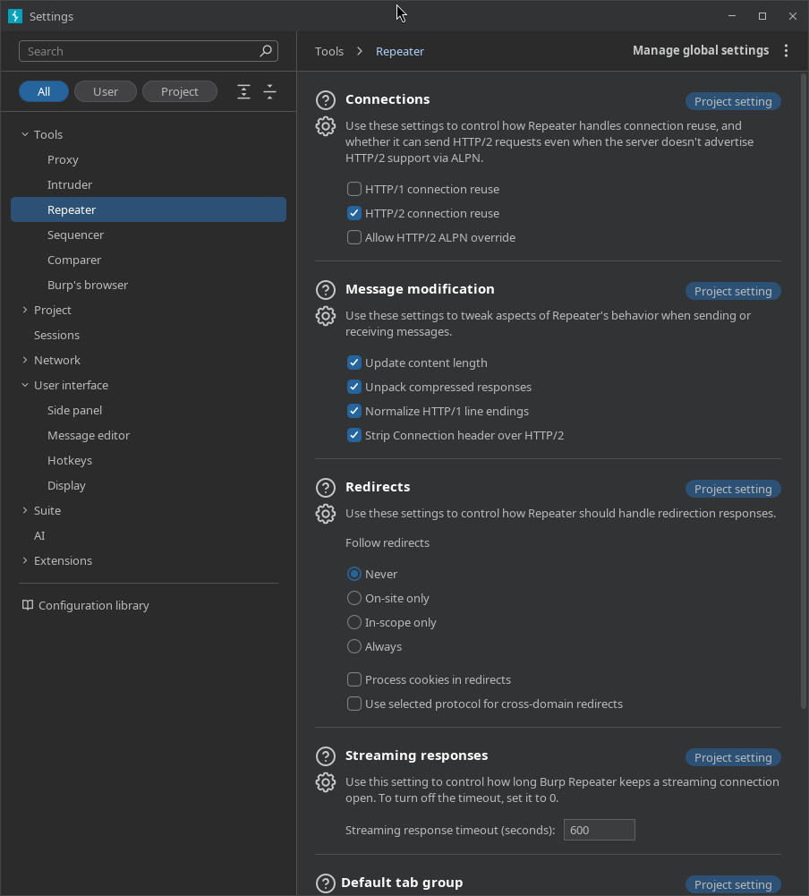
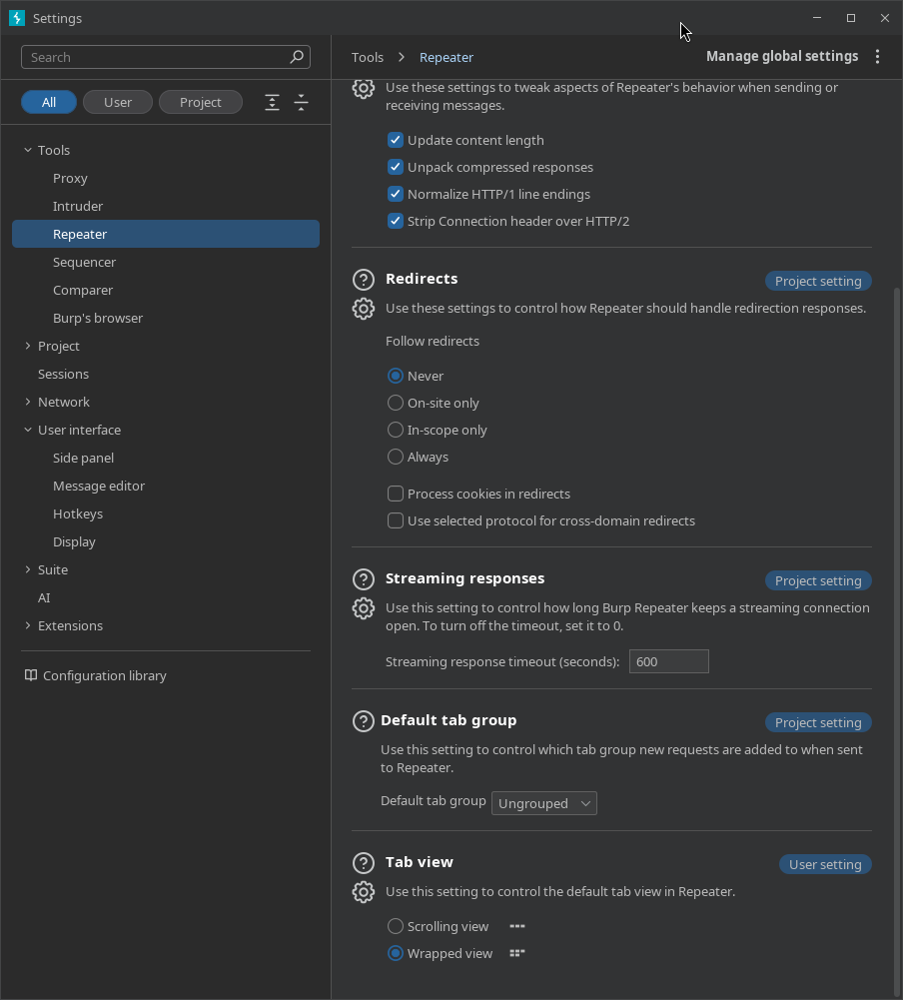
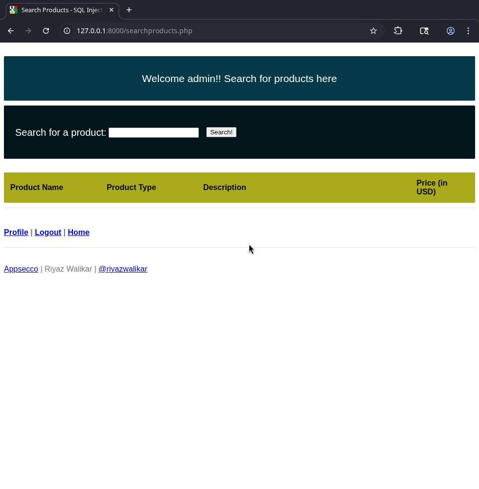
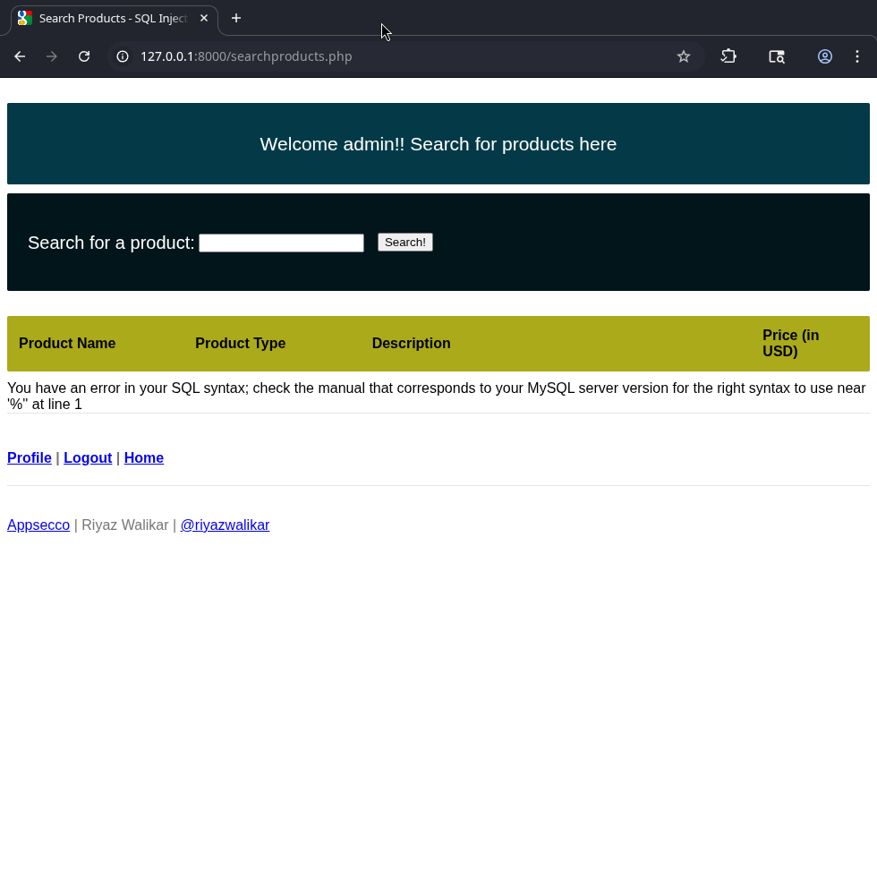

---
tags:
  - "#estructura/subseccion"
  - "#gestion/duracion/corto"
  - "#gestion/relevancia/muy-alta"
  - "#gestion/dificultad/normal"
  - "#hacking/red-team"
  - "#herramientas/burp-suite"
  - "#tecnologia/servicio/http-s"
  - "#formato/apunte"
  - gestion/estado/terminado
---
## 📌 Propósito Operativo del Módulo
El **Repeater** es el módulo centralizado de manipulación e ingeniería inversa de paquetes en Burp Suite. A diferencia del Intruder (que automatiza ráfagas masivas), Repeater está diseñado para el análisis quirúrgico y controlado. Permite al auditor aislar una única petición HTTP/S, modificar manualmente sus cabeceras, parámetros o cuerpo, y reenviarla tantas veces como sea necesario para estudiar la respuesta del servidor en tiempo real. Es la herramienta definitiva para comprobar vulnerabilidades complejas, depurar exploits y entender el comportamiento preciso de las respuestas de una aplicación web.

---

## 🎛️ 1. Panel de Control Principal e Interfaz de Modificación

El entorno operativo de Repeater divide el flujo de trabajo en una sección de entrada (petición modificable) y una sección de salida (respuesta inmediata del backend).

### A. Gestión de Pestañas y Enrutamiento (Top Bar)
* **Pestañas Numeradas:** Cada petición enviada a Repeater se abre en un hilo aislado independiente. Al hacer doble clic sobre el nombre de la pestaña, es posible renombrarla para organizar la auditoría (ej: `SQLi Test`, `LFI Bypass`).
* **Botón "Send":** Dispara el paquete HTTP configurado en la pantalla izquierda de forma directa a través de la red hacia el destino.
* **Target Flash (Destino de Red):** Situado en la esquina superior derecha del panel de peticiones. Muestra el host, puerto y el uso de cifrado TLS (`HTTPS`) al cual se enviará la solicitud actual. Al hacer clic sobre él, permite redirigir el destino del paquete a otro servidor sin alterar la estructura del texto.

### B. Panel de Solicitud (Left Panel - Request)
Muestra el paquete crudo interceptado. Admite edición libre en texto plano. En su parte superior e inferior cuenta con pestañas de renderizado de entrada:
* **Raw:** Visualización pura en texto ASCII del protocolo HTTP. Aquí se inyectan manualmente payloads de evasión o caracteres especiales.
* **Hex:** Editor hexadecimal integrado que permite modificar bytes específicos dentro del flujo de la petición, indispensable para ataques de truncamiento o subida de archivos con caracteres nulos (`%00`).

---

## 👁️ 2. Panel de Respuestas y Formatos de Visualización (Right Panel - Response)

Muestra de forma inmediata la información que devuelve el servidor web tras procesar la petición modificada por el auditor.

* **Raw:** Muestra la respuesta HTTP exactamente como llegó por el socket de red, incluyendo todas las cabeceras (`Set-Cookie`, `Server`, `X-Powered-By`) y el cuerpo crudo.
* **Pretty:** Aplica un formateo estético automático con sangrías y código de colores sobre formatos estructurados de datos como HTML, JSON, XML o CSS, facilitando una lectura rápida de las respuestas.
* **Hex:** Desglosa la respuesta en formato hexadecimal. Permite verificar la presencia de bytes invisibles o caracteres de control que la interfaz gráfica común suele ocultar.
* **Render:** Renderiza de forma interna el código HTML devuelto empleando un motor de navegación básico integrado en Burp Suite. Esto permite al analista ver visualmente lo que vería un usuario en su navegador (útil para verificar desvíos de inicio de sesión o paneles administrativos sin salir de la herramienta).

---

## 🔍 3. Barra de Control Analítico y Renderizado Lateral

Ubicada en la zona inferior y de flujo operativo, controla los mecanismos de navegación internos de la pestaña activa.

* **Barra de Búsqueda ("Search"):** Permite ingresar términos estáticos o expresiones regulares para localizar de manera instantánea fragmentos dentro de los paneles de Request o Response.
* **Filtros Avanzados de Búsqueda:**
    * *Case sensitive:* Distingue rigurosamente mayúsculas y minúsculas durante el rastreo del texto.
    * *Regex:* Activa el motor de expresiones regulares para patrones complejos (ej: buscar tokens, hashes o estructuras de tarjetas de crédito).
* **Auto-scroll to match:** Si está activo, desplaza automáticamente la pantalla de respuesta hacia la línea exacta donde coincide la búsqueda tras hacer clic en "Send", agilizando las auditorías de inyección reflejada.

---

## 🧭 4. Panel Lateral Complementario: Inspector (Análisis Técnico Estructurado)

El **Inspector** es una herramienta analítica ubicada en el extremo derecho de la ventana que desglosa los componentes de los paquetes HTTP/S en formato de tablas legibles, permitiendo modificaciones sin necesidad de tocar el texto crudo.

### A. Desglose de Parámetros y Cabeceras de Entrada

* **Request Attributes:** Descompone la línea de solicitud inicial indicando de forma aislada el método HTTP utilizado (`GET`, `POST`, `PUT`), la ruta del recurso web solicitado (`URL`) y la versión exacta del protocolo empleado.
* **Request Query Parameters:** Aísla de forma organizada todas las variables pasadas a través de la URL mediante el método GET. Permite decodificar o codificar valores al vuelo simplemente editando sus filas.
* **Request Headers:** Lista jerárquicamente todos los encabezados HTTP enviados por el cliente. Facilita la adición o remoción rápida de cabeceras de control (como `User-Agent:`, `Cookie:` o cabeceras de suplantación de IP como `X-Forwarded-For:`).

### B. Desglose de Parámetros de Cuerpo y Atributos de Salida

* **Request Body Parameters:** Si la petición es de tipo `POST` o contiene datos estructurados, este subpanel desglosa los parámetros enviados dentro del cuerpo de la solicitud (parámetros de formulario, strings JSON o nodos XML), permitiendo la edición limpia de sus valores.
* **Response Attributes:** Muestra de forma aislada la telemetría devuelta por el servidor: la versión del protocolo HTTP de respuesta, el código numérico de estado (`Status code`) y el mensaje textual del servidor (ej: `200 OK`, `500 Internal Server Error`).
* **Response Headers:** Organiza todas las cabeceras devueltas por la aplicación web, lo que agiliza la inspección de políticas de seguridad como `Content-Security-Policy (CSP)`, configuraciones de `CORS` o cookies de sesión estasblecidas.

---

## ⚙️ 5. Menú de Configuración Interno (Repeater Settings)

Determina las políticas operacionales de bajo nivel que rigen las conexiones de red y la interfaz visual exclusivamente para el módulo Repeater.

### A. Control Operacional de Red (Redirecciones y Conexiones)

* **Redirections (Comportamiento ante códigos 3xx):**
    * `Follow redirections`: Define si Repeater debe seguir automáticamente los saltos de redirección HTTP. El menú desplegable permite parametrizar las restricciones a `Never`, `On-site only`, `In-scope only` o `Always`.
    * `Process cookies in redirections`: Si se activa, Burp extraerá y actualizará dinámicamente las cookies de las cabeceras `Set-Cookie` recibidas durante los pasos intermedios de redirección, adjuntándolas en las peticiones subsiguientes.
* **HTTP/1 Connection Reuse:**
    * `Override project-level HTTP/1 setting`: Desvincula la pestaña de la configuración de hilos del proyecto.
    * `Reuse HTTP/1 connections`: Al activarse, mantiene los sockets TCP abiertos entre peticiones sucesivas hacia el mismo host, eliminando la latencia del saludo de red (*TCP Handshake*) y acelerando el tiempo de respuesta del módulo.
* **HTTP Version:**
    * `Override project-level HTTP/2 setting`: Permite activar de forma forzada el soporte para HTTP/2 o, en su defecto, degradar la comunicación a HTTP/1.1 para depurar servidores que presenten fallos de sincronización con protocolos modernos.

### B. Ajustes Visuales de Interfaz (View Settings)

* **View Settings (Organización de Paneles):**
    * `Left/right layout`: Configura la pantalla de forma clásica colocando el panel de Request a la izquierda y el panel de Response a la derecha. Desmarcarlo cambia la disposición a un formato vertical (Request arriba y Response abajo).
    * `In-task view only`: Restringe la telemetría del tráfico de Repeater para que solo sea visible dentro de la tarea analítica activa, evitando saturar otros registros históricos globales de Burp Suite.

---

## 🚀 6. Casos Prácticos de Uso en Auditorías de Seguridad

A través de Repeater, el auditor puede evaluar con precisión milimétrica la presencia de fallos de seguridad lógica analizando las respuestas del servidor.

### Caso 1: Escenario de Acceso Fallido (Control de Identidad Regular)
En una auditoría ordinaria sobre un panel de autenticación, el analista envía credenciales aleatorias.

El servidor procesa la lógica del backend y responde con un código estándar `200 OK` y una longitud de bytes específica. Al revisar el panel interno, la aplicación web responde con la interfaz común de rechazo ("Invalid username or password"), lo que demuestra que las políticas de seguridad están operando bajo el flujo esperado.

### Caso 2: Explotación Manual Exitosa (Bypass mediante inyección SQL)
Utilizando Repeater, el auditor modifica el parámetro vulnerable dentro del cuerpo de la petición introduciendo una sintaxis de bypass lógica clásica (ej: `'`).

Al presionar "Send", el impacto se identifica de inmediato en el panel de respuestas: el backend altera drásticamente su comportamiento lógico devolviendo una redirección de sesión `302 Found`. 

Al validar el panel gráfico mediante la pestaña **Render**, se confirma que la base de datos sufrió un cortocircuito lógico, validó la sesión como exitosa y redirigió al auditor directamente hacia el panel interno de administración, evidenciando un compromiso crítico del sistema de control de accesos.

---

[[Herramientas - Auditoría y Análisis Web con Burp Suite|⬅️ Volver a Burp Suite]]