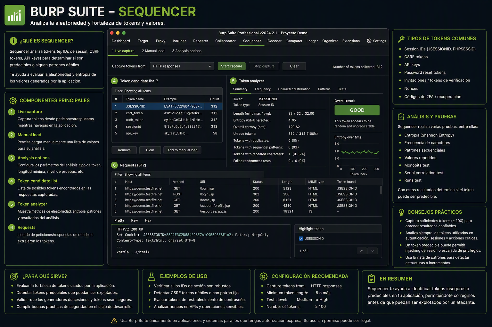

---
tags:
  - "#estructura/subseccion"
  - "#gestion/duracion/corto"
  - "#gestion/relevancia/muy-alta"
  - "#gestion/dificultad/normal"
  - "#hacking/red-team"
  - "#herramientas/burp-suite"
  - "#tecnologia/servicio/http-s"
  - "#formato/apunte"
  - "#gestion/estado/sin-empezar"
---
> ⚠️ **Nota de Estado:** Esta sección se encuentra actualmente **incompleta** y clasificada como **sin empezar**. 

A diferencia de los módulos interactivos como el Proxy o el Repeater, **Burp Sequencer** es una herramienta especializada en el análisis estadístico de la calidad de la aleatoriedad en tokens de datos. Su propósito principal es determinar la predictibilidad de elementos críticos de seguridad generados por el servidor web, tales como:

* Cookies de sesión (`PHPSESSID`, `JSESSIONID`, etc.).
* Tokens Anti-CSRF.
* Tokens de restablecimiento de contraseña enviados por correo.

### 🚫 Estado Actual y Falta de Caso de Uso
Durante las pruebas realizadas en el laboratorio local de SQL Injection de Appsecco, **no se identificó ningún escenario práctico** que requiriera el uso del Sequencer. Las vulnerabilidades de inyección de código y bypass de autenticación evaluadas dependen de fallos lógicos y falta de sanitización en el backend, mas no de la debilidad criptográfica o la predictibilidad de los identificadores de sesión.

Para poder nutrir esta sección con datos reales, gráficas de entropía y análisis de bits, se requiere un entorno o desafío enfocado específicamente en **Session Fixation, Session Prediction o criptografía débil**. Una vez que se interactúe con una aplicación web que genere identificadores vulnerables a patrones estadísticos, se documentará aquí el procedimiento completo de captura de muestras (mínimo 100 tokens recomendado) y la interpretación de los resultados del análisis.

---

[[Herramientas - Auditoría y Análisis Web con Burp Suite|⬅️ Volver a Burp Suite]]