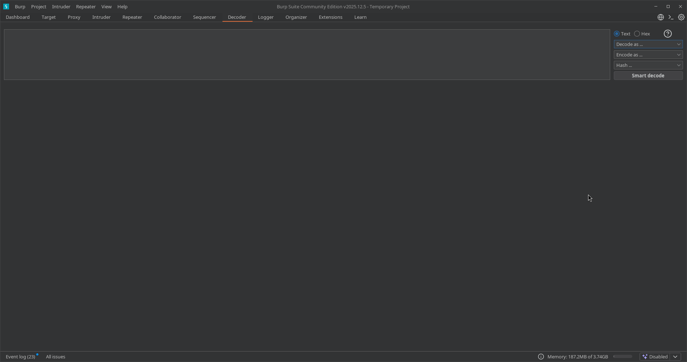
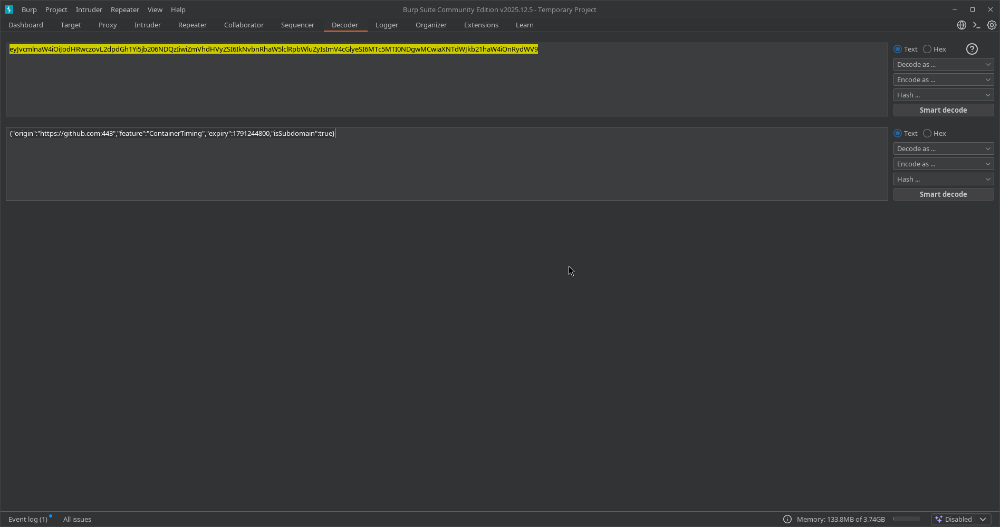
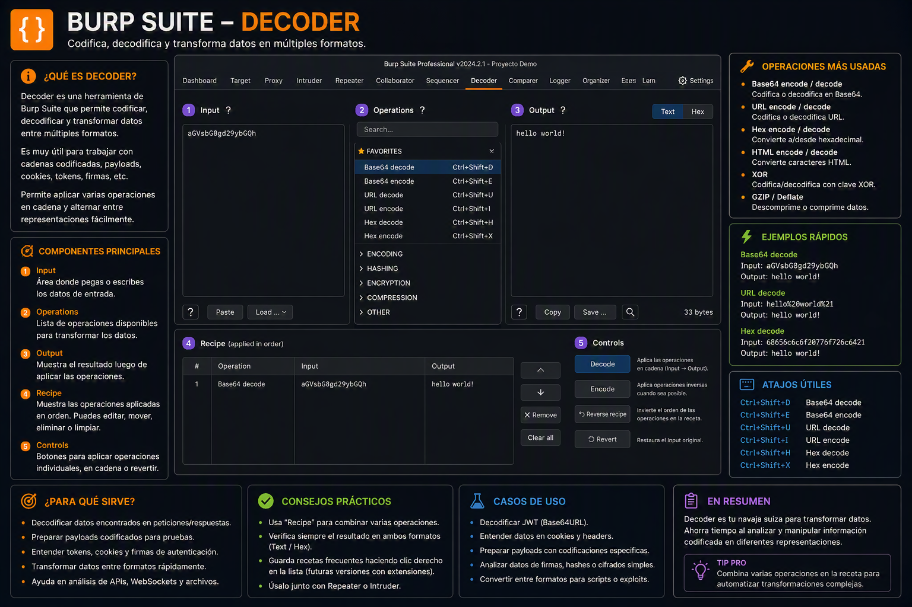

---
tags:
  - "#estructura/subseccion"
  - "#gestion/duracion/muy-corto"
  - "#gestion/relevancia/muy-alta"
  - "#gestion/dificultad/muy-facil"
  - "#hacking/red-team"
  - "#herramientas/burp-suite"
  - "#formato/apunte"
  - gestion/estado/terminado
---
## 📌 Propósito Operativo del Módulo
El **Decoder** es la herramienta de manipulación de formatos e ingeniería de datos integrada en Burp Suite. Su función primordial en auditorías web es la conversión instantánea de cadenas de texto entre múltiples esquemas de codificación, representación de datos y algoritmos de hashing criptográfico. 

Durante una intrusión, los parámetros web suelen viajar enmascarados o serializados (por ejemplo, tokens en Base64, payloads en codificación URL o hashes MD5/SHA de contraseñas). Decoder permite al auditor desofuscar datos recolectados para entender su contenido lógico o, en sentido inverso, empaquetar payloads complejos con formatos específicos para evadir filtros de seguridad web (WAF) sin necesidad de recurrir a herramientas externas de consola o sitios web de terceros que puedan filtrar la información del objetivo.

---

## 🎛️ 1. Panel de Entrada y Cascadas de Transformación

El diseño operativo de Decoder está pensado para trabajar de manera secuencial o en formato de "cascada", permitiendo realizar múltiples transformaciones sobre una misma cadena de origen.

### A. Espacio de Trabajo y Cajas de Texto
* **Paneles de Renderizado Secuencial:** Cada transformación que aplicas genera un panel nuevo inmediatamente debajo del anterior. Esto permite rastrear de forma visual la "evolución" de tu payload (por ejemplo: Texto Plano ➡️ Codificación URL ➡️ Conversión Hexadecimal).
* **Formatos de Visualización (Text / Hex):** Al igual que en Repeater, puedes alternar la entrada y salida entre el modo de texto legible ASCII (`Text`) o la representación de bytes pura (`Hex`), lo que resulta vital para manipular caracteres no imprimibles o bytes nulos (`%00`).

### B. Menús Desplegables de Control Técnico
En el extremo derecho de cada panel, dispones de dos selectores estratégicos para definir el comportamiento del motor:

1. **Decode as... (Decodificar como):** Traduce una cadena ilegible o codificada de vuelta a su estado original. Las opciones clave incluyen:
    * `URL` / `URL (ASCII)`: Remueve los percent-encodings (ej: de `%20` a un espacio).
    * `HTML`: Convierte entidades HTML (ej: de `&lt;` a `<`).
    * `Base64`: Decodifica cadenas base64 estándar (ej: de `YWRtaW4=` a `admin`).
    * `Hex`, `Octal`, `Binary`: Traduce bases numéricas a caracteres de texto plano.
    * `Gzip` / `Zlib`: Descomprime flujos de datos binarios utilizados frecuentemente en la serialización de datos de aplicaciones modernas.

2. **Encode as... (Codificar como):** Transforma tu payload o texto plano en el formato seleccionado para que sea interpretado correctamente por el servidor backend o para romper expresiones regulares de firewalls. Soporta exactamente las mismas variantes de bases lógicas que el menú de decodificación.

3. **Hash... (Funciones Criptográficas):** Somete la cadena de texto del panel actual a funciones de hashing unidireccionales. Es la utilidad estándar para calcular o comparar firmas digitales de contraseñas, cookies o tokens:
    * `MD5` / `SHA-1` / `SHA-224` / `SHA-256` / `SHA-384` / `SHA-512`

---

## 🚀 2. Casos Prácticos de Uso en Auditorías de Seguridad

### Caso 1: Desofuscación de Cookies y Tokens de Sesión (Análisis Lógico)
Durante la fase de enumeración, capturas una cookie de sesión con el valor `dXNlcklEPTVtYWRtaW49ZmFsc2Vd`. Al pegarla en el panel superior de Decoder y seleccionar **Decode as... ➡️ Base64**, la herramienta revela la estructura real en texto plano en la caja inferior:
`userID=[5;admin=false]`

El auditor puede modificar directamente ese resultado en un panel inferior, cambiando `admin=false` por `admin=true`, aplicar inmediatamente un **Encode as... ➡️ Base64** y obtener el nuevo token modificado listo para ser inyectado en Repeater para lograr una escalada de privilegios horizontal/vertical.

### Caso 2: Evasión de Filtros Perimetrales (WAF Bypass con Double URL Encode)
Si una aplicación web bloquea tus payloads de *Cross-Site Scripting (XSS)* porque su filtro sanitiza la palabra ``
2. Aplicas **Encode as... ➡️ URL** en el primer bloque.
3. Al resultado obtenido, le vuelves a aplicar **Encode as... ➡️ URL** en el segundo bloque.

Esto generará una codificación URL doble (`%253Cscript%253E...`). Si el WAF del objetivo solo decodifica una capa de la petición para analizarla, verá texto inofensivo y dejará pasar el paquete; posteriormente, cuando el backend de la aplicación realice la segunda decodificación interna para procesar el parámetro, ejecutará tu payload malicioso con éxito.

---

[[Herramientas - Auditoría y Análisis Web con Burp Suite|⬅️ Volver a Burp Suite]]