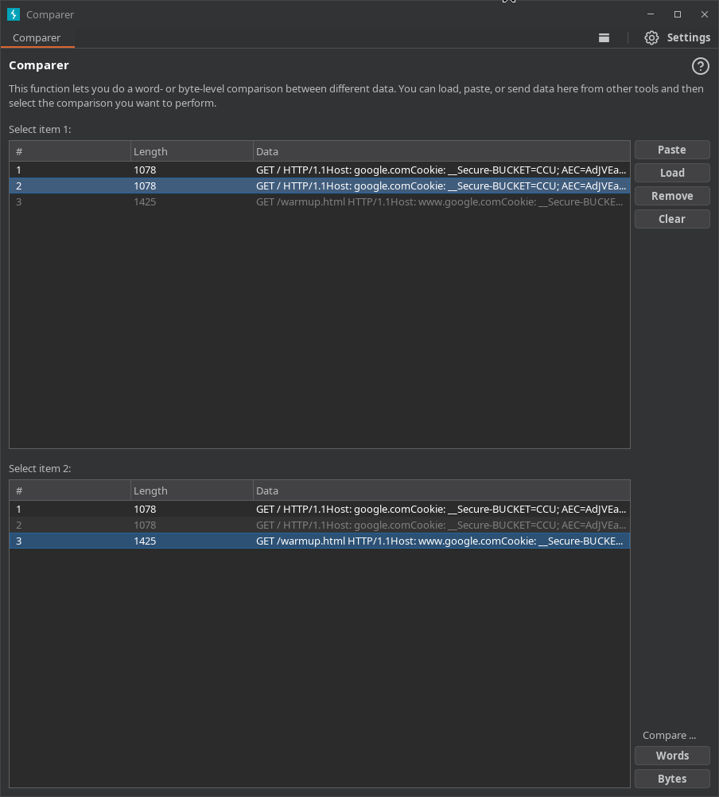
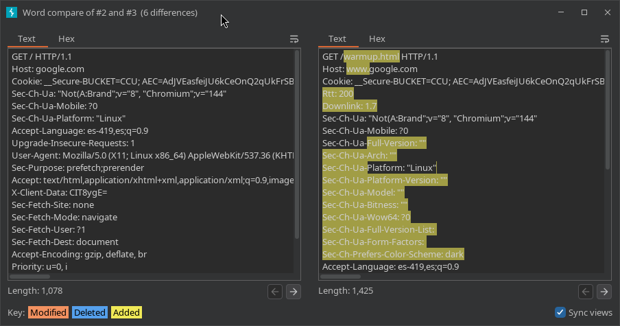
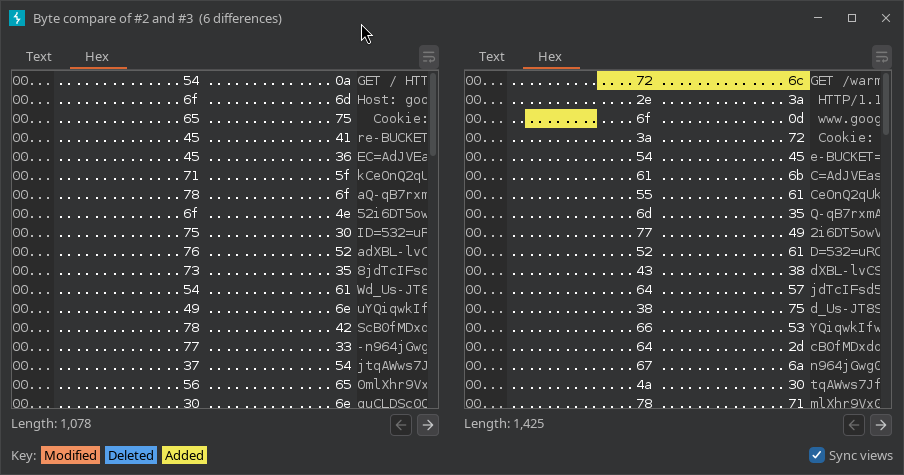

---
tags:
  - "#estructura/subseccion"
  - "#gestion/duracion/muy-corto"
  - "#gestion/relevancia/muy-alta"
  - "#gestion/dificultad/muy-facil"
  - "#hacking/red-team"
  - "#herramientas/burp-suite"
  - "#formato/apunte"
  - gestion/estado/terminado
---
## 📌 Propósito Operativo del Módulo
El **Comparer** es la utilidad de comparación visual (*diffing tool*) integrada en Burp Suite. Su objetivo principal es aislar y contrastar de manera milimétrica las diferencias estructurales, de texto o de bytes binarios entre dos peticiones o dos respuestas HTTP/S.

En auditorías web, pequeños cambios en la respuesta del servidor pueden representar la diferencia entre un exploit exitoso y uno fallido (por ejemplo, la sutil variación de un token, el reflejo de un carácter en inyecciones SQL ciegas, o respuestas de enumeración de usuarios). Comparer evita que el auditor tenga que exportar el texto a herramientas externas de terminal como `diff` o subirlos a plataformas en línea, acelerando el análisis de anomalías de forma nativa y centralizada.

---

## 🎛️ 1. Flujo de Trabajo e Invocación del Módulo

Al haber sido removido de la barra de pestañas principal en las versiones modernas de Burp Suite, Comparer funciona como un servicio contextual bajo demanda que almacena los paquetes enviados en una cola de espera.

### A. Cómo enviar datos a Comparer
El auditor puede enviar datos a Comparer desde prácticamente cualquier sección de Burp Suite (Proxy History, Repeater, Intruder, Logger):
1. Haz **clic derecho** sobre la petición o respuesta HTTP que te interesa analizar.
2. Selecciona la opción **Send to Comparer**.
3. Repite el proceso con el segundo paquete con el que deseas realizar el contraste.

### B. Estructura de Selección (Paneles Input)
Al invocar la herramienta, te encontrarás con dos paneles de selección idénticos compuestos por tablas ordenadas:
* **Select item 1 (Panel Superior):** Lista los fragmentos de datos enviados. Selecciona el primer paquete base de la comparación.
* **Select item 2 (Panel Inferior):** Lista el mismo historial de datos. Selecciona el segundo paquete contra el cual deseas contrastar.
* **Botonera de Selección de Motor:**
    * `Words`: Ejecuta una comparación basada en cadenas de texto y tokens lógicos (ideal para código HTML, estructuras JSON o cabeceras).
    * `Bytes`: Ejecuta una comparación binaria a nivel hexadecimal (indispensable para analizar archivos descargados, imágenes modificadas o respuestas comprimidas).

---

## 👁️ 2. Interfaz de Análisis Gráfico (Anatomía del "Diff")

Una vez seleccionada la modalidad de comparación (`Words` o `Bytes`), Burp despliega una nueva ventana dividida que resalta las discrepancias utilizando un código de colores estricto.

### A. Comparación por Palabras (Words Diff)

* **🟧 Naranja (Modified):** Indica que el texto existe en ambas respuestas, pero ha sufrido una modificación en su contenido (como el valor de una cookie o un ID).
* **🟦 Azul (Added):** Resalta elementos, cabeceras o líneas de código que están presentes en el segundo paquete pero que no existían en el primero.
* **🟥 Rosa/Rojo (Deleted):** Muestra los datos que se encontraban en el primer paquete pero que fueron eliminados o ya no se renderizan en el segundo.
* **🔗 Synchronized scrolling:** Ubicado en la esquina inferior izquierda. Al estar marcado, fuerza a que ambas ventanas se desplacen de forma idéntica e interactiva, manteniendo la simetría visual del código analizado.

### B. Comparación por Bytes (Hexadecimal Diff)

* Al seleccionar la modalidad por bytes, las estructuras de texto se traducen a su representación puramente hexadecimal.
* Este modo es fundamental para inspeccionar variaciones en flujos binarios, identificar corrupciones de datos deliberadas o encontrar caracteres de control invisibles en formato ASCII (como saltos de línea `0x0D 0x0A` o bytes nulos `0x00`) que el motor de texto plano podría pasar por alto o renderizar de manera idéntica.

---

## 🚀 3. Casos Prácticos de Uso en Auditorías de Seguridad

### Caso 1: Identificación de SQL Injection Ciega (Blind SQLi basados en Contenido)
En inyecciones SQL Booleanas a ciegas, el servidor no muestra errores en pantalla; solo altera sutilmente el contenido si la consulta es verdadera o falsa. Al enviar la respuesta de una consulta verdadera (`' OR 1=1--`) y una falsa (`' OR 1=2--`) a Comparer:
* La herramienta te pintará en **azul** o **rojo** palabras específicas que desaparecen (como un mensaje de *"Bienvenido"* o *"Artículo no encontrado"*). Esto te permite identificar instantáneamente cuál es la palabra clave exacta que debes usar en tus scripts de automatización para validar la exfiltración de la base de datos.

### Caso 2: Enumeración del Lado del Servidor (User Enumeration)
Al auditar un formulario de login, pruebas con el usuario `admin` y luego con el usuario `no-existe`. Ambas solicitudes devuelven un código `200 OK` y visualmente el mismo mensaje de error genérico.
* Al pasarlas por Comparer en modo `Words`, descubres que la respuesta de `admin` añade de forma invisible una pequeña variación en una cookie o un espacio extra en el HTML. Esa discrepancia te confirma que el servidor maneja de forma distinta los usuarios válidos de los inválidos, permitiéndote enumerar cuentas reales del sistema.

---

[[Herramientas - Auditoría y Análisis Web con Burp Suite|⬅️ Volver a Burp Suite]]