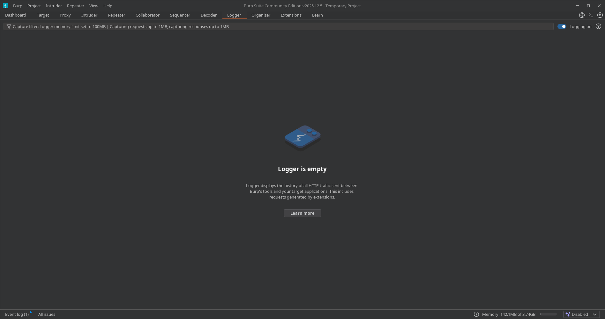
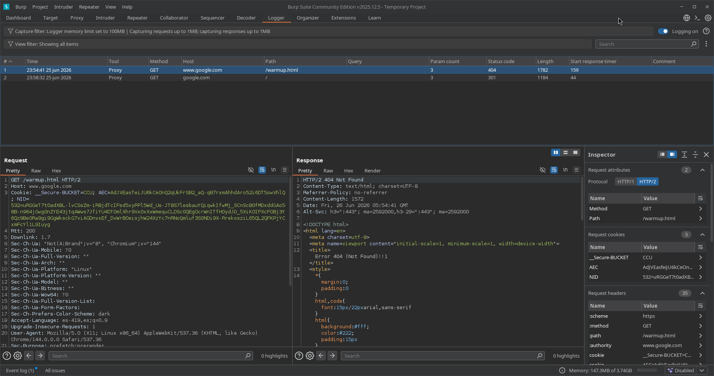
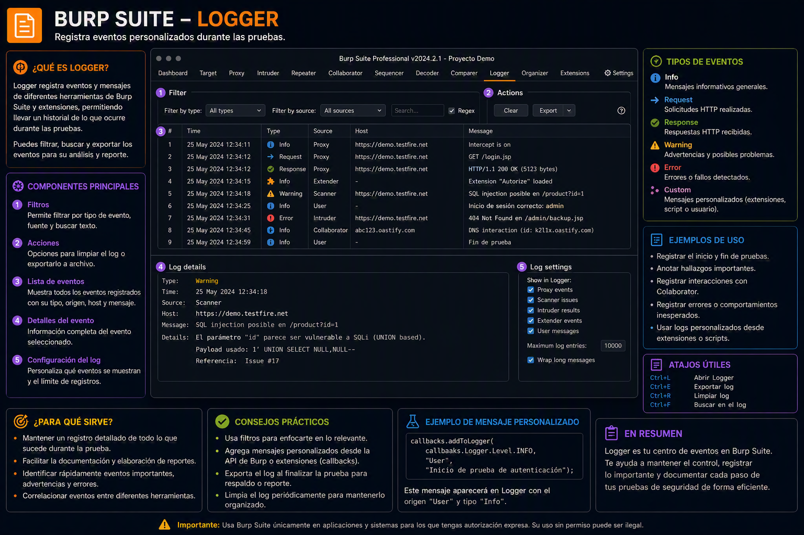

---
tags:
  - "#estructura/subseccion"
  - "#gestion/duracion/muy-corto"
  - "#gestion/relevancia/alta"
  - "#gestion/dificultad/muy-facil"
  - "#hacking/red-team"
  - "#herramientas/burp-suite"
  - "#formato/apunte"
  - gestion/estado/terminado
---
## 📌 Propósito Operativo del Módulo
El **Logger** es la bitácora unificada y el registro cronológico definitivo de Burp Suite. Su función es documentar de manera ininterrumpida cada una de las peticiones y respuestas HTTP/S que fluyen a través de la herramienta, sin importar qué módulo las haya originado.

A diferencia de la pestaña *Proxy History* (que solo guarda el tráfico que pasa desde tu navegador web hacia la víctima), el Logger captura **absolutamente todo**: las ráfagas masivas enviadas por el *Intruder*, las solicitudes controladas del *Repeater*, las consultas automatizadas de las *Extensions* (como SQLMap o plugins de la BApp Store) e incluso los escaneos automáticos del propio motor de Burp. Es la herramienta de auditoría de bajo nivel indispensable para depurar fallos en tus propios scripts de ataque, controlar el rendimiento de tus herramientas y garantizar que no estás enviando paquetes fuera del alcance legal (*Out of Scope*).

---

## 🎛️ 1. Panel de Visualización Histórica y Telemetría de Red

La interfaz del Logger proporciona un control centralizado para clasificar, inspeccionar y auditar cada paquete en tiempo real.

### A. Barra de Estado Operativo y Controles Globales (Top Bar)
* **Logger is [capturing/paused]:** Un interruptor interactivo que te permite detener temporalmente la captura de tráfico para evitar que el registro se sature mientras realizas tareas que no requieran monitoreo.
* **Barra de Configuración de Filtros ("Filter"):** Permite definir reglas visuales de exclusión o inclusión mediante expresiones regulares o cadenas de texto estáticas para aislar solicitudes de hosts específicos, extensiones de archivo o códigos de estado HTTP.
* **Botón "Clear":** Vacía por completo la tabla del historial acumulado para iniciar una sesión de monitoreo limpia.

### B. Desglose del Registro de Tráfico (Main Table)
Cada fila de la tabla representa un evento único de red y detalla los siguientes metadatos críticos:
* **\#:** Identificador numérico correlativo global.
* **Tool:** Especifica qué módulo exacto de Burp Suite generó la petición (ej: `Proxy`, `Repeater`, `Intruder`, `Extensions`).
* **Method & URL:** El método HTTP empleado (`GET`, `POST`, etc.) y la ruta absoluta del recurso web auditado.
* **Status:** El código de estado de respuesta que devolvió el servidor web (ej: `200`, `302`, `403`, `404`).
* **Length:** El tamaño exacto en bytes de la respuesta HTTP, esencial para detectar anomalías sutiles de contenido.

---

## 🔍 2. Panel de Inspección Técnica y Búsqueda de Cadenas

Al seleccionar cualquier fila de la bitácora, el Logger divide el entorno de trabajo para permitir una auditoría profunda del paquete HTTP seleccionado.

### A. Consola de Request / Response (Lower Panel)
* **Visualización Cruda y Formateada:** Permite alternar entre los modos `Raw`, `Pretty`, `Hex` y `Render` tanto para la solicitud enviada como para la respuesta recibidas por el socket.
* **Garantía de Trazabilidad:** Permite verificar con precisión milimétrica si un payload inyectado desde un script externo sufrió alteraciones de codificación (*percent-encoding*) antes de salir hacia la red.

### B. Motor de Búsqueda Integrado (Bottom Search Bar)
* **Search / Find:** Ubicado en la base de la pantalla, te permite rastrear palabras clave dentro de las cabeceras o el cuerpo del paquete seleccionado.
* **Navegación Interactiva:** Cuenta con botones de dirección (`<` y `>`) para saltar directamente entre las coincidencias halladas en el texto crudo.
* **Filtros Adicionales:** Incluye la casilla de distinción estricta de mayúsculas y minúsculas (`Case sensitive`) y el motor de expresiones regulares (`Regex`).

---

## 🚀 3. Casos Prácticos de Uso en Auditorías de Seguridad

### Caso 1: Depuración de Extensiones y Herramientas Automatizadas (Troubleshooting)
Estás utilizando una extensión automatizada para buscar inyecciones SQL (como *Bypass WAF* o un plugin de la BApp Store), pero notas que la herramienta arroja errores o no encuentra ninguna vulnerabilidad.
* **Solución con Logger:** Vas a la pestaña Logger y filtras las peticiones generadas por la herramienta (`Tool: Extensions`). Al analizar los paquetes crudos que está enviando, descubres que la extensión está codificando mal los caracteres especiales o que el servidor web te está respondiendo con un bloqueo `403 Forbidden` debido al *User-Agent* que usa el script. El Logger te permite corregir la configuración al instante.

### Caso 2: Control de Alcance Operativo y Evidencia (Post-Mortem)
Durante una auditoría de Red Team, necesitas comprobar si accidentalmente alguna de tus herramientas automáticas realizó solicitudes hacia un subdominio que está fuera del alcance acordado (*Out of Scope*) con el cliente, o necesitas guardar evidencias técnicas de que tu exploit efectivamente causó un código de error `500 Internal Server Error` en el servidor web de destino.
* **Solución con Logger:** El Logger guarda el historial completo y transparente de tus ataques con su marca de tiempo exacta. Esto te sirve como bitácora de respaldo irrefutable para justificar tus acciones ante el cliente en el reporte técnico final de auditoría.

---

[[Herramientas - Auditoría y Análisis Web con Burp Suite|⬅️ Volver a Burp Suite]]