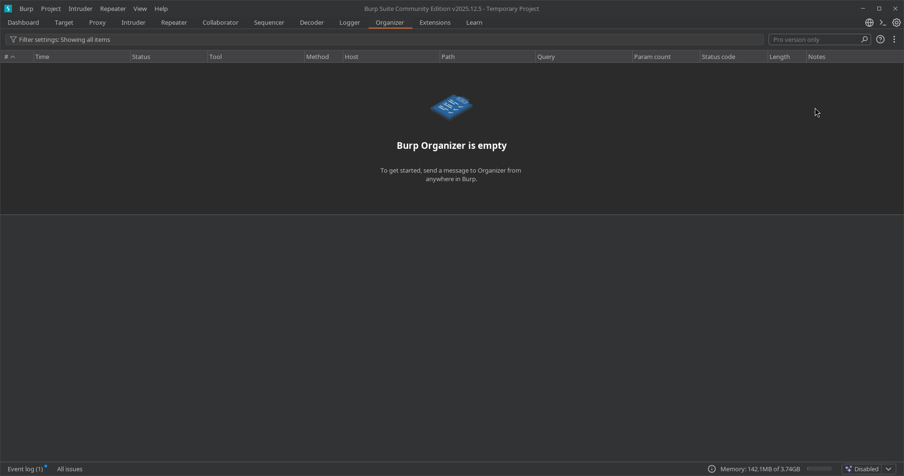
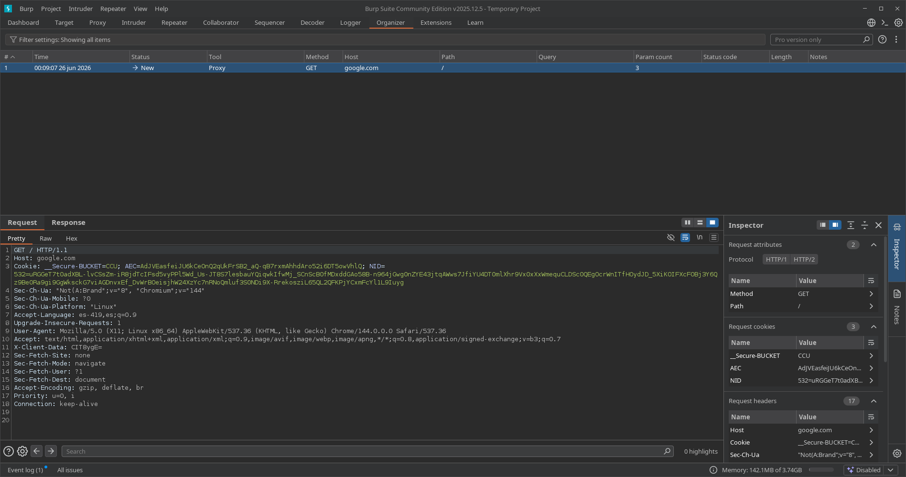
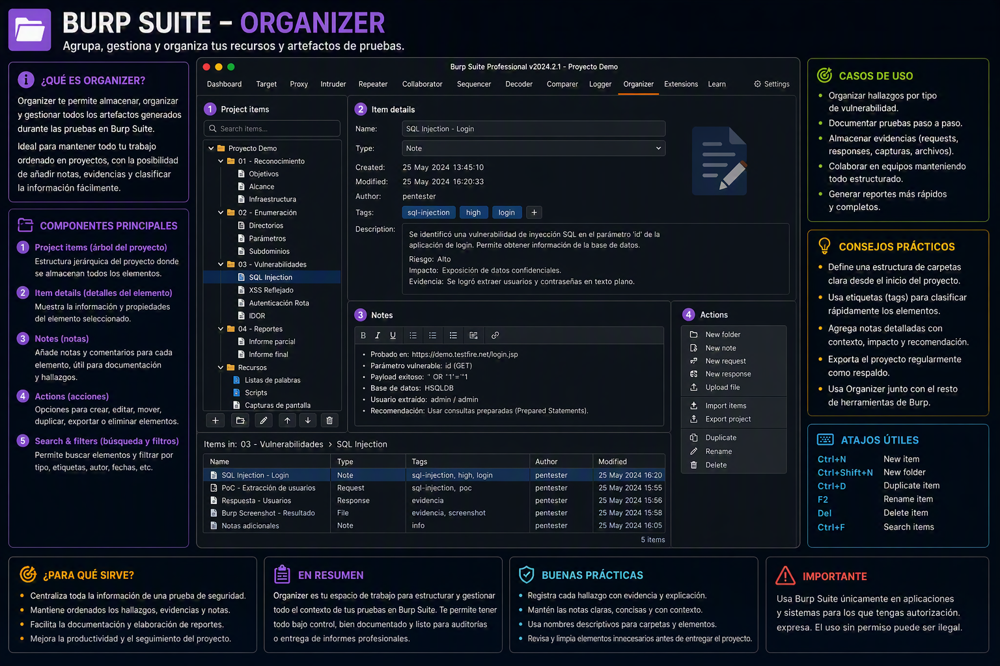

---
tags:
  - "#estructura/subseccion"
  - "#gestion/duracion/muy-corto"
  - "#gestion/relevancia/alta"
  - "#gestion/dificultad/muy-facil"
  - "#hacking/red-team"
  - "#herramientas/burp-suite"
  - "#formato/apunte"
  - gestion/estado/terminado
---
## 📌 Propósito Operativo del Módulo
El **Organizer** es una herramienta de gestión de flujo de trabajo e inventariado integrada en las versiones recientes de Burp Suite. Su propósito fundamental es permitir al auditor almacenar, ordenar y anotar peticiones HTTP/S específicas que resulten clave o sospechosas durante la fase de análisis, sin necesidad de enviarlas inmediatamente a módulos activos como Repeater.

Durante auditorías extensas, es común encontrar decenas de endpoints interesantes que no puedes analizar al mismo tiempo (por ejemplo, varios parámetros que huelen a IDOR, rutas de administración ocultas o puntos de inyección potenciales). En lugar de saturar el historial del Proxy o llenarte de pestañas anónimas en Repeater que olvidarás para qué servían, Organizer actúa como un **"baúl de marcadores" o repositorio táctico** donde guardas las evidencias y defines el orden de prioridad de tu investigación.

---

## 🎛️ 1. Panel de Gestión de Hallazgos e Inventario de Red

La interfaz de Organizer proporciona una estructura limpia en forma de tabla diseñada para centralizar tus objetivos de análisis pendientes.

### A. Almacenamiento e Invocación Contextual
Cualquier paquete interceptado en Burp Suite puede ser enviado aquí haciendo **clic derecho ➡️ Send to Organizer**.
* **Tabla de Tareas en Cola:** Muestra de forma cronológica los paquetes guardados.
* **Metadatos por Defecto:** Muestra información automática de red como el identificador numérico (`#`), el método HTTP (`Method`), la URL del recurso (`URL`), el código de estado (`Status`) y la longitud en bytes (`Length`).

### B. Atributos de Organización Lógica (Clasificación Manual)
Las columnas clave que diferencian a Organizer de un simple registro histórico son:
* **Notes (Notas):** Un espacio de texto libre donde el auditor apunta la hipótesis de la vulnerabilidad o la razón por la cual guardó el paquete (ej: *"Posible LFI en parámetro template"*, *"Cookie de sesión JWT para descifrar"*).
* **Status Flags / Labels:** Permite asignar etiquetas o estados para coordinar el progreso de la auditoría directamente sobre los paquetes seleccionados.

---

## 🔍 2. Inspección de Paquetes y Edición de Apuntes Técnicos

Al seleccionar cualquier fila de la lista de Organizer, el espacio de trabajo se divide para ofrecer una vista detallada del paquete crudo y sus anotaciones asociadas.

### A. Panel Inferior de Visualización (Request / Response)
* Permite revisar los paneles `Raw`, `Pretty`, `Hex` y `Render` de la solicitud original y su respuesta almacenada.
* **Acción Diferida:** Los paquetes se guardan en un estado estático (congelados en el tiempo). Si decides que es momento de atacar ese endpoint, puedes hacer clic derecho sobre la petición dentro de Organizer y enviarla directamente a **Repeater** o **Intruder** para iniciar la fase de explotación activa.

### B. Cuadro de Notas Dedicado
* Situado junto al renderizado del paquete, permite escribir descripciones detalladas o payloads preliminares que planeas probar más adelante.
* Facilita el orden en auditorías complejas o auditorías de caja blanca donde necesitas asociar una petición HTTP con una línea de código específica del backend del cliente.

---

## 🚀 3. Casos Prácticos de Uso en Auditorías de Seguridad

### Caso 1: Gestión de Flujo de Trabajo en Reconocimiento Masivo (Triaje de Parámetros)
Durante una fase de fuzzing o navegación inicial con el Proxy, descubres 15 endpoints diferentes que aceptan parámetros propensos a vulnerabilidades lógicas (como `?file=`, `?redirect=`, `?id=`). No quieres interrumpir tu navegación actual abriendo 15 pestañas de Repeater.
* **Solución con Organizer:** Envías las 15 peticiones a Organizer. En la columna de notas escribes el tipo de vector sospechoso (`Sospecha de LFI`, `Open Redirect`, etc.). Una vez que terminas la navegación global, abres Organizer y vas enviando uno a uno los paquetes a Repeater de forma ordenada, optimizando tu tiempo de auditoría.

### Caso 2: Documentación Temprana y Reporte de Evidencias
Estás auditando una aplicación web y localizas peticiones extrañas que alteran el comportamiento del sitio pero necesitas seguir investigando para confirmar el impacto completo. No quieres perder los paquetes exactos que causaron la anomalía.
* **Solución con Organizer:** Almacenas los flujos limpios en Organizer y redactas notas técnicas sobre el comportamiento observado en ese instante. Si al final de la auditoría confirmas la vulnerabilidad, Organizer conserva la evidencia exacta y tus apuntes de campo listos para ser estructurados e importados en el reporte técnico final para el cliente.

---

[[Herramientas - Auditoría y Análisis Web con Burp Suite|⬅️ Volver a Burp Suite]]