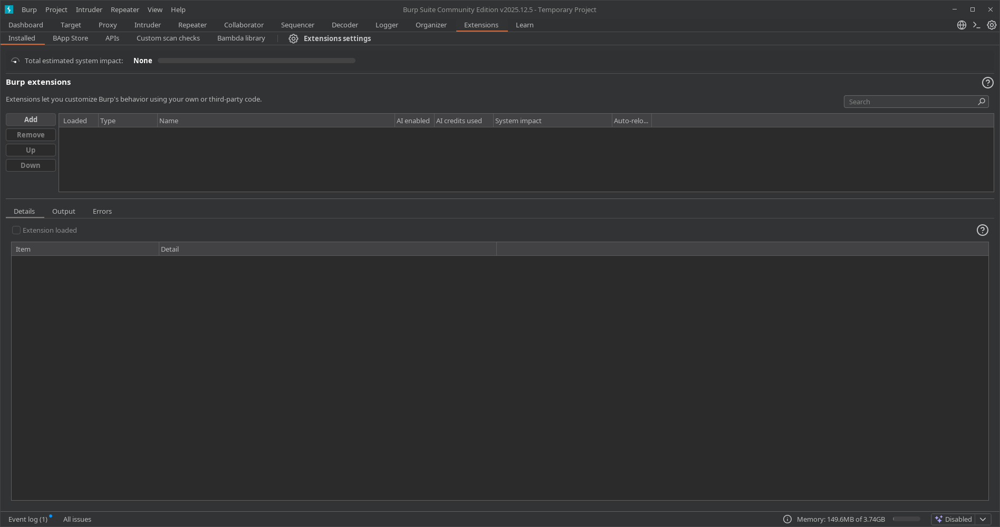
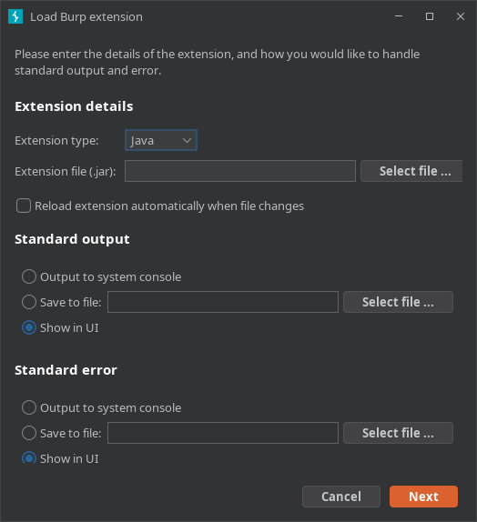
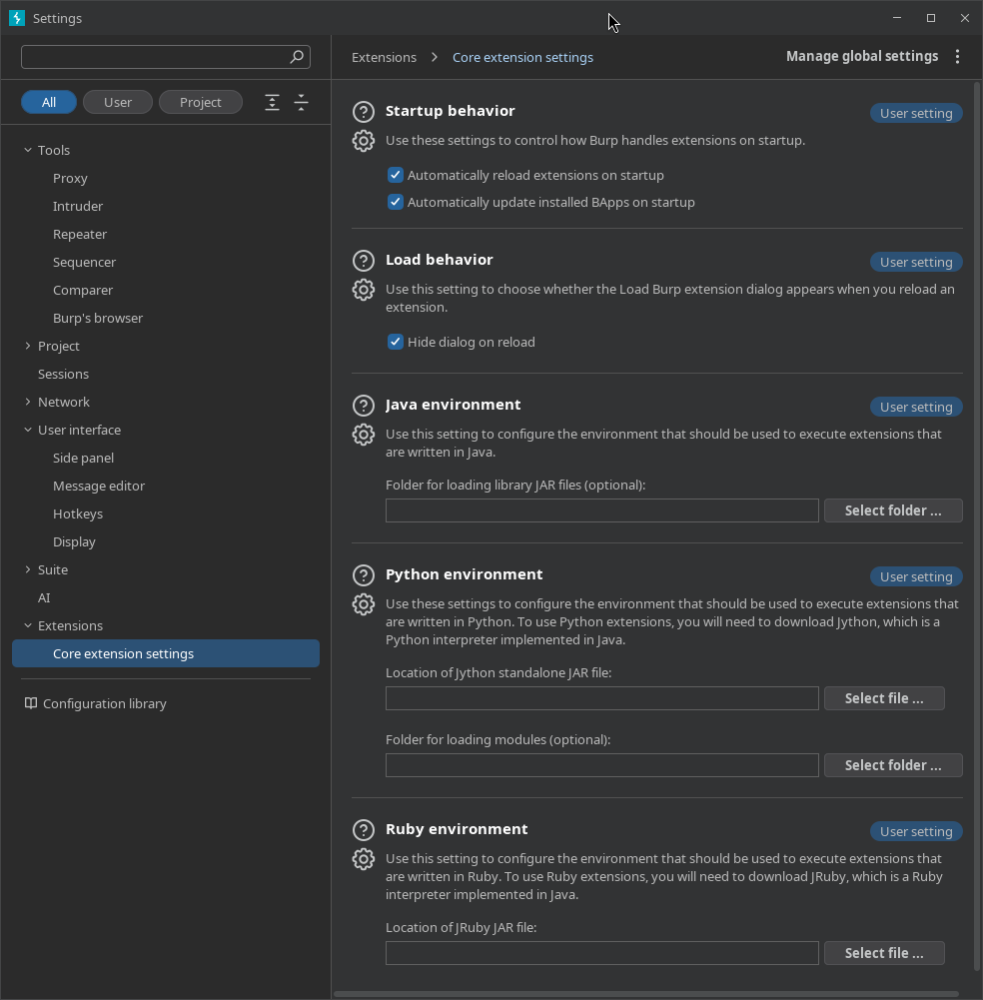

---
tags:
  - "#estructura/subseccion"
  - "#gestion/duracion/muy-corto"
  - "#gestion/relevancia/alta"
  - "#gestion/dificultad/facil"
  - "#hacking/red-team"
  - "#herramientas/burp-suite"
  - "#formato/apunte"
  - gestion/estado/terminado
---
## 📌 Propósito Operativo del Módulo
El módulo **Extensions** (anteriormente conocido como *Extender*) es el motor de orquestación de complementos de Burp Suite. Su propósito fundamental es permitir al auditor añadir herramientas, funcionalidades y automatizaciones desarrolladas por la comunidad o por terceros que no vienen de forma nativa en el núcleo de la aplicación.

En auditorías reales, las aplicaciones web suelen emplear mecanismos complejos que Burp no siempre sabe procesar por defecto (por ejemplo, firmas criptográficas personalizadas, serializaciones raras u ofuscaciones de tokens). El panel de extensiones permite instalar scripts para decodificar flujos en tiempo real, añadir motores de escaneo especializados (como detectores automáticos de Log4j, bypasses de WAF o integraciones con SQLMap) y personalizar por completo el arsenal del analista sin necesidad de reescribir el software base.

---

## 🎛️ 1. Panel de Control y Gestión de Extensiones Activas

La interfaz principal recopila el estado analítico de los complementos instalados y permite controlar la prioridad de ejecución dentro del flujo de red.

### A. Inventario y Estados de Carga (Installed)
* **Tabla de Extensiones:** Lista todos los plugins agregados al proyecto. Cuenta con una casilla de verificación (`Loaded`) para activar o desactivar la extensión al vuelo sin necesidad de borrarla.
* **Control de Orden (Priorización):** Los botones `Up` y `Down` permiten alterar el orden físico de la lista. Esto es crítico porque las extensiones procesan los paquetes HTTP en cascada; si una extensión modifica una cabecera para evadir un filtro, debe ejecutarse antes de que el paquete sea procesado por la siguiente herramienta.

### B. Consola de Depuración de Salidas y Errores (Lower Panel)
Al seleccionar una extensión, la mitad inferior de la pantalla desglosa su telemetría en tiempo real:
* **Output:** Muestra los registros informativos, logs de ejecución o banners de bienvenida creados por el desarrollador de la extensión.
* **Errors:** Consola de depuración indispensable si un plugin falla. Muestra las excepciones de código (ej: fallos de dependencias en Python o Java), permitiendo identificar por qué la extensión ha dejado de interceptar o modificar paquetes.

---

## 🏬 2. La Tienda Global de Complementos: BApp Store

La **BApp Store** (Burp App Store) es el repositorio integrado y oficial de PortSwigger desde donde se pueden descargar cientos de extensiones preaprobadas y validadas por seguridad.

* **Estructura de Navegación:** Muestra una lista alfabética con el nombre de la extensión, una breve descripción técnica de su impacto analítico y su calificación por estrellas basada en el feedback de la comunidad.
* **Ficha de Detalles Técnicos:** Al hacer clic sobre cualquier extensión (como *Turbo Intruder* o *Logger++*), el panel derecho muestra:
    * El autor del complemento.
    * La versión actual y la fecha de su última actualización.
    * **Estimated impact:** Una métrica visual que indica cuánta memoria RAM o procesamiento consume el plugin (`System overhead`) y qué tanto altera las peticiones (`Loss of control`).
* **Instalación Directa:** El botón `Install` descarga y acopla la extensión al vuelo directamente en el ecosistema de Burp Suite.

---

## ⚙️ 3. Entornos de Ejecución y Configuración Global (BApp Settings)

Para que Burp Suite pueda ejecutar extensiones escritas en lenguajes distintos a Java (el lenguaje nativo de Burp), es necesario indicarle dónde se encuentran los intérpretes correspondientes.

### A. Configuración del Entorno de Python (Jython)
* **Python Environment:** Dado que muchas de las mejores extensiones comunitarias están desarrolladas en Python 2/3, Burp Suite requiere el uso de un archivo llamado **Jython** (un intérprete de Python que corre sobre la máquina virtual de Java).
* **Location of Jython standalone JAR file:** En esta sección, el auditor debe descargar el archivo `.jar` de Jython desde su web oficial y cargar la ruta absoluta aquí para habilitar de inmediato la ejecución de complementos `.py`.

### B. Configuración de Entornos Adicionales y Caché
* **Ruby Environment:** Permite configurar el archivo JAR de *JRuby* para extensiones programadas en Ruby.
* **Java Environment:** Opciones para especificar rutas de compilación Java si estás desarrollando tus propios plugins mediante la API de Burp Suite.
* **Settings de la BApp Store:** Controla la carpeta temporal donde se almacenan las descargas de la tienda y la frecuencia con la que Burp Suite busca actualizaciones automáticas de los complementos instalados.

---

## 🚀 4. Casos Prácticos de Uso en Auditorías de Seguridad

### Caso 1: Instalación de Extensiones Esenciales para Red Team (Mejora del Escaneo)
Durante una auditoría, el proxy nativo recopila el tráfico pero necesitas automatizar la búsqueda de fallos complejos que el scanner por defecto no ve (como inyecciones secundarias o vulnerabilidades lógicas de autorización).
* **Solución operativa:** Vas a la **BApp Store** e instalas extensiones clave como **Autorize** (para detectar vulnerabilidades de control de acceso e IDORs de forma automática mientras navegas) o **Software Vulnerability Scanner** (para contrastar las versiones de software detectadas contra bases de datos de vulnerabilidades conocidas). El módulo se encarga de acoplarlas sin interrumpir tus interceptaciones activas.

### Caso 2: Preparación del Entorno para Plugins de Terceros (Jython Setup)
Descargas desde un repositorio de GitHub una herramienta de ataque especializada en evadir el WAF de un cliente, pero al intentar cargar el archivo `.py` en Burp, la aplicación arroja un error de ejecución.
* **Solución operativa:** Dirígeste a la pestaña **Extensions ➡️ Settings**, descargas el JAR de *Jython Standalone*, y mapeas su ubicación en la sección de Python. Al regresar a la pestaña principal y añadir el plugin, Burp Suite ya contará con el motor necesario para interpretar el script, permitiéndote inyectar las reglas de evasión personalizadas de forma transparente en tus peticiones de Repeater e Intruder.

---

[[Herramientas - Auditoría y Análisis Web con Burp Suite|⬅️ Volver a Burp Suite]]