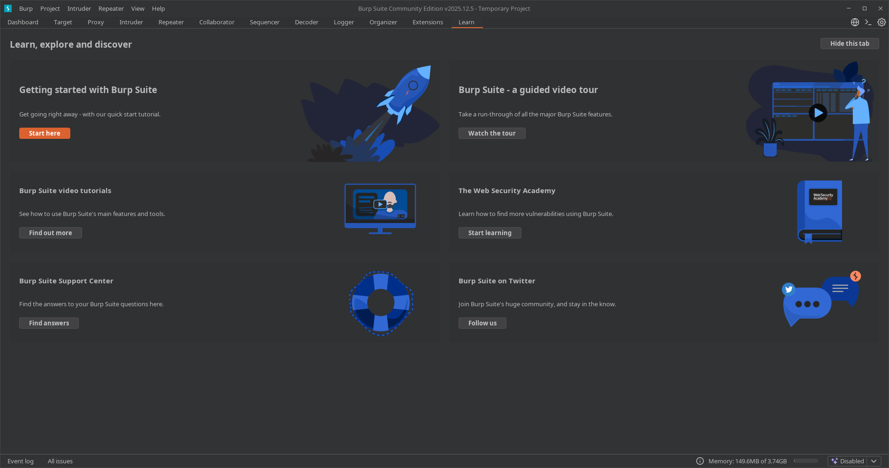

---
tags:
  - "#estructura/subseccion"
  - "#gestion/duracion/muy-corto"
  - "#gestion/relevancia/baja"
  - "#gestion/estado/terminado"
  - "#gestion/dificultad/muy-facil"
  - "#hacking/otros"
  - "#herramientas/obsidian"
  - "#formato/apunte"
---
## 📌 Propósito Operativo del Módulo
La pestaña **Learn** es el portal educativo nativo integrado en Burp Suite. Su función principal no es interactuar con el tráfico de red de un objetivo, sino actuar como un nexo directo con la **PortSwigger Web Security Academy**, la plataforma de entrenamiento interactivo de seguridad web de la empresa.

Durante el proceso de formación o en medio de una auditoría, el analista puede necesitar consultar rápidamente la teoría detrás de una vulnerabilidad recién descubierta (como un desvío de CORS o un ataque de deserialización). Este módulo centraliza accesos directos a laboratorios interactivos, artículos técnicos y guías paso a paso, permitiendo al usuario capacitarse o refrescar metodologías de explotación directamente desde la consola del software de ataque.

---

## 🎛️ 1. Interfaz y Distribución de Enlaces Formativos

El panel de Learn está estructurado como un índice visual interactivo dividido en categorías temáticas de aprendizaje.

### A. Acceso a la Academia (Web Security Academy)
* **Explore the Web Security Academy:** Enlace principal que redirige al navegador del sistema hacia el portal de laboratorios gratuitos de PortSwigger. Permite resolver retos de inyecciones, fallos lógicos y vulnerabilidades de infraestructura bajo entornos controlados.
* **Sección "Learning Paths":** Agrupa y organiza las vulnerabilidades por su naturaleza técnica para que el auditor pueda estudiar de forma estructurada (ej: Fundamentos Web, Vulnerabilidades del Lado del Servidor o Fallos del Lado del Cliente).

### B. Desglose Temático de Documentación Técnica
El panel lista las principales clases de fallos del top de seguridad web (como el OWASP Top 10), proporcionando enlaces directos a sus definiciones teóricas y cheatsheets de explotación:
* **SQL Injection (SQLi):** Conceptos, técnicas de exfiltración e inyecciones a ciegas.
* **Cross-Site Scripting (XSS):** Vectores reflejados, almacenados y basados en DOM.
* **Cross-Origin Resource Sharing (CORS):** Errores de configuración en las políticas de compartición de recursos en navegadores.
* **XML External Entity (XXE):** Manipulación de analizadores de datos y exfiltración Out-of-Band (OOB).

---

## 🚀 2. Casos Prácticos de Uso en el Flujo de Trabajo

### Caso 1: Consulta Teórica Rápida en Medio de un Pentest (Refresco Metodológico)
Estás utilizando el módulo Proxy y detectas que una aplicación web está utilizando plantillas dinámicas en el servidor, lo que te hace sospechar de una vulnerabilidad de *Server-Side Template Injection (SSTI)*. No recuerdas la sintaxis exacta para comprobar si el backend corre sobre Jinja2 o Thymeleaf.
* **Solución operativa:** Vas a la pestaña **Learn**, localizas la sección dedicada a *Server-Side Template Injection* y haces clic en ella. Burp Suite te abrirá la documentación técnica oficial de PortSwigger con los árboles de decisión y los payloads iniciales de verificación (como `${7*7}` o `{{7*7}}`) para que puedas copiarlos y probarlos de inmediato en Repeater.

### Caso 2: Entrenamiento Práctico y Replicación de Escenarios
Deseas dominar una vulnerabilidad compleja y avanzada como *HTTP Request Smuggling*, pero no tienes un entorno real o seguro donde realizar las pruebas de desincronización de peticiones sin romper los servicios de un cliente.
* **Solución operativa:** Utilizas la pestaña **Learn** para saltar directamente a la **Web Security Academy**. Buscas el laboratorio específico de *HTTP Request Smuggling*, lo activas y configuras tu Burp Suite para interactuar con dicho laboratorio. Esto te permite entrenar y validar tus payloads en un entorno de pruebas controlado y legal antes de enfrentarte a esa vulnerabilidad en una auditoría de infraestructura real.

---

[[Herramientas - Auditoría y Análisis Web con Burp Suite|⬅️ Volver a Burp Suite]]