---
tags:
  - "#estructura/seccion"
  - "#gestion/duracion/corto"
  - "#gestion/relevancia/muy-alta"
  - "#gestion/dificultad/normal"
  - "#hacking/practica"
  - "#herramientas/burp-suite"
  - "#formato/laboratorio"
  - gestion/estado/terminado
---

## 📌 Propósito del Laboratorio
El objetivo de esta práctica es consolidar los conocimientos adquiridos sobre los módulos esenciales de **Burp Suite Community Edition** mediante un entorno controlado. Se utiliza la aplicación de entrenamiento de SQL Injection desarrollada por **Appsecco**, la cual proporciona múltiples escenarios para evaluar técnicas de explotación manual y automatizada. En esta sesión inicial se ejecuta el mapeo del entorno, la captura de tráfico base y el análisis inicial del flujo de autenticación mediante manipulación controlada de peticiones.

---

## 🛠️ 1. Fase de Despliegue y Configuración del Alcance (Scope)

El laboratorio se obtiene desde el repositorio oficial de Appsecco. Tras levantar el contenedor utilizando Docker Compose, la aplicación queda expuesta de manera local en el puerto 8000.

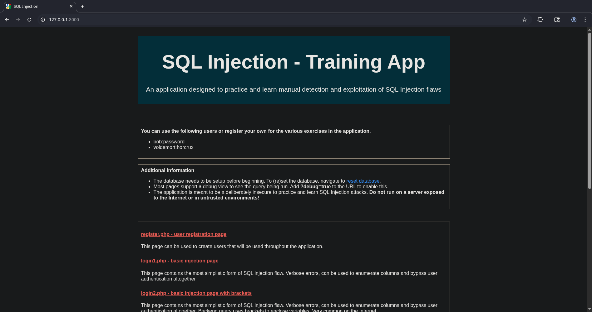

Al interactuar con la página por primera vez, el tráfico comienza a fluir a través de Burp Suite, nutriendo de forma automática el **Site Map**. Para focalizar la auditoría y evitar ruido de fondo, se define la dirección `127.0.0.1:8000` estrictamente como nuestro **Scope**.

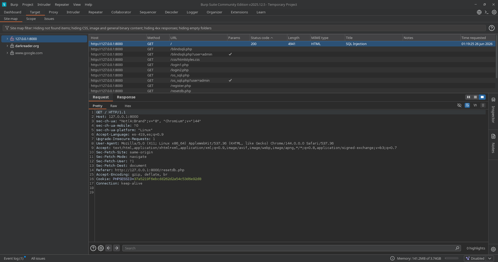

Una vez establecido el Scope, el **Dashboard** empieza a reflejar una vista general limpia de las métricas operativas y las tareas del proyecto.

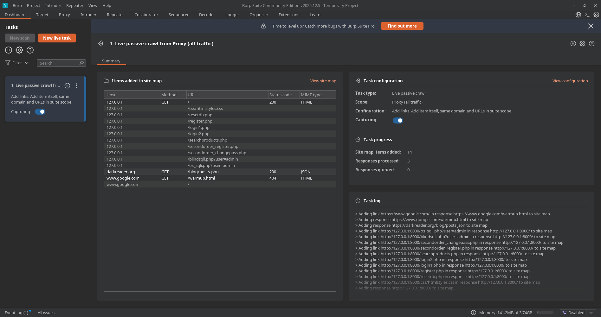

---

## 🧭 2. Mapeo del Laboratorio: Vectores Disponibles

La aplicación cuenta con 5 secciones críticas diseñadas para entrenar diferentes subtipos de inyecciones SQL:

1. **`login1.php` y `login2.php` (Bypass de Autenticación):** Formularios propensos a cortocircuitos lógicos. Devuelven errores detallados (*Verbose Errors*), ideales para identificar la estructura interna de la consulta (ej. uso de comillas simples o cierres con paréntesis).
2. **`searchproducts.php` (Extracción con UNION):** Buscador reflejado en pantalla. Permite alterar la lógica para concatenar datos de tablas internas (como credenciales) mediante sentencias `UNION SELECT`.
3. **`secondorder_register.php` y `secondorder_changepass.php` (Segundo Orden):** Inyecciones almacenadas. El payload malicioso se registra de forma "segura" en la base de datos y se detona posteriormente cuando otra función de la aplicación (el cambio de contraseña) invoca el dato guardado sin sanitizar.
4. **`blindsqli.php` (Inyección Ciega):** Escenario sin errores ni datos reflejados en pantalla. Requiere inferencia lógica mediante variaciones de contenido (*Content-based*) o retrasos temporales provocados en el servidor (*Time-based*).
5. **`os_sqli.php` (Toma de Control):** Explotación avanzada donde se abusa de privilegios altos de la base de datos para interactuar con el sistema operativo subyacente mediante funciones como `INTO OUTFILE` o `LOAD_FILE()`.

> 📝 **Nota de Enfoque:** Debido a que el objetivo actual es asimilar las funciones básicas de Burp Suite, esta sección se centrará en el flujo inicial de acceso para posteriormente auditar el endpoint **`searchproducts.php`**.

---

## 🪝 3. Interceptación, Registro Técnico y Triaje (Proxy, Logger y Organizer)

Para capturar la petición de login, nos dirigimos a la interfaz web y nos aseguramos de activar el botón **Intercept is on** dentro de la pestaña del Proxy.

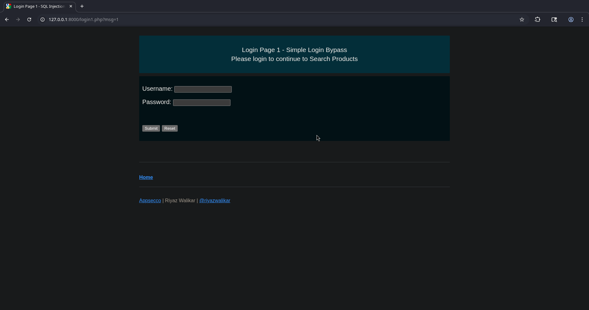
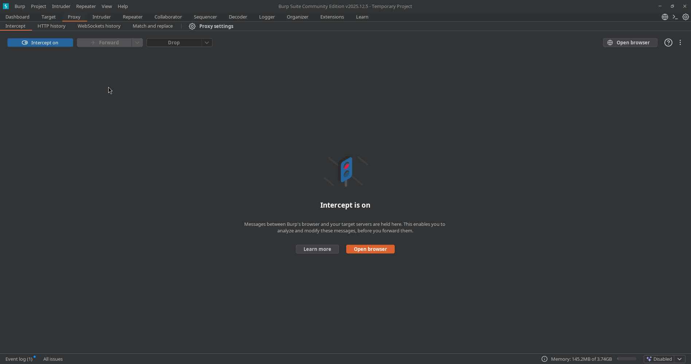

Introducimos credenciales de prueba arbitrarias en el formulario (`admin` / `admin`) y presionamos *Submit*. El Proxy captura de forma inmediata la siguiente solicitud estructurada:

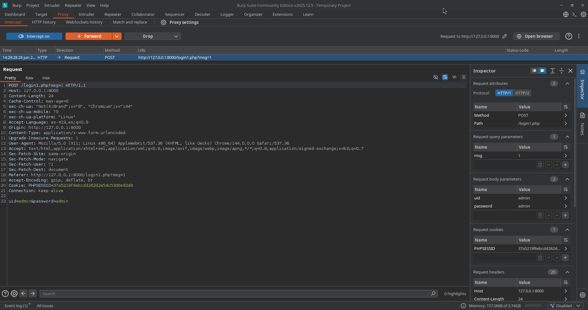

### 🧐 Anatomía del Paquete Interceptado
* **`POST /login1.php?msg=1 HTTP/1.1`:** Indica el envío de datos mediante método POST hacia el recurso de autenticación básica. El parámetro `msg=1` en la URL se encarga de gestionar alertas visuales en la interfaz del cliente.
* **`Content-Type: application/x-www-form-urlencoded`:** Define que los datos viajan codificados bajo la estructura estándar de formularios web interconectados por símbolos `&` e `=`.
* **`Cookie: PHPSESSID=37a5219f6ebcdd26...`:** Identificador único de sesión asignado por el servidor para el seguimiento de nuestro estado de navegación.
* **`uid=admin&password=admin`:** Cuerpo de la petición que almacena directamente los inputs ingresados en los campos de texto de la aplicación.

En paralelo, el módulo **Logger** ha registrado cronológicamente cada una de las interacciones previas de red para su posterior consulta y depuración.

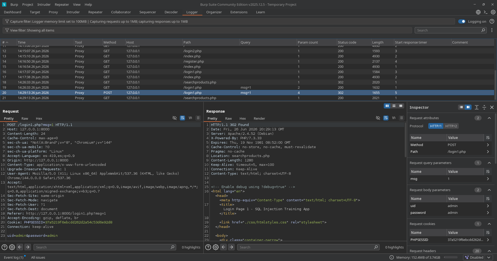

Como esta petición representa nuestro punto de entrada crítico de análisis, hacemos **clic derecho ➡️ Send to Organizer** para archivarla en nuestro baúl de marcadores estáticos, asegurando su persistencia y permitiendo añadir notas de campo.

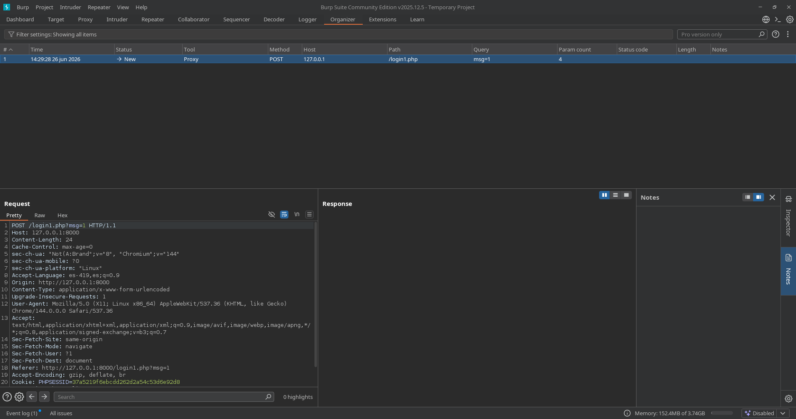

Hasta este momento, el flujo operativo ha involucrado exitosamente las siguientes secciones:
* **Target:** Configuración del Site Map y delimitación del alcance (*Scope*).
* **Dashboard:** Supervisión del estado general de la tarea.
* **Proxy:** Interceptación en tiempo real del vector de autenticación.
* **Logger:** Registro histórico global de eventos.
* **Organizer:** Almacenamiento y documentación diferida de hallazgos.

---

## 🔄 4. Ingeniería Inversa de Peticiones mediante Repeater

Para iniciar las pruebas de manipulación, enviamos el paquete capturado al **Repeater** utilizando el menú contextual.

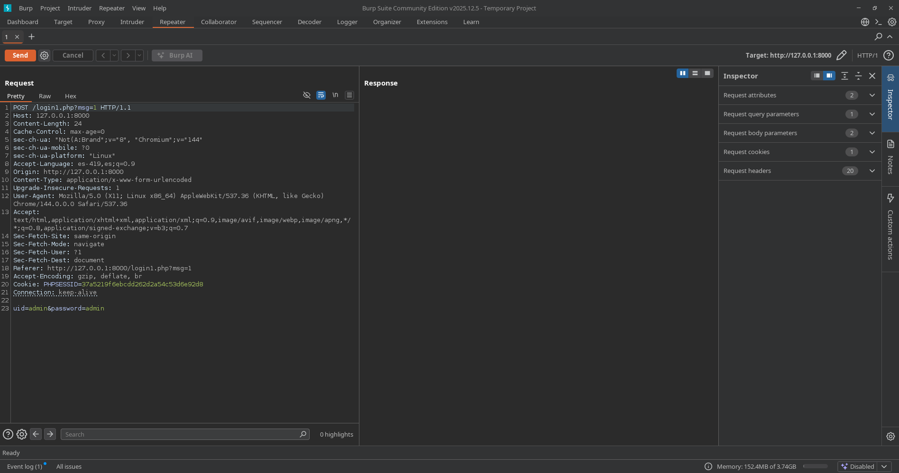

Al procesar la petición original con credenciales válidas o evaluar el comportamiento básico, observamos que el servidor responde con un código de estado **`302 Found`**. Esto significa que la solicitud fue procesada con éxito y el servidor web nos redirige internamente hacia el panel correspondiente, en este caso, encaminando el flujo hacia `searchproducts.php`.

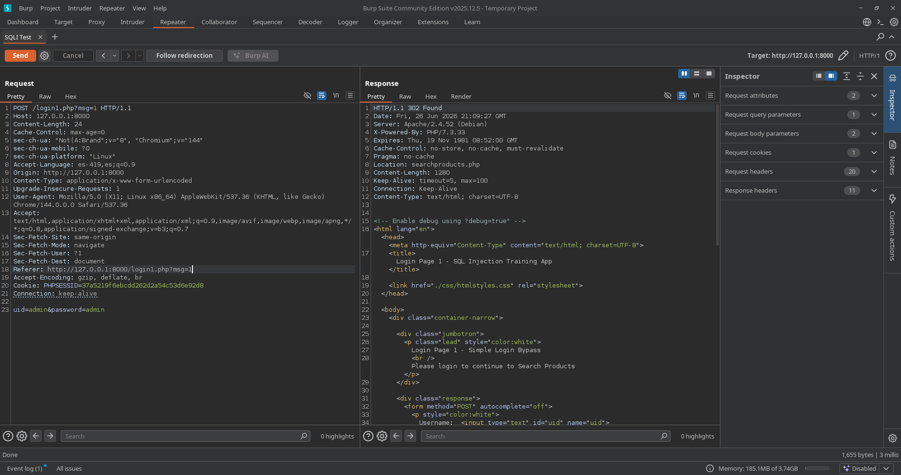

Con el paquete aislado en el entorno controlado de Repeater, el auditor puede alterar manualmente los campos de datos, inyectar payloads de evasión o modificar la estructura de las respuestas para forzar un comportamiento anómalo. 

Por ejemplo, si necesitáramos forzar o simular una respuesta específica (como un error de sintaxis del cliente cambiándolo a un status code `400 Bad Request`), podríamos clonar la estructura, editar la cabecera directamente y analizar de qué manera reacciona la lógica del lado del cliente ante códigos de control inesperados del servidor web.

---

## 🎛️ 5. Automatización con Proxy Match and Replace

Para fuerza la alteración de las respuestas de manera automatizada sin necesidad de detener cada paquete manualmente en el Proxy, empleamos la subpestaña **Match and Replace** ubicada en las configuraciones del Proxy.

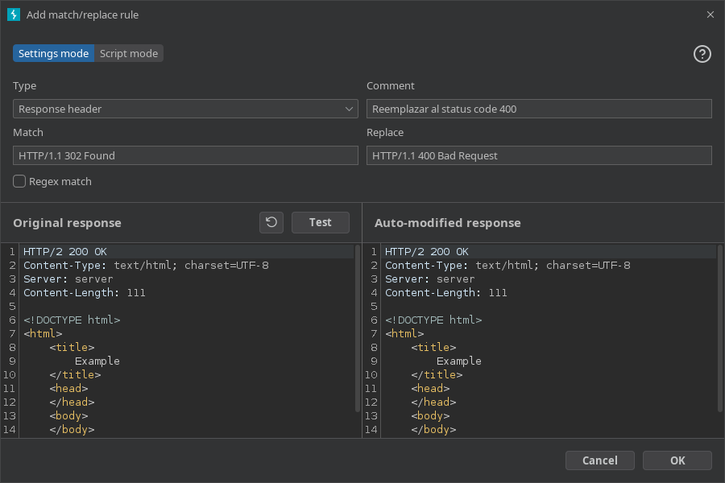

Dado que el código de estado HTTP es un parámetro estructural que se define exclusivamente en la cabecera del mensaje, configuramos una regla bajo el tipo **Response Header**. Definimos que cuando el motor detecte la cadena correspondiente a una redirección exitosa `HTTP/1.1 302 Found`, la reemplace automáticamente por un código de error de cliente `HTTP/1.1 400 Bad Request`. Adicionalmente, se introduce un comentario descriptivo para facilitar el control de la regla.

Al volver a ejecutar la petición, el impacto de la regla automatizada se refleja directamente en la captura:

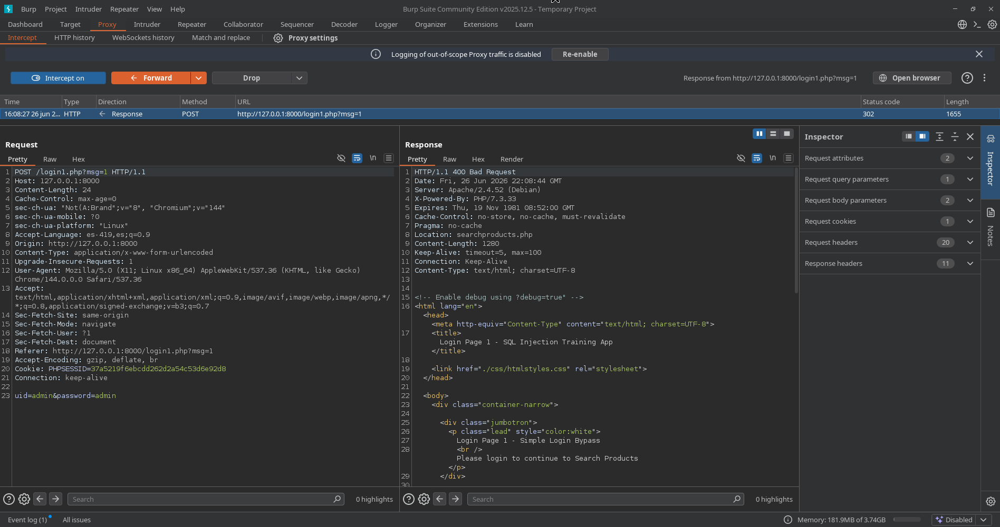

Al recibir de forma forzada un estado `400 Bad Request` en lugar del `302 Found`, el navegador web interpreta que la solicitud sufrió un fallo y no ejecuta la redirección hacia el endpoint `searchproducts.php`, manteniéndonos estáticos dentro de la interfaz de inicio de sesión. 

Si bien en este escenario específico esta modificación no compromete directamente la lógica, la manipulación automatizada de cabeceras de respuesta y estados HTTP es una técnica habitual para saltarse controles del lado del cliente, analizar la resiliencia del software o evadir mecanismos superficiales de autenticación que dependen de las respuestas que devuelve el servidor.

---

## 🎯 6. Attacks de Fuerza Bruta Automatizados mediante Intruder

Simulando un escenario real en el que no conocemos las credenciales del usuario `admin`, recurrimos al módulo **Intruder** para automatizar el descubrimiento de la contraseña mediante un ataque de diccionario.

A partir del análisis previo del cuerpo de la petición POST (`uid=admin&password=admin`), seleccionamos el valor asignado a la variable `password` y la encapsulamos como nuestro vector objetivo presionando el botón **Add position**.

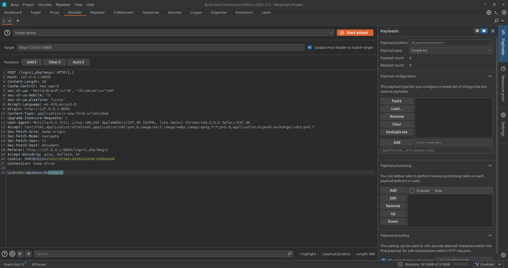

Definimos un tipo de ataque **Sniper** debido a que únicamente contamos con una posición de payload activa y buscamos evaluar una sola lista secuencial de datos. Para alimentar el ataque, cargamos el diccionario estándar de las 10,000 contraseñas más comunes a nivel mundial, extraído de la suite de seguridad **SecLists**.

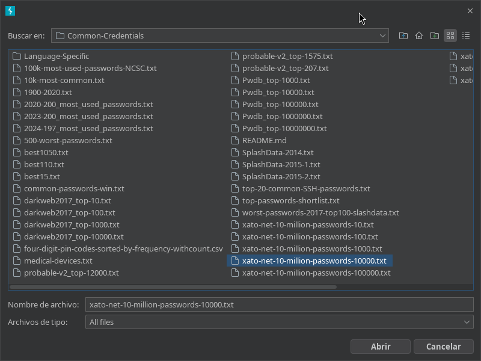
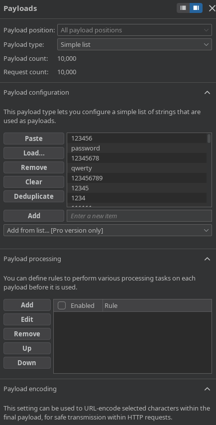

Tras lanzar el ataque, la tabla de resultados de Intruder nos proporciona métricas analíticas fundamentales para identificar la credencial válida:

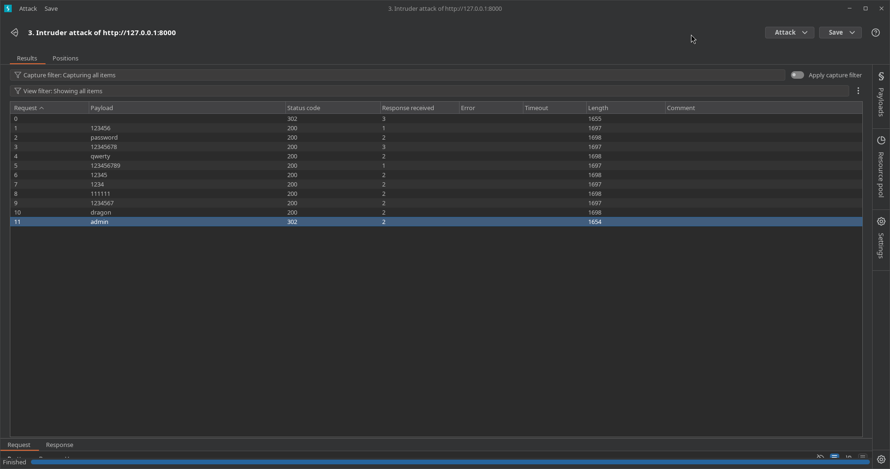

El análisis comparativo del output revela dos anomalías clave:
* **Status Code:** Las contraseñas incorrectas devuelven un estado estático `200 OK`, lo que significa que el servidor renderiza el formulario de error genérico. En contraste, el payload `admin` provoca un estado `302 Found`, indicando que el proceso de autenticación fue completado y ordenó una redirección.
* **Length (Longitud):** Mientras que los intentos fallidos mantienen un tamaño uniforme en bytes de `1697` y `1698`, el intento exitoso arroja un tamaño menor de `1654 bytes`. Esta discrepancia de tamaño en las respuestas confirma el cambio estructural del HTML devuelto al validar la cuenta. El Length vendría siendo el tamaño de una petición o respuesta en específico y su unidad de medición es en bytes.

---

## 🔏 7. Técnicas de Evasión de Filtros utilizando Decoder

Durante auditorías web avanzadas, los sistemas de seguridad perimetral como los WAF (Web Application Firewalls) suelen filtrar cadenas de texto plano peligrosas. Para saltarse estas restricciones, utilizamos el módulo **Decoder** para transformar los payloads a formatos equivalentes que el backend sea capaz de procesar pero el filtro no reconozca.

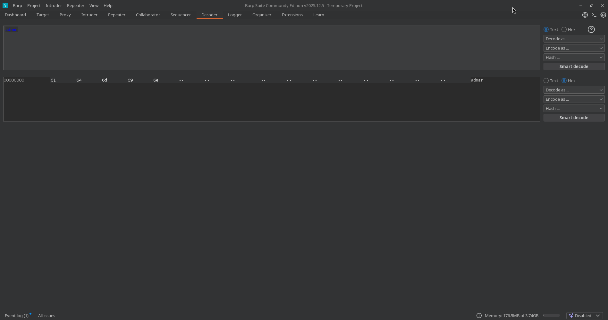

Al anteponer el prefijo `0x` a la cadena hexadecimal, el motor de bases de datos (en este caso, el contenedor MySQL) interpreta y traduce automáticamente este flujo binario de forma interna, ejecutando el término `admin` directamente en la consulta SQL y neutralizando los filtros de validación basados en texto plano de la aplicación.

---

## 🔍 8. Análisis Forense y Diferenciación de Paquetes con Comparer

Como parte de los procedimientos de análisis y documentación de evidencias, el contraste milimétrico de las respuestas correctas e incorrectas nos permite mapear de forma exacta el comportamiento del backend. Para ello, enviamos los flujos de respuesta de los payloads evaluados al módulo **Comparer**.

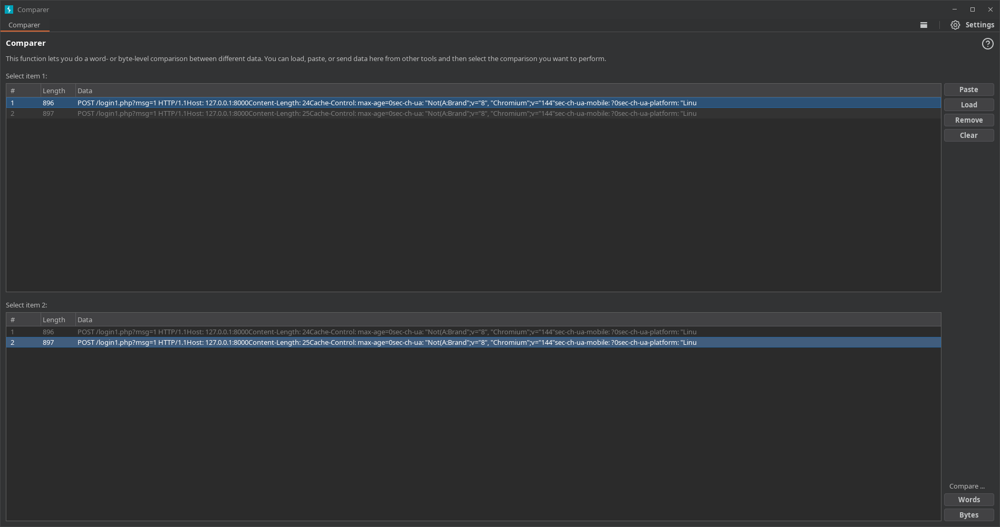
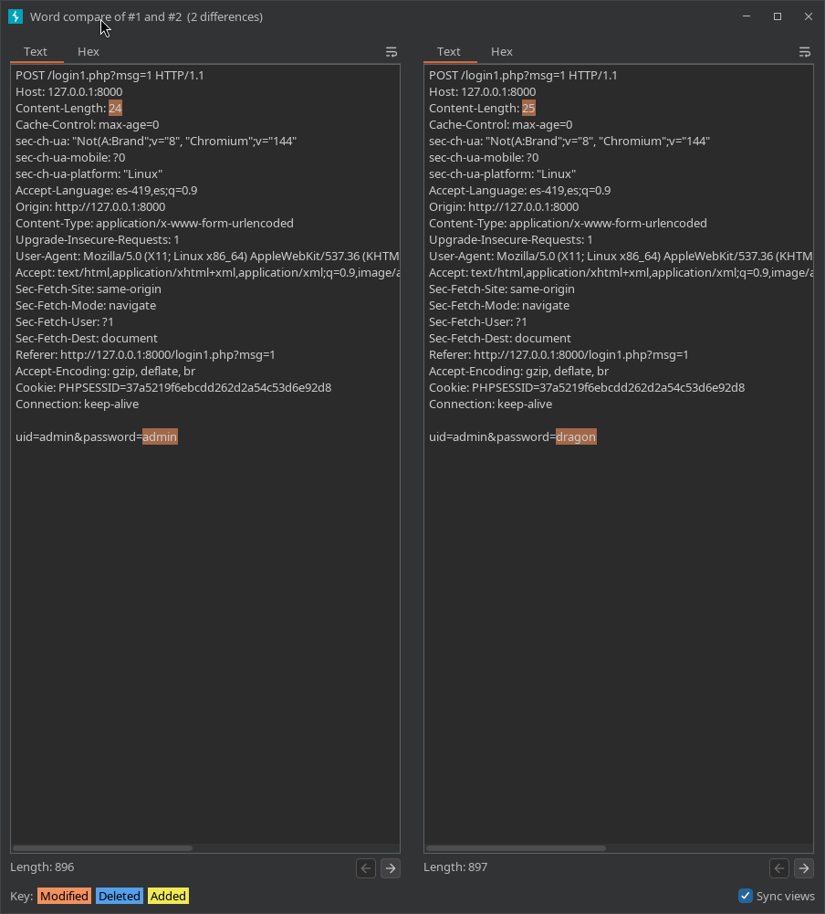

Al ejecutar la comparación por palabras (**Words**), el entorno gráfico resalta de forma inmediata las discrepancias exactas en las respuestas:

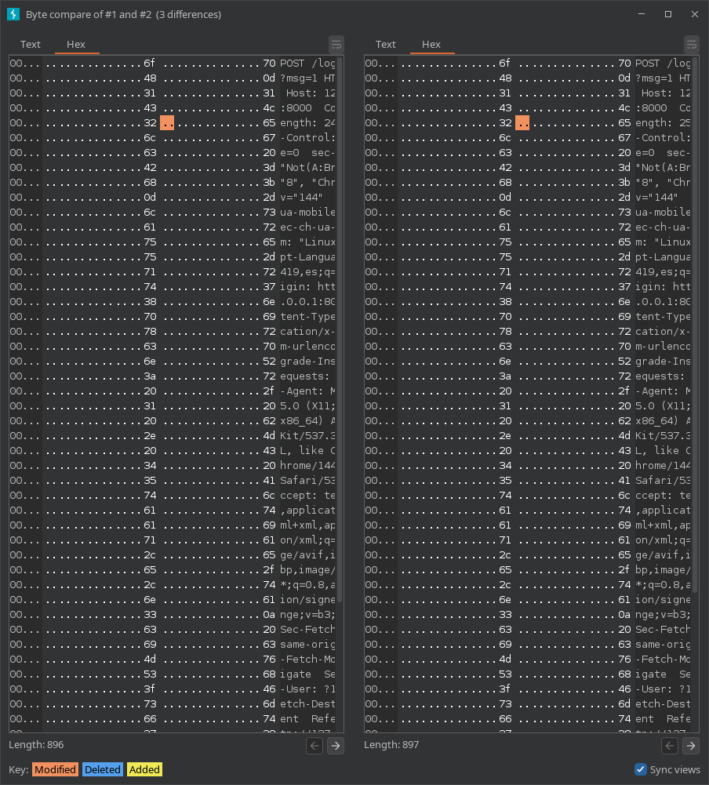

El código de colores nos permite aislar los cambios del servidor: la respuesta exitosa elimina las cadenas de error o los formularios repetitivos presentes en el intento fallido (resaltado en **rojo**), modificando las cabeceras de localización del recurso y los parámetros de las cookies de sesión (resaltado en **naranja**). Esto provee un flujo visual transparente para verificar el éxito de la explotación.

---

## 📝 Conclusiones de la Fase Inicial
Con este flujo se ha logrado abarcar el uso práctico de casi todas las secciones esenciales de Burp Suite. Cabe destacar que herramientas como **Collaborator** no fueron implementadas por ser exclusivas de la versión *Professional Edition*, mientras que para las características de este laboratorio de SQLi no se requirió la medición estadística de aleatoriedad del módulo **Sequencer**. 

Los ejemplos plasmados mantienen una estructura simplificada de forma intencional, cumpliendo con el propósito de esta guía enfocada al uso básico y didáctico del ecosistema de Burp Suite. Las metodologías de explotación avanzada y cadenas de ataque complejas se documentarán de forma individual conforme se ejecuten auditorías en escenarios reales y entornos de producción.

---

[[Herramientas - Auditoría y Análisis Web con Burp Suite|⬅️ Volver a Burp Suite]]